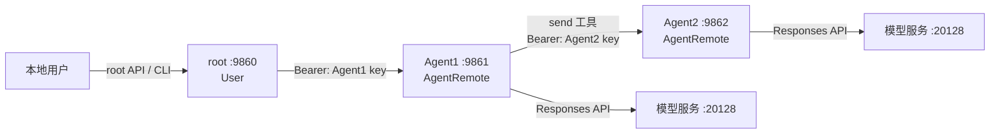
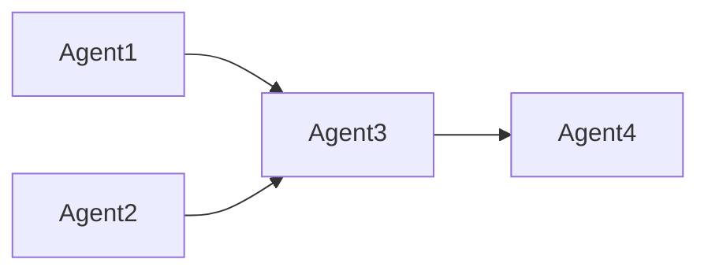
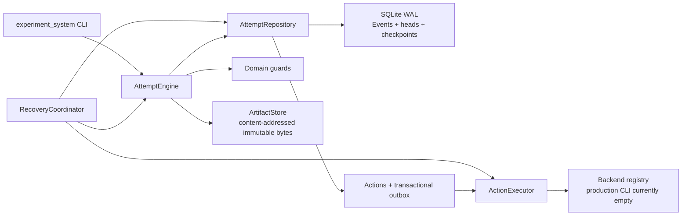

# AgentGraphInternet 项目交接文档

> 适用对象：准备接手本仓库开发、审查、调试或扩展工作的 AI Agent / 人类维护者
>
> 文档日期：2026-07-31
>
> 项目阶段：Agent 数据面 MVP 与 Attempt 状态内核 Phase 6 已完成；release gate 已通过
> 重要原则：本文件记录“接手上下文与不变量”；用户使用方法以 [README.md](README.md) 为准，教学说明以 [docs/中文入门教程.md](docs/中文入门教程.md) 为准。

## 1. 接手后的第一组命令

不要仅凭本文假设工作树仍处于相同状态。新 Agent 首先执行：

```powershell
git status --short --branch
git log -8 --oneline --decorate --graph
git remote -v
uv sync --locked
```

然后运行离线测试：

```powershell
$env:UV_CACHE_DIR = '.uv-cache'
$testTemp = Join-Path $env:TEMP ('agentgraph-handoff-' + [guid]::NewGuid().ToString('N'))
uv run pytest -m "not live" -q -p no:cacheprovider --basetemp=$testTemp
```

使用临时 `basetemp` 和禁用 pytest cache provider，是为了绕过某些 Windows/Codex 环境中 `.pytest_cache` 所有者不同导致的权限错误；这不是生产代码要求。

交接时的稳定基线：

- 默认分支：`master`
- 远程：`origin`
- 远程地址：`lc@10.126.126.2:/mnt/sda1/gitRepos/AgentGraphInternet.git`
- MVP 合并提交：`0d09ec5 merge: integrate AgentGraphInternet MVP`
- 功能分支备份仍可能存在于远程：`feature/agentgraph-internet-mvp`
- 会话隔离修复后的验证汇总：`207 passed, 1 skipped`（固定三节点验收使用 clean `HEAD` 示例配置独立执行）
- 唯一默认 skip：需要真实本地模型服务的 `tests/test_live_chain.py`
- `tests/test_integration_chain.py` 会校验示例配置契约；本地改写 `agents_setting/*.json` 后应改用 clean `HEAD` 配置副本验收，不能据此判断运行时代码回归。
- 状态内核 Phase 5B 基线：`a447b92`、`4ae583f`、`6cc139d`。
- Task 18 operator surface：`a8b61d6 feat: add local attempt control cli`。
- Task 18 clean detached worktree：`1159 passed, 1 deselected`；独立高风险组：`123 passed`。
- `agents_setting/Agent1.json`、`agents_setting/Agent2.json` 属于仓库所有者；不得查看其 diff、修改、暂存、提交或展示。
- 仓库所有者于 2026-07-31 明确确认：相关已暴露凭据均已轮换，tracked Agent 配置已恢复为环境变量引用。该确认不授权后续接手者展示配置、diff 或凭据。

如果实际 Git 状态与以上内容不同，以 `git` 命令结果为准。

## 2. 项目目标与当前完成范围

AgentGraphInternet 是一个最小的“有向 Agent 互联网”实现。每个进程只加载一个 JSON 配置，每个普通 Agent 只能访问配置 allowlist 中的直接邻居。

仓库现在还包含独立的 `experiment_system` Attempt 控制面。它以 SQLite、immutable
Events、outbox 和 artifacts 保存可恢复的编排状态，但不导入或接管 `Agent.py`、
`AgentRemote.py`、`User.py`、`core.py` 或 `tool_system` 数据面。当前 Agent CLI 和
HTTP 契约未改变。

已经完成：

- `root` 特殊用户网关，不调用模型，只把用户请求转发给直接可见 Agent。
- 普通 Agent 使用 `AsyncOpenAI` 的 Responses API 完成推理与工具循环。
- 工具由冻结 `ToolRegistry` 统一声明、校验、绑定、分发和生命周期管理；内置 `send(msg, to_id)`、`close(to_id)` 继续兼容，模型不能提供或选择会话 id。
- 外部工具由 `ToolExtension.EXTENSION_TOOLS` 显式列出，普通 Agent 通过 `tools.extensions` 的 `"all"`、`"none"` 或名称列表选择；每个 Agent 单独绑定工具实例。
- Agent 间使用 FastAPI + HTTP(S) + Bearer key 通信。
- 普通 Agent 的入站会话按完整 `ConversationKey(from_id, conversation_id)` 隔离，每个键拥有独立 `ChatSpace`。
- 向下游执行 `send` / `close` 时，运行时自动附加当前本地 `ChatSpace.conversation_id`，使汇聚后的分支仍可继续区分。
- 同一完整 `ConversationKey` 的请求 FIFO 排队；任一字段不同的会话在 Agent 忙时立即收到 HTTP 409。
- 对话关闭携带完整会话键，遵循“先成功保存，再只删除对应内存分支”。
- root 可递归发现有向拓扑，并对节点数、深度、记录处理和响应字节进行限制。
- 提供 root CLI、HTTP API、三节点示例配置、确定性端到端测试和可选 live smoke。
- 提供严格的 Attempt Command/Event/Engine、SQLite WAL repository、immutable artifact、
  transactional outbox、暂停/外部输入控制与按 policy 恢复。
- 提供本地 `python -m experiment_system` 的 create/status/pause/resume/cancel/
  submit-input/recover 控制命令；production Backend registry 当前为空。

Agent 数据面当前明确不包含：

- Web 前端。
- Agent 会话数据库、分布式锁、跨进程共享会话或 Agent 会话重启恢复。
- 完整身份系统、mTLS、签名请求或按 caller 绑定的 token。
- 自动重试、幂等执行、消息队列、任务调度器。
- 生产级限流、指标、链路追踪和集中日志。
- Agent 动态注册、配置热更新或服务发现中心。

Attempt 控制面当前明确不包含 `ResponseRunner`、`LiveLLMBackend`、现有 Agent runtime
adapter、Backend 配置格式、HTTP API、console script、`run` 或 `start` 命令。

## 3. 架构与调用链

示例配置形成以下有向图：



一次 `root -> Agent1 -> Agent2` 的关键顺序：

1. 用户通过 root API 或 CLI 提交消息。
2. `User.talk_to()` 在 root 本地 `ChatSpace` 追加 `user` 消息；该对象拥有唯一的本地 `conversation_id`。
3. root 根据本地 `agents[]` 找到 Agent1 的 IP、端口和 key，发送包含 `from_id='root'` 与该本地 `conversation_id` 的认证 HTTP 请求。
4. Agent1 以 `ConversationKey('root', root_conversation_id)` 查找或创建入站 `ChatSpace`；新对象再生成属于 Agent1 本地的另一个 `conversation_id`。
5. Agent1 调用 Responses API；模型可以返回 `function_call(name='send')`，但参数中只有 `msg` 和 `to_id`。
6. Agent1 只接受合法工具名、严格参数和 allowlist 中的 `to_id`。
7. 工具运行时调用 Agent2 时自动附加 Agent1 当前本地 `ChatSpace.conversation_id`；Agent2 因而以 `ConversationKey('Agent1', agent1_local_conversation_id)` 隔离会话。
8. Agent2 的最终文本作为 Agent1 工具结果，使用原 `call_id` 写入 `function_call_output`。
9. Agent1 再次调用 Responses API，直到没有工具调用且出现最终 assistant 文本。
10. Agent1 回复 root；root 把结果作为 `assistant` 消息保存。
11. 所有成功、异常和取消路径都必须释放普通 Agent 的 `currentChatSpace`。

分支汇聚时，不能只使用直接 caller id：



Agent3 为 Agent1、Agent2 的两个入站键分别创建本地 `ChatSpace`。虽然向 Agent4 发出的 `from_id` 都是 `Agent3`，运行时传播的两个本地 `conversation_id` 不同，因此 Agent4 保存为两个不同的 `ConversationKey`，消息不会混入同一上下文；关闭其中一个键也不会影响另一个键。

三节点调用链的确定性证据见 [tests/test_integration_chain.py](tests/test_integration_chain.py)，分支汇聚隔离与精确关闭见 [tests/test_conversation_isolation.py](tests/test_conversation_isolation.py)。

## 4. 文件与职责地图

| 路径 | 关键职责 | 修改时重点关注 |
| --- | --- | --- |
| `core.py` | Pydantic 配置、环境变量展开、`ConversationKey`、HTTP 请求模型、统一错误、`ChatSpace` | secret 脱敏、会话键校验、原子保存、Responses item 完整性 |
| `AgentRemote.py` | 普通 Agent、HTTP 客户端、工具循环、会话隔离、并发状态、入站 API、拓扑递归 | 完整会话键、逐跳 id 传播、精确 close、FIFO/409、取消清理、allowlist、响应预算 |
| `User.py` | root 会话、talk/history/close、root API、全局拓扑聚合 | root 无模型、本地 conversation id 传播、目标级锁、远端优先 close、全局拓扑预算 |
| `Agent.py` | 配置入口、运行时工厂、Uvicorn、root CLI | TTY 判断、CLI 不阻塞事件循环、服务干净退出 |
| `tool_system/contract.py` | `ToolArguments`、`ToolSpec`、`AgentTool` 与工具状态错误 | 契约必须保持严格参数和每 Agent 绑定 |
| `tool_system/registry.py` | 工具目录校验、选择、冻结、分发与生命周期 | schema 深拷贝、固定顺序、启动回滚和逆序关闭 |
| `tool_system/builtin_tools/` | 内置 `send`、`close` 与 `BUILTIN_TOOLS` | 保持 schema、allowlist 与会话 id 注入兼容 |
| `ToolExtension/__init__.py` | 受信任外部工具的显式 `EXTENSION_TOOLS` 类元组 | 默认登记未启用的 `TextStatsTool`、`AgentInfoTool`、`GetWeatherTool`；不做自动发现，root 不导入该包 |
| `ToolExtension/text_stats.py` | 教学文本统计：必填 1..10000 `text` | 返回字符、非空白字符、空白分词和 `splitlines()` 行数；`character_count` 是 Python `len(text)` 的 Unicode code point 数，不是字素簇或 UTF-8 字节；尾随换行不新增空行 |
| `ToolExtension/agent_info.py` | 教学最小身份：无参数 | 成功结果固定含 `ok: true`；仅经 `get_profile()` 后白名单返回 `agent_id`、`introduction` 两个身份字段，不能返回配置、keys、模型 URL、peer、client、session |
| `ToolExtension/get_weather.py` | 教学天气查询：必填 `location`、`units` | 固定访问 Open-Meteo；展示精确 OpenAI schema、Pydantic 本地校验、`httpx.AsyncClient` startup/shutdown 与两阶段请求 |
| `agents_setting/*.json` | 三节点示例 | 预期契约是环境变量引用；owner 已确认门禁状态，后续仍不得展示配置、diff 或凭据 |
| `tests/helpers.py` | fake Responses 与 host:port ASGI transport | 测试记录不得保存 header、Bearer 或消息正文 |
| `tests/test_agent_remote.py` | 工具循环、并发、取消、拓扑和错误边界 | 普通 Agent 的核心回归门禁 |
| `tests/test_user.py` | root 会话、API、close、拓扑和 TLS 客户端 | root 核心回归门禁 |
| `tests/test_integration_chain.py` | 完整三节点确定性验收 | 必须从 root HTTP API 发起，不可绕过接口 |
| `tests/test_conversation_isolation.py` | 同源多会话、逐跳传播、四节点汇聚与精确 close | 会话隔离核心回归门禁 |
| `tests/test_live_chain.py` | 可选真实模型 smoke | 默认必须 skip，失败信息不得泄漏 key |
| `README.md` | 正式项目入口、运行与运维说明 | 命令必须与真实 CLI/API 一致 |
| `docs/中文入门教程.md` | 初学者教程 | 从概念到实操递进，避免假设已有异步经验 |

### 4.1 Attempt 状态内核模块图



| 路径 | 关键职责 |
| --- | --- |
| `experiment_system/commands.py` / `events.py` | 严格 discriminated unions、schema version 与未知字段拒绝 |
| `experiment_system/reducer.py` / `state.py` | 纯 Event 投影、hashable canonical state 与脱敏 OperatorView |
| `experiment_system/engine.py` | 唯一逻辑状态写入边界、revision/command idempotency 与 domain guards |
| `experiment_system/store.py` / `stores/` | repository 契约、memory 实现、SQLite WAL durability 和重建 |
| `experiment_system/artifacts.py` | content-addressed immutable artifact；状态仅保存严格 `ArtifactRef` |
| `experiment_system/executor.py` | lease/dispatch/observation；只执行已原子提交的 outbox Action |
| `experiment_system/recovery.py` | 按持久化 recovery policy 协调重启，不猜测外部副作用结果 |
| `experiment_system/cli.py` | 本地 operator adapter、依赖注入、规范 JSON 与安全退出码 |

架构权威顺序：

1. [Agent Orchestration State Design](docs/superpowers/specs/2026-07-23-agent-orchestration-state-design.md) 规范 Attempt 状态、持久化、outbox、暂停和恢复。
2. [Multi-Agent Research Platform Design](docs/superpowers/specs/2026-07-23-multi-agent-research-platform-design.md) 提供更上位的产品与研究背景；与前者冲突时，以状态设计为当前内核实现依据。

## 5. 不能破坏的核心不变量

### 5.1 配置与秘密

- 普通 Agent 必须配置 `key`、`openai_baseurl`、`openai_key`、`model`。
- root 不需要 OpenAI 配置，也不得创建 OpenAI 客户端、system prompt 或模型工具。
- `${ENV_VAR}` 在 JSON 树中递归展开；缺失时只报告变量名。
- `SecretStr` 只是降低误打印风险，不代表可以把 secret 放入日志、异常或模型上下文。
- Agent 间地址、协议、端口和 Bearer key 必须来自本地 `PeerConfig`，不能由模型参数或 HTTP body 指定。
- Bearer 只能放在 `Authorization` header，不能进入 URL、查询字符串、错误正文或日志。

### 5.2 Responses API 工具循环

- 只使用 Responses API，不要改回 Chat Completions。
- 每次调用使用 `store=False`。
- 下一轮输入必须回放完整 `response.output`，包括 reasoning、message、function call 及 SDK 新增 item；不能只保存 `output_text`。
- 每个持久化的 `function_call` 必须恰好有一个相同 `call_id` 的 `function_call_output`。
- 工具批次必须先整体预检，再执行副作用；发现重复 call id、非法结构或模型伪造的 output 时整批拒绝。
- 工具参数始终视为不可信：严格校验工具名、JSON、字段类型、额外字段和 `to_id`。
- `ToolRegistry` 在普通 Agent 完成基础状态初始化后构建；目录必须为类元组，所有工具名全局唯一，工具、schema 和名称映射在构建后冻结。
- `schemas()` 每次返回深拷贝；工具执行前要求 registry 已启动。工具 `startup()` 正序执行，失败时逆序回滚；`shutdown()` 逆序尽力清理，随后才关闭 Agent 自有客户端。
- `parallel_tool_calls=False`，确保副作用顺序可预测。
- 默认上限：每轮最多 200 个工具调用、256 个 Responses 步骤；不得创建无上限循环。
- 远端工具异常写入稳定、脱敏的工具结果，不能把底层 URL、header 或 key 送回模型。

官方依据：

- [OpenAI Function calling](https://developers.openai.com/api/docs/guides/function-calling)
- [OpenAI Responses create API](https://developers.openai.com/api/docs/api-reference/responses/create)

### 5.3 会话与并发

- `ConversationKey` 由规范化后的 `from_id` 和 UUID `conversation_id` 共同组成；不能退化为只按 caller 保存。
- `AgentRemote.chat_spaces` 按完整 `ConversationKey` 保存入站会话；同一个 caller 可以同时拥有多个相互隔离的分支。
- 入站键中的 `conversation_id` 属于上游本地 `ChatSpace`；当前 Agent 新建的 `ChatSpace.conversation_id` 属于当前 hop。向下游传播后者，不能原样转发前者。
- `User.chat_spaces` 仍按 root 的直接目标 id 保存本地用户会话，但每个 `ChatSpace` 的本地 UUID 必须随 message/close 请求发送给目标 Agent。
- 普通 Agent 同一时刻只服务一个完整 `ConversationKey`；同一键的重叠请求使用 per-conversation `asyncio.Lock` FIFO 串行。
- 当任一字段不同的另一个 `ConversationKey` 已占用 Agent，必须立即返回 409、`AGENT_BUSY` 和 `Retry-After: 60`，即使 `from_id` 相同也不能排入当前队列。
- pending count、active conversation key 和 per-conversation lock 的登记/清账必须在同一个状态锁下维护。
- 等待锁时被取消也必须减少 pending reservation，不能永久卡住 Agent。
- `currentChatSpace` 只表示正在实际处理的本地会话；工具运行时从这里取得本地 `conversation_id`。无论成功、模型异常、工具异常还是取消，都必须在 `finally` 中释放。
- root 同一目标串行，不同目标可并发；不要把 root 改成全局单锁。

### 5.4 ChatSpace 与持久化

- `messages` 是面向人类的简化视图，只包含 `user/assistant` 文本。
- `context_items` 是面向 Responses API 的完整视图。
- `get_context_messages()` 返回深拷贝，调用方不能修改内部状态。
- 保存路径固定为：`chat_history/<owner_id>/<peer_id>/<conversation_id>.json`。
- 保存使用同目录临时文件、flush、`fsync` 和 `os.replace`，保证目标文件原子替换。
- 保存失败时尽力删除临时文件，但保留原文件和内存会话。
- Agent 间 `MessageRequest` 和 `CloseRequest` 都必须携带 UUID `conversation_id`；这是运行时协议字段，不是模型工具参数。
- 普通 Agent 收到 close 时：按 `ConversationKey(from_id, conversation_id)` 精确查找，先 `save()`，成功后只从 `chat_spaces` 删除该键。
- root close 时：先确认远端关闭成功，再保存并删除 root 本地会话。
- root 不存在本地会话时不得构造一个无依据的 conversation id 去关闭远端分支。

### 5.5 拓扑发现

- 图是有向图；配置中的直接边是可信本地事实。
- root 只直接访问自己的邻居，由邻居继续递归，不能让 root 使用未授权的深层 key。
- `visited_ids` 防环；不同直接分支共享已发现节点和剩余预算。
- `topology_max_nodes` 和 `topology_max_depth` 必须执行；不可信 nodes、edges、errors 还受处理记录预算约束。
- 下游 topology 请求明确发送 `Accept-Encoding: identity`。
- 读取正文前拒绝非 identity 的 `Content-Encoding`，并同时限制 `Content-Length` 与累计 raw bytes。
- 成功响应必须包含 list 类型的 `nodes`、`edges`、`errors`，并包含当前认证直接 peer 的自身节点。
- 下游节点、边和错误只允许白名单字段；下游错误正文不能直接透传。
- 单个分支失败只形成 `unreachable` 节点和局部 error，不能让整个拓扑请求失败。
- profile/topology 不获取聊天锁、不创建对话、不调用模型。

### 5.6 HTTP 与错误边界

- 成功 envelope：`{"data": ...}`。
- 失败 envelope：`{"error":{"code":"...","message":"..."}}`。
- 422 校验错误只输出 `loc/message/type`，不能输出 Pydantic 保存的原始 input/context。
- 未知 HTTP 异常由 `_SafeHTTPExceptionBoundary` 消费并转换为固定 `INTERNAL_ERROR`，避免 Starlette 重新抛出包含敏感信息的异常给服务器日志。
- 非 HTTP scope 和 `CancelledError` 必须继续传播，不能被安全边界伪装成 500。

### 5.7 Attempt 持久化、恢复与 operator 边界

- `AttemptEngine` 是平台控制状态的唯一逻辑 writer；repository 只提供原子 durability，不承载业务转移。
- 严格 Command/Event 拒绝未知字段和不支持的 schema version；同 command id 的相同请求返回原结果，内容不一致的复用和 stale revision 均不追加 Event。
- accepted Action 与 outbox row 必须在同一事务提交，且先于任何副作用；每个 accepted Action 最终只能有一个 terminal execution observation。
- batch budget reservation 原子、有界，并且只结算或释放一次。
- checkpoints 是优化，不是新的真相源；canonical Events 重放必须重现 state bytes/hash。
- SQLite head 损坏由 immutable Events 重建；Event/hash chain 损坏 fail closed，不猜测或静默修复历史。
- pause 和 external input 在 repository close/reopen 后仍存在，resume/submit-input 使用精确 revision，不重放既有逻辑。
- 恢复严格遵循持久化 Action policy。non-replayable 外部结果不确定时进入 `OUTCOME_UNKNOWN`，要求 reconciliation 或 interruption。
- artifact bytes 只进入 content-addressed immutable `ArtifactStore`；状态、Event、CLI 输出和错误只携带严格 `ArtifactRef` / `ErrorSummary` 等脱敏摘要。
- CLI 成功输出仅为 `OperatorView`、`CommandResult` 或 `RecoverySummary` 规范 JSON；参数/Command UUID/JSON、missing Attempt、revision conflict 和其它预期失败分别使用稳定退出码 `2/3/4/5`。
- production CLI 的 Backend registry 为空；需要 live Backend 的恢复必须以结构化摘要安全失败，不得调用模型或网络。

## 6. 对外接口契约

### 6.1 root API

| 方法 | 路径 | 认证 | 作用 |
| --- | --- | --- | --- |
| `GET` | `/healthz` | 无 | 健康检查 |
| `POST` | `/v1/user/chats/{to_id}/messages` | 无 | 用户向直接可见 Agent 发消息 |
| `GET` | `/v1/user/chats/{to_id}` | 无 | 获取 root 本地可读历史 |
| `DELETE` | `/v1/user/chats/{to_id}` | 无 | 远端优先关闭并归档本地会话 |
| `GET` | `/v1/user/topology` | 无 | 获取脱敏有向拓扑 |

root API 无 Bearer，安全前提是默认只绑定 `127.0.0.1`。如要暴露到网络，必须先新增真正的用户认证与访问控制。

### 6.2 普通 Agent API

| 方法 | 路径 | 认证 | 作用 |
| --- | --- | --- | --- |
| `GET` | `/healthz` | 无 | 健康检查 |
| `GET` | `/v1/agents/{target_id}/profile` | 目标 Bearer | 返回公开 profile |
| `POST` | `/v1/agents/{target_id}/messages` | 目标 Bearer | 处理 caller 消息和模型工具循环 |
| `POST` | `/v1/agents/{target_id}/conversations/close` | 目标 Bearer | 归档并删除 caller 入站会话 |
| `POST` | `/v1/agents/{target_id}/topology` | 目标 Bearer | 继续递归拓扑发现 |

`POST .../messages` 请求体必须包含 `from_id`、`conversation_id`、`message`、`request_id`；`POST .../conversations/close` 必须包含 `from_id`、`conversation_id`、`request_id`。`conversation_id` 是 UUID，缺失或非法时由请求校验拒绝。

模型看到的 `send` / `close` 工具 Schema 故意不包含 `conversation_id`。只有运行时可读取当前本地 `ChatSpace` 并把其 UUID 注入下游 HTTP 请求，避免模型串线、伪造或关闭其它分支。

MVP 的共享 Bearer 只能证明调用者知道目标 key，不能证明 JSON 中的 `from_id` 或 `conversation_id` 真实可信。不要把它描述为完整身份认证。

### 6.3 Attempt 本地 CLI

数据库由全局 `--database` 指定，artifact 目录固定为数据库父目录下的
`artifacts/`。下列命令不改变 `Agent.py` CLI 或任何 HTTP 契约：

```powershell
python -m experiment_system --database $database attempt create --command-json $createCommand
python -m experiment_system --database $database attempt status $attemptId
python -m experiment_system --database $database attempt pause $attemptId
python -m experiment_system --database $database attempt resume $attemptId
python -m experiment_system --database $database attempt cancel $attemptId
python -m experiment_system --database $database attempt submit-input $attemptId --request-id $requestId --response-kind APPROVE
python -m experiment_system --database $database recover
```

`create` 只接受严格的 `CreateAttempt` Command JSON。`submit-input` 支持全部既有
response kind，但详情只能使用严格 `--response-ref-json` 或 `--error-json`，不接受 raw
prompt/response。退出码：成功 `0`，参数/Command UUID/JSON `2`，Attempt 不存在 `3`，revision
conflict `4`，其它预期安全失败 `5`。production registry 当前没有 live Backend。

## 7. 配置契约

权威示例：

- [agents_setting/root.json](agents_setting/root.json)
- [agents_setting/Agent1.json](agents_setting/Agent1.json)
- [agents_setting/Agent2.json](agents_setting/Agent2.json)

新建普通 Agent 时至少提供：

```json
{
  "id": "ExampleAgent",
  "introduction": "简短职责说明",
  "host": "127.0.0.1",
  "port": 9900,
  "key": "replace-with-local-or-secret-managed-key",
  "openai_baseurl": "http://localhost:20128/v1",
  "openai_key": "${OPENAI_API_KEY}",
  "model": "gpt-5.6-luna",
  "agents": []
}
```

不要把真实 key 写入仓库。生产环境应由进程环境、secret manager 或部署平台注入。

## 8. 测试地图与验证命令

| 测试文件 | 主要覆盖 |
| --- | --- |
| `tests/test_config.py` | UTF-8 JSON、环境变量、secret-safe 配置错误 |
| `tests/test_tool_contract.py` | 工具声明与参数契约 |
| `tests/test_tool_registry.py` | 目录校验、选择、冻结、分发与生命周期 |
| `tests/test_builtin_tools.py` | `send` / `close` schema 与会话 id 注入兼容 |
| `tests/test_chat_space.py` | 双视图、深拷贝、完整 output、原子保存、clear |
| `tests/test_agent_remote.py` | send/close、工具协议、循环上限、并发取消、拓扑安全 |
| `tests/test_agent_api.py` | Bearer、API envelope、请求体限制、未知异常边界 |
| `tests/test_user.py` | root talk/history/close/API/topology/客户端生命周期 |
| `tests/test_agent_entry.py` | Agent 工厂、argparse、CLI、Uvicorn 生命周期 |
| `tests/test_example_extension_tools.py` | 三个教学扩展的严格参数、稳定选择与结果；另覆盖 `get_weather` 完整 tools JSON 等值、固定请求和客户端生命周期 |
| `tests/test_integration_chain.py` | root→Agent1→Agent2 完整确定性链路 |
| `tests/test_conversation_isolation.py` | `(from_id, conversation_id)` 隔离、同键 FIFO、异键 409、逐跳 id 注入、四节点汇聚、分支级 close |
| `tests/test_experiment_cli.py` | Attempt CLI 命令、退出码、脱敏、严格输入与 production 装配 |
| `tests/test_experiment_store_contract.py` | memory/SQLite repository 共享契约与幂等语义 |
| `tests/test_experiment_sqlite_store.py` | WAL durability、重开、head 修复与 Event corruption fail-closed |
| `tests/test_experiment_recovery.py` | startup coordination 与逐 policy 恢复 |
| `tests/test_experiment_crash_matrix.py` | 六个事务/执行 durability 边界的 crash injection |
| `tests/test_live_chain.py` | 可选真实 Responses 服务 smoke |

常用命令：

```powershell
uv sync --locked

# 默认离线测试
$env:UV_CACHE_DIR = '.uv-cache'
$testTemp = Join-Path $env:TEMP ('agentgraph-test-' + [guid]::NewGuid().ToString('N'))
uv run pytest -m "not live" -q -p no:cacheprovider --basetemp=$testTemp

# Attempt CLI/control/recovery
$cliTemp = Join-Path $env:TEMP ('agentgraph-cli-green-' + [guid]::NewGuid())
.\.venv\Scripts\python.exe -m pytest tests\test_experiment_cli.py tests\test_experiment_control.py tests\test_experiment_recovery.py -q -p no:cacheprovider --basetemp=$cliTemp

# 状态内核最高风险组
$riskTemp = Join-Path $env:TEMP ('agentgraph-release-risk-' + [guid]::NewGuid())
.\.venv\Scripts\python.exe -m pytest tests\test_experiment_store_contract.py tests\test_experiment_sqlite_store.py tests\test_experiment_recovery.py tests\test_experiment_crash_matrix.py -q -p no:cacheprovider --basetemp=$riskTemp

# 固定三节点验收
$chainTemp = Join-Path $env:TEMP ('agentgraph-chain-' + [guid]::NewGuid().ToString('N'))
uv run pytest -q -p no:cacheprovider --basetemp=$chainTemp tests/test_integration_chain.py

# 语法编译检查
uv run python -m compileall Agent.py AgentRemote.py User.py core.py tool_system ToolExtension
.\.venv\Scripts\python.exe -m compileall -q experiment_system

# 差异格式检查
git diff --check
```

真实模型 smoke：

```powershell
$env:OPENAI_API_KEY = '<your-key>'
$env:RUN_LIVE = '1'
uv run pytest -q -p no:cacheprovider -m live tests/test_live_chain.py
```

只有用户明确希望访问本地 20128 服务且已提供环境变量时才运行 live；不要把它作为稳定 CI 门禁。

## 9. Git 与交付流程

远程是纯 bare Git 仓库，没有 GitHub/GitLab/Gitea PR 页面。默认分支为 `master`，采用短期分支 + 本地验证 + 直接合并流程。

推荐步骤：

```powershell
git checkout master
git pull --ff-only origin master
git checkout -b feature/<short-name>

# 修改、测试、提交
git add <files>
git commit -m "feat: ..."

# 合并前回到 master
git checkout master
git merge --no-ff feature/<short-name> -m "merge: ..."

# 在合并结果上重跑完整测试，然后推送
git push origin master
```

不要强推 `master`。远程 feature 分支删除属于破坏性清理，除非用户明确授权，否则保留。

## 10. 已知限制与风险

### 安全

- root HTTP API 无认证，只适合回环地址或受信网络。
- 共享目标 key 无法强认证 `from_id` 或 `conversation_id`，知道同一目标 key 的调用方可冒充其它 caller 或猜测/伪造分支 id。
- localhost 示例 dev key 不是生产凭据。
- 没有速率限制、IP allowlist、审计日志、证书自动轮换或密钥轮换机制。

### 可靠性

- Agent 数据面会话只存在进程内存；只有 close 时写盘，进程崩溃可能丢失未归档对话。
- Agent 数据面保存的 JSON 不会在进程重启时自动恢复为活动会话。
- Agent 数据面的 `request_id` 目前只用于接口追踪形状，不执行幂等去重。
- Agent 间请求不自动重试，目的是避免重复模型调用和重复工具副作用。
- Agent 数据面仍是单进程单 Agent，不支持水平扩展后的共享锁与会话协调。
- Attempt 控制面已经具备持久化、幂等 command、outbox 和 policy-driven recovery，
  但尚未连接现有 Agent runtime 或任何 live Backend。

### 模型行为

- 真实模型可能不调用 `send`；确定性测试使用 fake Responses 状态机证明协议，而非证明任意模型提示都稳定。
- `gpt-5.6-luna` 是用户指定的本地服务模型标识，不应假设它是 OpenAI 公共模型名。
- peer introduction 虽被明确标记为不可信元数据，但 prompt injection 防御不能替代代码级权限边界。

### 产品能力

- 没有前端、管理页面、可视化拓扑、会话搜索或配置编辑器。
- 没有动态发现；拓扑发现只能沿配置中的有向邻居递归。
- 没有消息流式返回、WebSocket 或 SSE。

## 11. 常见扩展任务的正确切入点

### 新增模型工具

1. 复制 `ToolExtension/text_stats.py`、`ToolExtension/agent_info.py`，或资源型示例 `ToolExtension/get_weather.py` 为独立模块，定义继承 `ToolArguments` 的参数模型；所有 schema 属性必须必填，且 `extra="forbid"`。
2. 定义不可变 `ToolSpec` 与 `AgentTool` 子类；`execute()` 返回严格 JSON 可序列化 `dict`，不自行绕过注册表解析。
3. 有异步资源时才实现 `startup()` / `shutdown()`，不在模块导入或注册表构建时创建资源；需要精确匹配外部工具 JSON 时可覆写 `parameters_schema()`，但必须保留同步的 Pydantic 参数模型做本地严格校验。不要修改 `AgentRemote` 的工具分发逻辑。
4. 将类加入 `ToolExtension/__init__.py` 的 `EXTENSION_TOOLS` 并维持稳定顺序；注册不等于启用。内置工具加入 `tool_system/builtin_tools/__init__.py` 的 `BUILTIN_TOOLS`。
5. 在普通 Agent JSON 显式选择，例如 `{"tools":{"extensions":["text_stats","agent_info","get_weather"]}}`；省略、`[]` 和 `"none"` 均不启用，root 只能禁用扩展。`"all"` 会按目录顺序启用当前三个工具。
6. 保持一个 call id 对应一个 output 的批次不变量，并补充完整 schema 等值、严格参数、结果、选择、生命周期和敏感字段边界测试。对外部 HTTP 使用 mock transport，不让离线测试依赖公网。

### 新增 API

1. 在 `core.py` 定义 Pydantic 输入/输出契约。
2. 在对应 `create_app()` 注册路由并写中文 docstring。
3. 使用统一 `data/error` envelope。
4. 明确认证、锁、模型调用和日志脱敏语义。
5. 添加 API 级真实 ASGI 测试，而不是只测内部方法。

### 增加新 Agent

1. 创建新 JSON。
2. 只在允许调用它的上游 `agents[]` 中配置目标地址和 key。
3. 不要因为 A 能调用 B，就默认 B 能调用 A。
4. 检查端口冲突和环境变量。
5. 增加拓扑与链路测试。

### 改造持久化

对 Agent 数据面，优先保持 `ChatSpace` 的公开接口稳定：`add_msg()`、
`get_context_messages()`、`save()`、`clear()`。若未来把 Agent 会话迁移到数据库，仍需
单独定义原子性、失败保留、并发、迁移和恢复；不要把现有 `experiment_system`
Attempt repository 当作已经完成该迁移。Attempt 持久化修改则必须保持 5.7 的
Event、outbox、artifact、revision 和 recovery invariants，并补 repository contract 与
crash-injection 测试。

## 12. 推荐的后续工作优先级

Phase 6 release gate 通过后，状态内核后续只能按以下固定顺序另行创建、评审并执行
计划。本阶段仅记录顺序，不创建或实现这些计划：

1. `ResponseRunner` 抽取与显式 `ToolExecutionContext`，保持完整 Responses replay 与既有工具语义。
2. `LiveLLMBackend` 与 `DecentralizedPeerStrategy`，live 调用必须受门禁控制并记录为 artifacts/Events。
3. 其余策略、Blackboard、Experiment/Trial planning、evaluation、metrics、Pareto reporting 和 Dashboard。

现有 Agent 数据面的 caller/root 强认证、可观测性、部署和拓扑 hardening 资料继续保留
在本文各对应章节；这些 backlog 不得越过或改写上述状态内核计划顺序。

## 13. 建议接手 Agent 使用的技能

根据任务选择最小集合：

- `using-agent-skills` / `using-superpowers`：先路由正确工作流。
- `test-driven-development`：所有行为修改先写可观察的失败测试。
- `debugging-and-error-recovery` 或 `systematic-debugging`：测试或异步并发异常时使用。
- `api-and-interface-design`：新增或改变 HTTP/模块公开契约时使用。
- `security-and-hardening`：认证、secret、外部输入、模型工具和持久化修改时使用。
- `openai-docs`：Responses API、SDK 类型或模型行为相关修改必须查官方资料。
- `code-review-and-quality` / `requesting-code-review`：提交前做 spec 与质量双轴审查。
- `documentation-and-adrs`：改变架构、安全模型或公开 API 时记录原因与后果。

## 14. 给下一位 Agent 的建议开场提示

可以把以下内容直接交给新 Agent：

```text
请先阅读 HANDOFF.md、README.md 和与任务相关的测试。执行 git status、git log、
uv sync --locked，并用独立临时 basetemp 跑完整 pytest。不要修改任何代码，直到你能
说明这次任务会影响哪些核心不变量。所有行为变化必须先写失败测试；涉及 OpenAI
Responses API 时只使用官方文档。不要把消息、Bearer 或 OpenAI key 写入日志、错误、
测试快照或提交。
```

## 15. 最终交接清单

接手者在开始开发前应能回答：

- 当前分支和 upstream 是什么？
- 修改会影响 root、普通 Agent，还是两者？
- 是否会改变 Responses item 或工具 call id 配对？
- 是否会改变完整 `ConversationKey` 的 FIFO/409、取消或 `currentChatSpace` 释放？
- 向下游调用时是否始终注入当前本地 `ChatSpace.conversation_id`，且模型工具 Schema 仍不暴露该字段？
- 是否会改变 close 的完整键匹配、分支级保存/删除顺序？
- 是否会扩大模型、HTTP 或拓扑的权限范围？
- 是否会让任何 secret、消息正文或下游错误进入日志？
- 哪个测试文件最适合先写 RED？
- 完整测试、集成测试和 live 测试各自如何运行？

如果其中任一项无法回答，应先阅读代码和测试，不要凭猜测实施。
