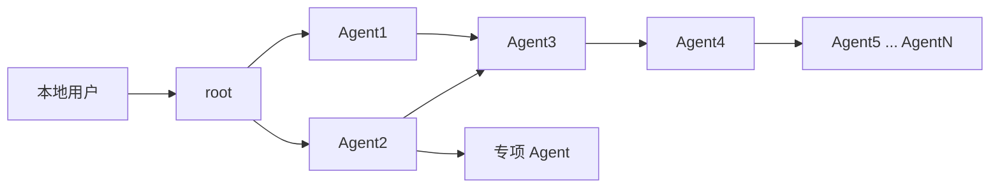
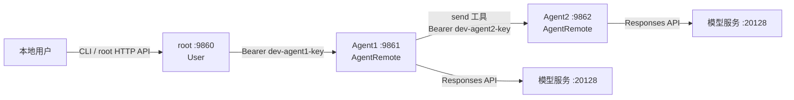
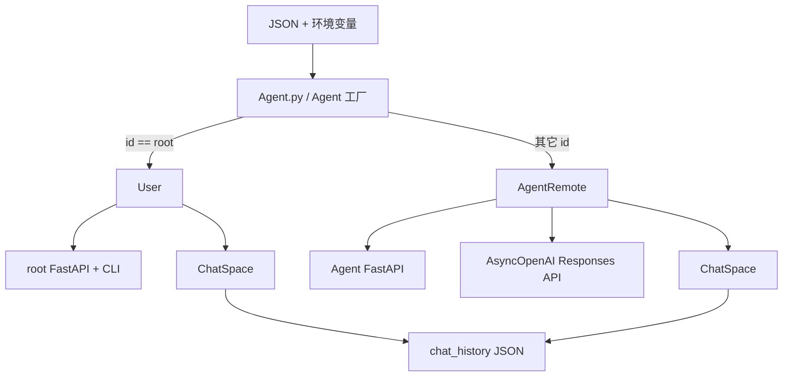
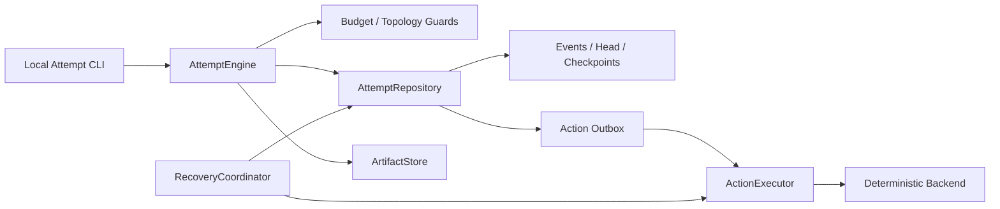
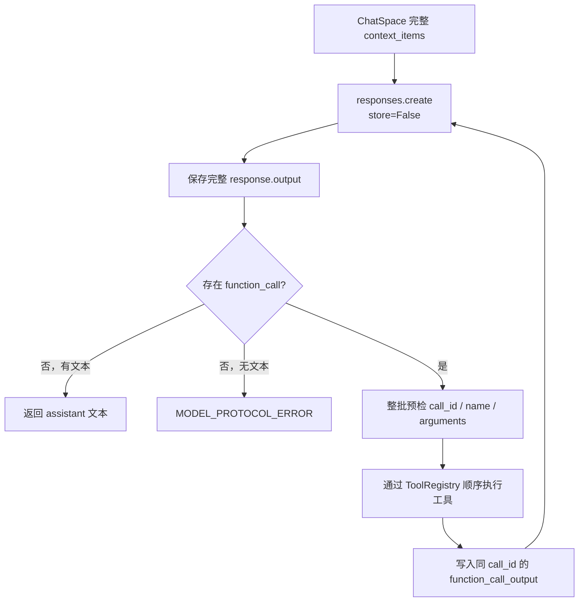

# AgentGraphInternet

AgentGraphInternet 是一个使用 Python、FastAPI、HTTPX 和 OpenAI Responses API 构建的最小有向 Agent 图运行时。它不把协作关系固化为单条链：每个进程只运行一个由 JSON 配置创建的节点，每个节点都可以拥有零个、一个或多个出站邻居，多个上游节点也可以共同指向同一个下游节点。普通 Agent 只能调用本地 allowlist 中明确列出的目标，`root` 则作为不调用模型的本地用户入口。

当前版本定位为 **MVP / 架构验证版本**：核心通信、上下文、工具循环、并发、持久化、拓扑发现和确定性测试已经完成；前端、分布式会话、强身份认证和生产可观测性仍属于后续工作。仓库中的 `root → Agent1 → Agent2` 只是便于测试和教学的最小样例，不是架构能够表达的拓扑上限。

## 文档导航

- [中文入门教程](docs/中文入门教程.md)：面向 Python 初学者，从语言基础到三节点链路逐步讲解。
- [项目交接文档](HANDOFF.md)：面向接手开发的 Agent 或维护者，包含架构不变量、测试地图、Git 状态、风险和续作建议。
- **Architecture designs**
  - [Multi-Agent Architecture Research Platform Design](docs/superpowers/specs/2026-07-23-multi-agent-research-platform-design.md)：产品方向、策略矩阵、评估和报告的上位设计。
  - [Agent Orchestration State Design](docs/superpowers/specs/2026-07-23-agent-orchestration-state-design.md)：Attempt 状态、持久化、outbox、暂停和恢复的规范设计。
  - [Agent Orchestration State Kernel Implementation Plan](docs/superpowers/plans/2026-07-23-agent-orchestration-state-kernel.md)：实现顺序、验证证据和提交边界。若状态语义冲突，以状态设计为准；研究目标冲突以上位设计为准。
- [三节点确定性验收](tests/test_integration_chain.py)：可执行的端到端协议说明。
- [示例配置目录](agents_setting)：root、Agent1、Agent2 的本地链路。

## 目录

1. [项目特性](#项目特性)
2. [设计理念与核心思想](#设计理念与核心思想)
3. [架构概览](#架构概览)
4. [核心概念](#核心概念)
5. [环境要求](#环境要求)
6. [快速开始](#快速开始)
7. [项目结构](#项目结构)
8. [配置说明](#配置说明)
9. [CLI 使用](#cli-使用)
10. [HTTP API](#http-api)
11. [Responses 工具循环](#responses-工具循环)
12. [会话、并发与关闭语义](#会话并发与关闭语义)
13. [拓扑发现](#拓扑发现)
14. [持久化](#持久化)
15. [安全模型](#安全模型)
16. [测试与质量门禁](#测试与质量门禁)
17. [常见问题](#常见问题)
18. [开发与交付流程](#开发与交付流程)
19. [当前限制与路线图](#当前限制与路线图)
20. [官方参考](#官方参考)

## 项目特性

| 能力                         | 状态   | 说明                                                                                         |
| ---------------------------- | ------ | -------------------------------------------------------------------------------------------- |
| 单进程单 Agent               | 已完成 | `Agent.py --config <json>` 每次只创建一个节点                                              |
| root 特殊网关                | 已完成 | 固定`id=root`，无模型、无 system prompt、无工具                                            |
| Agent 间 HTTP(S)             | 已完成 | FastAPI 服务端、HTTPX 客户端、目标 Bearer 认证                                               |
| 有向 allowlist               | 已完成 | 模型只能选择本地配置中允许的`to_id`                                                        |
| 任意有向图拓扑               | 已完成 | 每个节点可配置多个出边，支持分叉、汇聚、多级扩展和显式环路                                   |
| Responses API                | 已完成 | `AsyncOpenAI.responses.create()`、`store=False`                                          |
| 工具调用循环                 | 已完成 | 冻结`ToolRegistry`、内置 `send`/`close`、可配置扩展、完整 output 回放与原 call id 配对 |
| 会话隔离                     | 已完成 | 入站会话按`(from_id, conversation_id)` 独立 `ChatSpace`                                  |
| 并发控制                     | 已完成 | 同`ConversationKey` FIFO；不同键立即 409                                                   |
| 原子归档                     | 已完成 | 同目录临时文件、`fsync`、`os.replace`                                                    |
| 拓扑发现                     | 已完成 | 逐级委托、防环、预算、部分结果、脱敏                                                         |
| root CLI                     | 已完成 | talk、topology、history、close、quit                                                         |
| 确定性端到端测试             | 已完成 | root→Agent1→Agent2 的真实 ASGI/HTTP 链路                                                   |
| 真实模型 smoke               | 可选   | 仅在显式环境开关和本地 20128 服务存在时运行                                                  |
| Web 前端                     | 未实现 | 已保留稳定 HTTP API                                                                          |
| Agent 数据面分布式运行与恢复 | 未实现 | 当前 Agent 会话和锁只在单进程内存中                                                          |
| Attempt 状态内核控制面       | 已完成 | 独立`experiment_system` 包、SQLite WAL、artifact、outbox、暂停、外部输入和恢复             |
| 本地 Attempt CLI             | 已完成 | create/status/pause/resume/cancel/submit-input/recover；不启动 live Backend                  |

## 设计理念与核心思想

### 图是基本模型，链只是最小样例

AgentGraphInternet 的基本抽象不是一条固定的 Agent 调用链，而是一张由配置共同定义的有向图：

- 每个 `root` 或普通 Agent 都是图中的一个节点；
- 当 Agent A 的 JSON 配置在 `agents[]` 中声明 Agent B 时，图中就存在一条 `A → B` 有向边；
- 一个节点的出度可以是 0、1 或任意多个，因此 root 可以同时访问 Agent1、Agent2，Agent1 也可以同时访问多个下游；
- 多个节点可以指向同一个节点，因此 Agent1、Agent2 可以共同调用 Agent3，形成汇聚；
- 只要显式配置反向边，拓扑也可以包含环；拓扑发现会使用 `visited_ids` 防止递归遍历陷入死循环。

例如，下面是一张同时包含分叉、汇聚和继续向下扩展的有向图：



因此，仓库中的三节点配置只是最小可验证切片。通过继续创建 JSON 配置、启动对应进程并添加有向邻接关系，可以扩展出更宽、更深的 Agent 图。这里所说的“无限深”是指架构没有写死固定层数；实际一次请求仍受进程数量、网络、模型上下文、工具调用次数和拓扑预算限制，不能无资源约束地无限执行。

### 局部邻接表组成全局图

系统不要求每个 Agent 保存整张网络，也不依赖一个掌握全部节点和密钥的中心注册表。每个配置文件只保存当前节点自身信息和它可以访问的直接邻居，相当于图的一行邻接表。所有节点的局部配置组合起来，才形成完整的全局有向图。

这种设计带来几个重要性质：

- 增加 Agent4 时，通常只需修改需要访问 Agent4 的直接上游，不必修改所有节点；
- Agent1 与 Agent2 都可以保存 Agent3 的访问配置，而 Agent3 不需要知道是谁能够调用自己；
- 如果需要双向通信，必须分别配置 `A → B` 和 `B → A` 两条边，权限不会被自动推断；
- 节点可以部署在不同主机，只要相应有向边上的地址、端口、协议和凭据有效。

### 有向边既是连接，也是能力边界

`agents[]` 不只是网络地址簿，也是一份最小权限 allowlist。模型可以决定“这一步应该询问哪个可见 Agent”并提供 `to_id` 与消息，但不能自己指定 URL、端口或通信 key。程序只会从本地配置解析目标连接信息。

这实现了职责分离：

- 模型负责语义路由、任务拆分和判断何时需要下游能力；
- Python 运行时负责身份校验、目标解析、输入验证、超时、并发和资源上限；
- 配置维护者决定图中存在哪些边，也就决定每个 Agent 实际拥有何种网络能力。

### 每个普通 Agent 同时扮演服务端与客户端

普通 Agent 面向上游时是一个可回复消息的 HTTP 服务端，面向下游时又可以通过 `send` 工具成为 HTTP 客户端。这种双重身份让同一套节点模型可以递归组合：上游 Agent 不需要知道下游任务又被拆给了多少层，只需要把下游最终结果当作工具结果继续推理。

`root` 是特殊的入口节点，而不是必须掌握全局计划的中央调度器。它可以直接连接一个或多个普通 Agent；后续任务如何沿图传播，由每个节点在自己的可见邻居范围内逐跳决定。

### 图描述可通信关系，会话仍然彼此隔离

图中的边表示“谁被允许向谁发起请求”，不表示全图共享一份上下文。普通 Agent 使用 `ConversationKey(from_id, conversation_id)` 标识入站分支：上游消息在当前 Agent 中以 `user` 身份进入，下游回复在调用方中以工具结果返回，root 与直接 Agent 的对话则使用普通的 `user/assistant` 角色。

每个新入站键都会创建一个拥有独立本地 UUID 的 `ChatSpace`。模型调用 `send(msg, to_id)` 或 `close(to_id)` 时看不到也不能选择会话 id；运行时自动把当前本地 `ChatSpace.conversation_id` 写入下一跳 HTTP 请求。于是 Agent1、Agent2 汇聚到 Agent3 后，即使都继续询问 Agent4，Agent4 也会得到 `(Agent3, Agent3分支A的本地UUID)` 与 `(Agent3, Agent3分支B的本地UUID)` 两个独立会话。

这种逐跳重新命名避免了无关分支泄漏上下文，也允许同一个直接上游同时拥有多个会话。同一时刻普通 Agent 只服务一个完整 `ConversationKey`：同键请求 FIFO，不同键立即 409。需要跨分支共享的信息必须通过显式消息传递，而不是依赖隐藏的全局内存。

### 去中心化扩展，有限预算执行

图可以在架构层面持续增加节点和层级，但每一次具体操作都必须是有限且可控的：

- 拓扑发现逐级委托给直接邻居，并使用 visited、深度和节点预算控制遍历；
- 单轮模型处理受最大 Responses 步骤数和最大工具调用数约束；
- 每个 Agent 只暴露本地 allowlist 中的边，避免模型任意扩大访问范围；
- 图可以包含环，但同步调用重新进入一个正在服务其它会话键的节点时会得到 409，工具循环上限也会阻止无界调用；
- 并发锁、超时和响应大小限制防止单个分支无限占用节点资源。

核心思想可以概括为：**用局部配置构造全局有向图，用逐跳工具调用完成去中心化协作，用严格边界保证每一步都可认证、可隔离、可限制、可测试。**

## 架构概览

### 最小三节点演示拓扑

> 下面的直链专门用于快速开始和确定性端到端测试。它是一般有向图的一种最简单特例，不代表系统只能按直线连接。



授权是有向的：

- root 的 `agents[]` 保存访问 Agent1 所需的地址和 Agent1 key；
- Agent1 的 `agents[]` 保存访问 Agent2 所需的地址和 Agent2 key；
- Agent2 不需要保存 Agent1 的信息，除非显式增加反向边；
- 任一节点的 `agents[]` 都可以同时包含多个目标，多个节点也可以分别配置指向同一个目标；
- 模型只能提供 `to_id` 和消息，真实 URL、端口和 key 始终由本地配置解析。

### 运行时组件



### Attempt 状态内核控制面

`experiment_system` 是与现有 Agent 数据面隔离的控制面。`Agent.py`、
`AgentRemote.py`、`User.py`、`core.py`、`tool_system/` 和既有 HTTP 契约没有
改变，也不会导入 `experiment_system`。状态内核通过严格 Command 和 Event、
事务 outbox、SQLite WAL 与 immutable artifacts 管理 Attempt；它不接管当前
Responses/HTTP 执行路径。



当前生产 CLI 故意使用空 Backend registry：本阶段没有 `ResponseRunner`、
`LiveLLMBackend`、现有 Agent runtime adapter 或 Backend 配置格式。需要 Backend
的恢复会输出结构化 `RecoverySummary` 并安全地返回非零码，不会触发模型、网络或
外部工具调用。

## 核心概念

### AgentConfig 与 PeerConfig

- `AgentConfig` 描述当前节点自身：id、介绍、监听地址、入站 key、模型、限制和直接邻居。
- `PeerConfig` 描述一个可访问目标：id、IP、协议、端口、目标 key 和可选 CA。
- 配置字符串支持 `${ENV_VAR}` 递归展开。
- secret 使用 Pydantic `SecretStr` 承载，错误信息不回显输入值。

### User

`User` 是固定 `id=root` 的特殊节点：

- 不创建 OpenAI 客户端；
- 不生成 system instructions；
- 不向模型暴露工具；
- 只与配置中的直接 Agent 对话；
- 将本地用户消息记录为 `user`，远端回复记录为 `assistant`。

### AgentRemote

`AgentRemote` 是普通模型节点：

- 按完整 `ConversationKey` 维护入站会话；
- 调用 Responses API；
- 校验并执行 `send` / `close`；
- 提供认证 HTTP API；
- 处理同会话 FIFO、异会话 409；
- 对外公开脱敏 profile 和递归 topology。

### ChatSpace

每个 `ChatSpace` 同时保存：

- `messages`：面向用户或前端的简单 `user/assistant` 文本；
- `context_items`：可完整回放给 Responses API 的 message、reasoning、function call 和 function output；
- `instructions`：当前 Agent 和 caller 的可信系统说明；
- `tools`：当前会话可用的严格工具定义；
- `conversation_id`：当前节点生成的本地分支 UUID，也是归档文件名和下一跳请求携带的会话 id。

## 环境要求

### 必需

- Python 3.12+
- [uv](https://docs.astral.sh/uv/)
- Windows PowerShell、PowerShell 7 或兼容终端

### 真实模型运行所需

示例配置假定：

- Responses API 兼容服务：`http://localhost:20128/v1`
- 模型标识：`gpt-5.6-luna`
- 模型 key：环境变量 `OPENAI_API_KEY`

`gpt-5.6-luna` 是项目使用者指定的本地模型标识，不代表 OpenAI 公共模型目录中的官方名称。

### 安装依赖

```powershell
uv sync --locked
```

检查环境：

```powershell
uv run python --version
uv run python -c "import openai; print(openai.__version__)"
```

## 快速开始

### 1. 先运行离线测试

默认测试不调用真实模型：

```powershell
$env:UV_CACHE_DIR = '.uv-cache'
$testTemp = Join-Path $env:TEMP ('agentgraph-test-' + [guid]::NewGuid().ToString('N'))
uv run pytest -m "not live" -q -p no:cacheprovider --basetemp=$testTemp
```

Task 18 clean detached worktree 的当前离线证据为
`1159 passed, 1 deselected`；被排除项是显式 `live` smoke。

只运行三节点确定性验收：

```powershell
$testTemp = Join-Path $env:TEMP ('agentgraph-chain-' + [guid]::NewGuid().ToString('N'))
uv run pytest -q -p no:cacheprovider --basetemp=$testTemp tests/test_integration_chain.py
```

### 2. 设置模型 key

在启动 Agent1、Agent2 的 PowerShell 进程中设置：

```powershell
$env:OPENAI_API_KEY = '<your-key>'
```

不要把真实 key 写入 JSON、README、提交、错误文本或测试快照。

### 3. 按下游到上游的顺序启动

窗口 1：Agent2

```powershell
uv run python Agent.py --config agents_setting/Agent2.json --no-interactive
```

窗口 2：Agent1

```powershell
uv run python Agent.py --config agents_setting/Agent1.json --no-interactive
```

窗口 3：root

```powershell
uv run python Agent.py --config agents_setting/root.json --interactive
```

### 4. 发起对话

```text
/talk Agent1 请询问Agent2在干嘛
```

其它 CLI 命令：

```text
/topology
/history Agent1
/close Agent1
/quit
```

## 项目结构

```text
AgentGraph/
├─ Agent.py                      # 统一配置入口、Uvicorn 和 root CLI
├─ AgentRemote.py                # 普通 Agent、工具循环、并发、拓扑
├─ User.py                       # root 网关、会话管理和 root API
├─ core.py                       # 配置、schema、错误和 ChatSpace
├─ tool_system/                  # 工具契约、冻结注册表和内置工具目录
│  └─ builtin_tools/             # `send`、`close` 与 BUILTIN_TOOLS
├─ ToolExtension/                # 受信任外部工具的显式 EXTENSION_TOOLS 目录
│  ├─ text_stats.py              # 教学：严格文本统计工具
│  ├─ agent_info.py              # 教学：最小 Agent 公开身份工具
│  └─ get_weather.py             # 教学：Open-Meteo 异步资源生命周期工具
├─ experiment_system/            # 独立 Attempt 控制面
│  ├─ cli.py                     # 本地 create/status/control/recover CLI
│  ├─ state.py                   # Attempt 状态与只读视图
│  ├─ commands.py                # 严格 Command union
│  ├─ events.py / reducer.py     # append-only Events 与纯投影
│  ├─ engine.py                  # 唯一逻辑状态写入边界
│  ├─ store.py / stores/         # repository contract、memory、SQLite WAL
│  ├─ artifacts.py               # content-addressed immutable artifacts
│  ├─ executor.py / runner.py    # outbox dispatch 与确定性驱动
│  ├─ recovery.py                # 按 Action policy 的启动恢复
│  └─ backends/ / strategies/    # 当前仅确定性 adapters
├─ README.md                     # 正式项目入口
├─ HANDOFF.md                    # 项目交接文档
├─ pyproject.toml                # 项目元数据、依赖和 pytest 配置
├─ uv.lock                       # 锁定依赖版本
├─ agents_setting/
│  ├─ root.json
│  ├─ Agent1.json
│  └─ Agent2.json
├─ docs/
│  ├─ 中文入门教程.md
│  └─ superpowers/               # 两份 architecture specs 与实现计划
└─ tests/
   ├─ helpers.py
   ├─ test_config.py
   ├─ test_chat_space.py
   ├─ test_agent_remote.py
   ├─ test_agent_api.py
   ├─ test_user.py
   ├─ test_agent_entry.py
   ├─ test_example_extension_tools.py
   ├─ test_integration_chain.py
   ├─ test_experiment_cli.py
   ├─ test_experiment_store_contract.py
   ├─ test_experiment_sqlite_store.py
   ├─ test_experiment_recovery.py
   ├─ test_experiment_crash_matrix.py
   └─ test_live_chain.py
```

## 配置说明

### 节点字段

| 字段                            | 类型    | 必需          | 默认值        | 说明                                        |
| ------------------------------- | ------- | ------------- | ------------- | ------------------------------------------- |
| `id`                          | string  | 是            | 无            | 稳定节点 id；`root` 选择 `User` 运行时  |
| `introduction`                | string  | 是            | 无            | 非空职责说明，最大 2000 字符                |
| `host`                        | string  | 否            | `127.0.0.1` | Uvicorn 监听地址                            |
| `port`                        | integer | 是            | 无            | 1–65535                                    |
| `key`                         | string  | 普通 Agent 是 | `null`      | 当前节点验证入站 Bearer 的 key              |
| `openai_baseurl`              | string  | 普通 Agent 是 | `null`      | Responses API 基础 URL                      |
| `openai_key`                  | string  | 普通 Agent 是 | `null`      | 模型 key，建议`${ENV_VAR}`                |
| `model`                       | string  | 普通 Agent 是 | `null`      | Responses API 模型名                        |
| `agents`                      | array   | 否            | `[]`        | 当前节点允许访问的直接邻居                  |
| `tools`                       | object  | 否            | `{}`        | 普通 Agent 的外部工具选择；省略时不启用扩展 |
| `ssl_certfile`                | path    | 否            | `null`      | 当前 Uvicorn HTTPS 证书                     |
| `ssl_keyfile`                 | path    | 否            | `null`      | 当前 Uvicorn HTTPS 私钥，必须与证书成对     |
| `http_timeout_seconds`        | number  | 否            | `60`        | Agent 间 HTTP 超时                          |
| `openai_timeout_seconds`      | number  | 否            | `600`       | 模型请求超时                                |
| `include_encrypted_reasoning` | boolean | 否            | `true`      | 是否请求并回放加密 reasoning item           |
| `max_tool_calls_per_turn`     | integer | 否            | `200`       | 单轮工具调用总上限                          |
| `max_response_steps_per_turn` | integer | 否            | `256`       | 单轮 Responses 请求步数上限                 |
| `max_context_chars`          | integer \| null | 否     | `null`      | 会话上下文字符预算（序列化字符数，非 token）；启用后从最旧单元裁剪，`function_call` 与其结果同进退，保留最新单元不清空 |
| `topology_max_nodes`          | integer | 否            | `1000`      | 拓扑节点及不可信记录预算                    |
| `topology_max_depth`          | integer | 否            | `64`        | 拓扑递归深度上限                            |

### `agents[]` 字段

| 字段         | 类型                 | 必需 | 默认值        | 说明                          |
| ------------ | -------------------- | ---- | ------------- | ----------------------------- |
| `id`       | string               | 是   | 无            | 目标 Agent id                 |
| `ip`       | string               | 否   | `127.0.0.1` | 目标地址                      |
| `protocol` | `http` / `https` | 否   | `http`      | 通信协议                      |
| `port`     | integer              | 是   | 无            | 目标端口                      |
| `key`      | string               | 是   | 无            | 调用目标时发送的 Bearer key   |
| `ca_file`  | path                 | 否   | `null`      | 验证目标 HTTPS 证书的 CA 文件 |

### `tools.extensions`

普通 Agent 可用 `tools.extensions` 控制 `ToolExtension.EXTENSION_TOOLS` 中的受信任扩展工具：

```json
{
  "tools": {
    "extensions": ["text_stats", "agent_info", "get_weather"]
  }
}
```

- 省略 `tools` 或 `extensions` 等价于 `[]`，不启用外部工具；
- `"all"` 启用目录中全部扩展，当前按 `text_stats`、`agent_info`、`get_weather` 的目录顺序加载；`"none"` 不启用外部工具；
- 名称列表只启用指定工具，例如 `{"extensions": ["text_stats", "agent_info", "get_weather"]}`；名称区分大小写、不得重复，且必须在 `EXTENSION_TOOLS` 中存在；注册到目录不等于启用；
- `root` 只允许省略、`[]` 或 `"none"`，不会导入扩展目录，也不会向模型暴露工具；
- 内置 `send`、`close` 不需要写入配置；它们由 `BUILTIN_TOOLS` 按固定顺序提供，并在当前 Agent 没有直接邻居时一起隐藏。

### 环境变量展开

```json
{
  "openai_key": "${OPENAI_API_KEY}"
}
```

变量缺失时会产生安全 `ConfigError`，只报告缺失的变量名，不回显原始 JSON 或其它 secret。

### HTTPS

服务端：

```json
{
  "ssl_certfile": "certs/agent.crt",
  "ssl_keyfile": "certs/agent.key"
}
```

调用方邻居：

```json
{
  "protocol": "https",
  "ca_file": "certs/private-ca.crt"
}
```

证书和私钥不得提交到仓库；`.gitignore` 已排除常见 `*.pem`、`*.key` 和 `.env*`。

## CLI 使用

### Agent 数据面 CLI

交互式聊天 CLI 只适用于 root。普通 Agent 即使传入 `--interactive` 也不会进入用户交互循环。

| 命令          | 参数                  | 作用                                    |
| ------------- | --------------------- | --------------------------------------- |
| `/talk`     | `<to_id> <message>` | 向 root 直接可见 Agent 发消息           |
| `/topology` | 无                    | 获取完整脱敏拓扑                        |
| `/history`  | `<to_id>`           | 获取 root 本地可读历史                  |
| `/close`    | `<to_id>`           | 远端优先关闭并归档会话                  |
| `/quit`     | 无                    | 停止 CLI 和 Uvicorn，等待 lifespan 清理 |

同步 `input()` 通过 `asyncio.to_thread()` 执行，避免阻塞 Uvicorn 事件循环。

### Attempt 控制面 CLI

Attempt CLI 是独立的本地进程入口。数据库由全局 `--database` 指定；artifact
目录固定为数据库父目录下的 `artifacts/`。以下示例使用临时目录，不会启动 Agent、
模型或网络调用：

```powershell
$stateRoot = New-Item -ItemType Directory -Path (Join-Path $env:TEMP ('agentgraph-state-' + [guid]::NewGuid().ToString('N')))
$database = Join-Path $stateRoot.FullName 'attempts.sqlite3'
$createCommand = 'C:\approved-input\create-attempt.json' # 预先生成的严格 Command 文件

$created = python -m experiment_system --database $database attempt create --command-json $createCommand | ConvertFrom-Json
$attemptId = $created.attempt_id
python -m experiment_system --database $database attempt status $attemptId
python -m experiment_system --database $database recover

# controls 针对已由 Engine 推进到相应 phase 的既有 Attempt；本 CLI 没有 start/run
$runningAttemptId = 'replace-with-running-attempt-id'
$pausedAttemptId = 'replace-with-paused-attempt-id'
$cancellableAttemptId = 'replace-with-cancellable-attempt-id'
python -m experiment_system --database $database attempt pause $runningAttemptId
python -m experiment_system --database $database attempt resume $pausedAttemptId
python -m experiment_system --database $database attempt cancel $cancellableAttemptId
```

`create-attempt.json` 必须是完整、严格且 `command_type="CREATE_ATTEMPT"` 的
`CreateAttempt` Command JSON；未知字段、非法 UUID、其它 Command discriminator
或不合法 JSON 都会被拒绝。`create` 只写入 `PLANNED` Attempt，本阶段没有
`start`、`run` 或 live Backend 命令。上面的命令展示独立语法与 phase 前置条件，
不是把新建 `PLANNED` Attempt 直接 pause/resume 的顺序脚本。

外部输入只接受既有的六种 response kind。`APPROVE`、`REJECT`、`ABANDON`
不带详情；`PROVIDE_INPUT`、`CONFIRM_SUCCEEDED` 必须通过
`--response-ref-json` 提供严格 `ArtifactRef` JSON；`CONFIRM_FAILED` 必须通过
`--error-json` 提供严格 `ErrorSummary` JSON。例如：

```powershell
$artifactRef = '{"capture_class":"hashed","content_hash":"aaaaaaaaaaaaaaaaaaaaaaaaaaaaaaaaaaaaaaaaaaaaaaaaaaaaaaaaaaaaaaaa","media_type":"text/plain","byte_size":1}'
$requestId = 'replace-with-pending-request-id'
python -m experiment_system --database $database attempt submit-input $attemptId `
  --request-id $requestId `
  --response-kind PROVIDE_INPUT `
  --response-ref-json $artifactRef
```

CLI 不接受 raw prompt 或 raw response 参数。每次 mutating convenience command
只 load 一次 Attempt，使用当时的精确 revision 和新的外部 command id，不做隐藏
重试。成功或结构化恢复失败只输出一个直接 JSON 对象，类型限定为
`OperatorView`、`CommandResult` 或 `RecoverySummary`。

| 退出码 | 含义                                        |
| ------ | ------------------------------------------- |
| `0`  | 成功                                        |
| `2`  | 参数、Command UUID 或 JSON 无效             |
| `3`  | Attempt 不存在                              |
| `4`  | revision conflict；CLI 不重试               |
| `5`  | 其它预期失败，包括缺少可执行 Backend 的恢复 |

错误输出使用固定消息，不回显参数、输入 JSON、Pydantic 详情、异常、URL、凭据或
traceback。生产 CLI 当前装配 SQLite、ArtifactStore、SystemClock、UUID factory、
Engine、Executor 和 RecoveryCoordinator，但 Backend registry 为空。

## HTTP API

### 通用 envelope

成功：

```json
{
  "data": {}
}
```

失败：

```json
{
  "error": {
    "code": "ERROR_CODE",
    "message": "安全错误说明",
    "retry_after_seconds": 60
  }
}
```

`details` 和 `retry_after_seconds` 只在对应错误需要时出现。

### root API

root API 无 Bearer，部署时必须保持在回环地址或受信网络。

| 方法       | 路径                                | 请求                   | 响应 data              |
| ---------- | ----------------------------------- | ---------------------- | ---------------------- |
| `GET`    | `/healthz`                        | 无                     | `{"status":"ok"}`    |
| `POST`   | `/v1/user/chats/{to_id}/messages` | `UserMessageRequest` | 回复文本               |
| `GET`    | `/v1/user/chats/{to_id}`          | 无                     | 可读消息数组           |
| `DELETE` | `/v1/user/chats/{to_id}`          | 无                     | `closed/saved`       |
| `GET`    | `/v1/user/topology`               | 无                     | `nodes/edges/errors` |

发送消息：

```powershell
$body = @{
  message = '请询问Agent2在干嘛'
  request_id = [guid]::NewGuid().ToString()
} | ConvertTo-Json

Invoke-RestMethod -Method Post `
  -Uri 'http://127.0.0.1:9860/v1/user/chats/Agent1/messages' `
  -ContentType 'application/json' `
  -Body $body
```

获取拓扑：

```powershell
Invoke-RestMethod -Method Get `
  -Uri 'http://127.0.0.1:9860/v1/user/topology'
```

关闭会话：

```powershell
Invoke-RestMethod -Method Delete `
  -Uri 'http://127.0.0.1:9860/v1/user/chats/Agent1'
```

### 普通 Agent API

除 `/healthz` 外，普通 Agent 路由要求：

```http
Authorization: Bearer <目标 Agent key>
```

| 方法     | 路径                                           | 请求                | 响应 data              |
| -------- | ---------------------------------------------- | ------------------- | ---------------------- |
| `GET`  | `/healthz`                                   | 无                  | `{"status":"ok"}`    |
| `GET`  | `/v1/agents/{target_id}/profile`             | 无 body             | 公开 profile           |
| `POST` | `/v1/agents/{target_id}/messages`            | `MessageRequest`  | 最终 assistant 文本    |
| `POST` | `/v1/agents/{target_id}/conversations/close` | `CloseRequest`    | `closed/saved`       |
| `POST` | `/v1/agents/{target_id}/topology`            | `TopologyRequest` | `nodes/edges/errors` |

消息示例：

```powershell
$headers = @{ Authorization = 'Bearer dev-agent1-key' }
$conversationId = [guid]::NewGuid().ToString()
$body = @{
  from_id = 'root'
  conversation_id = $conversationId
  message = '请询问Agent2在干嘛'
  request_id = [guid]::NewGuid().ToString()
} | ConvertTo-Json

Invoke-RestMethod -Method Post `
  -Uri 'http://127.0.0.1:9861/v1/agents/Agent1/messages' `
  -Headers $headers `
  -ContentType 'application/json' `
  -Body $body
```

关闭同一分支时必须复用调用方本地会话 id：

```powershell
$closeBody = @{
  from_id = 'root'
  conversation_id = $conversationId
  request_id = [guid]::NewGuid().ToString()
} | ConvertTo-Json

Invoke-RestMethod -Method Post `
  -Uri 'http://127.0.0.1:9861/v1/agents/Agent1/conversations/close' `
  -Headers $headers `
  -ContentType 'application/json' `
  -Body $closeBody
```

### 常见错误

| HTTP | code                                                              | 含义                                       |
| ---- | ----------------------------------------------------------------- | ------------------------------------------ |
| 401  | `AUTHENTICATION_FAILED`                                         | 入站 Bearer 缺失或错误                     |
| 403  | `PEER_NOT_ALLOWED`                                              | 目标不在本地 allowlist                     |
| 404  | `TARGET_NOT_FOUND`                                              | URL target id 不是当前 Agent               |
| 409  | `AGENT_BUSY`                                                    | 另一完整`ConversationKey` 正在占用 Agent |
| 413  | `TOPOLOGY_REQUEST_TOO_LARGE`                                    | topology 请求体超过原始字节限制            |
| 422  | `VALIDATION_ERROR` / `INVALID_TOPOLOGY_REQUEST`               | 输入不符合 schema 或遍历限制               |
| 502  | `MODEL_ERROR` / `DOWNSTREAM_ERROR` / `MODEL_PROTOCOL_ERROR` | 模型或下游协议失败                         |
| 504  | `DOWNSTREAM_TIMEOUT`                                            | 下游 Agent 超时                            |

未知异常统一转换为固定 `INTERNAL_ERROR`；公共错误不返回底层异常、完整 URL、消息正文或 key。

## Responses 工具循环

### 工具

普通 Agent 由启动时构建的冻结 `ToolRegistry` 向模型提供工具。内置 `send`、`close` 只在存在直接邻居时可用；启用的外部工具来自 `ToolExtension.EXTENSION_TOOLS`，并按“内置目录顺序，再扩展目录顺序”稳定排列：

- `send(msg, to_id)`：向一个直接可见 Agent 发送消息；运行时附加当前本地会话 id；
- `close(to_id)`：只关闭当前分支在目标远端的会话；运行时附加同一会话 id。
- `text_stats(text)`：`text` 必填，长度为 1 到 10000；返回 `character_count`、`non_whitespace_character_count`、按空白分词的 `word_count`，以及 `splitlines()` 的 `line_count`（尾随换行不新增空行）。`character_count` 使用 Python `len(text)` 统计 Unicode code point，不是用户感知的字素簇，也不是 UTF-8 字节数。
- `agent_info()`：无参数；成功结果固定含 `ok: true`，通过 `get_profile()` 后再次正向白名单取出的身份字段仅为 `agent_id` 与 `introduction`，绝不返回配置、keys、模型 URL、peer、client 或 session。
- `get_weather(location, units)`：两个参数均必填，`units` 仅允许 `celsius` 或 `fahrenheit`。工具只访问固定的 Open-Meteo 主机，先把城市与国家名解析为经纬度，再查询当前温度；模型不能提供或改写请求 URL。

工具 schema 使用：

- `strict=true`；
- 所有字段 required；
- `additionalProperties=false`；
- `to_id` 为直接邻居 id 的 enum。

`GetWeatherTool` 为了与 OpenAI Function Calling 示例的完整工具 JSON 逐字段一致，显式覆写 `parameters_schema()`，避免 Pydantic 自动添加模型和字段 `title`。这不会取代 `GetWeatherArguments`：模型可见 schema 用于 Responses API，Pydantic 模型仍在本地严格校验模型返回的 JSON，精确等值测试防止两者漂移。

`conversation_id` 不属于工具参数，模型无法覆盖或选择它；该字段只存在于 Agent 间的 `MessageRequest` / `CloseRequest` 协议中。

### 循环流程



每个持久化 function call 必须恰好有一个 output。重复 call id、非法结构、模型伪造 output、批次部分写入等情况都有回归测试。

注册表为每个普通 Agent 单独实例化工具，名称映射与 schema 在构建后冻结；`schemas()` 返回独立深拷贝。工具需要异步资源时可实现 `startup()` / `shutdown()`，FastAPI lifespan 会按注册顺序启动、按逆序关闭工具，并在关闭工具后再关闭 Agent 自有客户端。`get_weather` 就是资源型示例：只有被配置启用后才会实例化，`startup()` 创建专用 `httpx.AsyncClient`，`shutdown()` 关闭并清除它；模块导入和注册表构建不会建立连接。

### 新增工具

新增外部工具不需要修改 `AgentRemote`。可参考 `ToolExtension/text_stats.py`、`ToolExtension/agent_info.py` 或资源型的 `ToolExtension/get_weather.py`，然后：

1. 新建独立工具模块，定义继承 `ToolArguments` 的参数模型；所有 schema 属性必须必填，且基类保持 `extra="forbid"`。
2. 定义 `frozen` 的 `ToolSpec`，并实现 `AgentTool` 子类；`execute()` 必须返回严格 JSON 可序列化的 `dict`。
3. 需要异步资源时才实现 `startup()` / `shutdown()`；不要在模块导入时创建客户端、连接或后台资源。若为获得精确的模型可见 JSON 而覆写 `parameters_schema()`，仍必须保留同步的 Pydantic 参数模型做本地校验。
4. 在 `ToolExtension/__init__.py` 的 `EXTENSION_TOOLS` 加入工具类，并维持稳定顺序。注册只是目录许可，不会自动启用工具。
5. 在普通 Agent JSON 明确启用，例如 `{"tools":{"extensions":["text_stats","agent_info","get_weather"]}}`；省略、`[]` 与 `"none"` 都仍不启用外部工具。
6. 补充 schema、严格参数、成功结果、启用选择和敏感字段边界的测试。

内置工具同理，只需加入 `tool_system/builtin_tools/__init__.py` 的 `BUILTIN_TOOLS` 元组。

## 会话、并发与关闭语义

### root

- 每个 `to_id` 一把独立锁；
- 同目标消息和 close 串行；
- 不同目标可并发；
- 成功 talk 记录 `user -> assistant`；
- talk 自动把 root 本地 `ChatSpace.conversation_id` 传给目标；
- close 携带同一 id，远端成功后才保存并删除本地会话；没有本地会话时直接返回未关闭，不猜测远端分支 id。

### 普通 Agent

- 入站会话表、pending count、活动状态和 FIFO 锁都按完整 `ConversationKey` 管理；
- 同一 `(from_id, conversation_id)` 的重叠请求进入同一 FIFO 锁；
- 任一字段不同都视为不同会话，并在已有活动会话时立即得到 409，不进入等待队列；
- close 必须携带会话 id，只保存并删除匹配键对应的 ChatSpace；
- `currentChatSpace` 只在实际执行期间存在；
- 正常、异常和取消路径均在 `finally` 中释放状态。

### 为什么 Agent 间消息不自动重试

超时并不代表远端没有执行。自动重试可能重复触发模型或工具副作用，因此 MVP 每个 Agent 间请求最多发送一次。

## 拓扑发现

拓扑发现采用逐级委托：root 只访问自己的直接邻居，每个邻居再使用自己的 allowlist/key 递归访问下一层。遍历会覆盖不同 sibling 分支、汇聚节点和环路，而不是只沿一条链向下查找。

结果：

```json
{
  "nodes": [
    {"id": "root", "status": "reachable"},
    {"id": "Agent1", "status": "reachable"}
  ],
  "edges": [
    {"from_id": "root", "to_id": "Agent1"}
  ],
  "errors": []
}
```

安全与资源约束：

- `visited_ids` 防止环路；
- depth 和 node budget 受请求与本地配置双重限制；
- sibling 分支共享 visited 和剩余预算；
- 配置中的直接边是可信本地事实；
- 不可信 child nodes、edges、errors 受处理记录预算限制；
- 请求体在 Pydantic 解析前限制原始字节；
- 下游响应要求 `Accept-Encoding: identity`；
- 在读取正文前拒绝压缩；
- 检查 `Content-Length` 和累计 raw bytes；
- 成功数据必须含 list 类型的 `nodes/edges/errors` 和直接 peer 自身节点；
- 单分支失败形成 `unreachable` 节点和局部 error，不中断整体结果；
- 输出只保留公开字段，不包含 key、Authorization 或 OpenAI 配置。

profile 和 topology 不获取聊天锁、不创建 ChatSpace、不调用模型。

## 持久化

### Agent 数据面会话归档

归档路径：

```text
chat_history/<owner_id>/<peer_id>/<conversation_id>.json
```

保存内容包括：

- schema version；
- owner / peer / conversation id；
- UTC 保存时间；
- instructions 和 tools；
- 人类可读 messages；
- 完整 Responses context items。

原子写入过程：

1. 在目标目录创建临时文件；
2. 写入 UTF-8 JSON；
3. flush + `fsync`；
4. 使用 `os.replace` 原子替换目标文件；
5. 失败时清理临时文件并保留旧文件和内存状态。

成功 close 后活动会话会从内存删除；当前实现不会在重启时自动恢复归档为活动会话。

### Attempt 控制面状态

Attempt 控制面使用单个 SQLite WAL 数据库保存 Attempt head、immutable Events、
checkpoints、Command results、Actions、outbox、leases 和外部输入请求。artifact 与数据库
分目录保存，默认布局为：

```text
<state-root>/
├─ attempts.sqlite3
├─ attempts.sqlite3-wal         # SQLite 运行期间可能存在
├─ attempts.sqlite3-shm         # SQLite 运行期间可能存在
└─ artifacts/
   └─ sha256/<first-2>/<digest> # 仅 full-capture 的 immutable bytes
```

`hashed` 与 `metadata_only` capture 只保存引用元数据，不创建 artifact 内容文件。

逻辑状态只能由 `AttemptEngine` 写入；Action 接受与 outbox 行在同一事务提交后，
`ActionExecutor` 才能执行副作用。启动恢复依据每个 Action 已持久化的 recovery policy
处理，绝不把未知外部结果猜成失败。SQLite head 损坏可由 immutable Events 重建；
Event 损坏则 fail closed。两套持久化互不接管：`ChatSpace` 仍按原有 JSON close 归档，
Attempt 内核也不会恢复或迁移现有 Agent 会话。

## 安全模型

### 已实现

- 目标地址和 key 只来自本地 allowlist；
- Bearer 只进入 header；
- secret 配置使用 `SecretStr`；
- 配置、校验、模型和下游错误使用固定脱敏消息；
- 未知 HTTP 异常由安全 ASGI 边界消费；
- 模型工具名、参数、JSON 和目标 id 二次校验；
- peer introduction 明确标记为不可信元数据；
- 拒绝压缩拓扑响应并设置多层消费预算；
- 测试 transport 不记录 header、Bearer 或 body；
- `.env`、证书、私钥和聊天归档不进入 Git。
- Attempt CLI 对 Command、ArtifactRef、ErrorSummary 和 Command UUID 做严格边界校验；错误仅输出
  固定摘要，不回显输入 JSON、Pydantic ValidationError、异常、URL、凭据或 traceback。

### MVP 限制

目标级共享 Bearer key 只能证明调用者知道“访问该目标”的秘密，不能强认证 body 中的 `from_id` 或 `conversation_id`。知道同一个目标 key 的调用方可以伪造另一个 caller 或分支 id。

root API 没有认证，默认安全边界是 `127.0.0.1`。

生产建议：

- HTTPS；
- 高熵且独立轮换的 key；
- mTLS、短期签名 token 或 caller 绑定请求签名；
- root 用户认证；
- 限流和审计事件；
- secret manager；
- 结构化脱敏日志与指标。

## 测试与质量门禁

### 测试分层

| 文件                                        | 覆盖重点                                       |
| ------------------------------------------- | ---------------------------------------------- |
| `tests/test_config.py`                    | 配置、环境变量、secret-safe 错误               |
| `tests/test_tool_contract.py`             | 工具声明和严格参数契约                         |
| `tests/test_tool_registry.py`             | 目录校验、三态选择、冻结、分发和生命周期       |
| `tests/test_builtin_tools.py`             | `send` / `close` schema 与会话 id 注入兼容 |
| `tests/test_chat_space.py`                | 双视图、完整 item、深拷贝、原子保存            |
| `tests/test_agent_remote.py`              | 工具循环、协议、并发取消、拓扑                 |
| `tests/test_agent_api.py`                 | 认证、envelope、请求限制、安全异常边界         |
| `tests/test_user.py`                      | root talk/history/close/API/topology           |
| `tests/test_agent_entry.py`               | 工厂、CLI、Uvicorn 生命周期                    |
| `tests/test_integration_chain.py`         | 三节点完整确定性 HTTP 链路                     |
| `tests/test_experiment_cli.py`            | Attempt CLI 契约、退出码、脱敏和生产装配       |
| `tests/test_experiment_store_contract.py` | repository 共享契约与幂等语义                  |
| `tests/test_experiment_sqlite_store.py`   | SQLite WAL、重开、损坏检测与修复               |
| `tests/test_experiment_recovery.py`       | 按 Action policy 恢复与不确定结果处理          |
| `tests/test_experiment_crash_matrix.py`   | 六个持久化边界的 crash injection               |
| `tests/test_live_chain.py`                | 可选真实 Responses smoke                       |

### 默认测试

```powershell
$env:UV_CACHE_DIR = '.uv-cache'
$testTemp = Join-Path $env:TEMP ('agentgraph-test-' + [guid]::NewGuid().ToString('N'))
uv run pytest -m "not live" -q -p no:cacheprovider --basetemp=$testTemp
```

Task 18 CLI/control/recovery 门禁：

```powershell
$testTemp = Join-Path $env:TEMP ('agentgraph-cli-green-' + [guid]::NewGuid())
.\.venv\Scripts\python.exe -m pytest tests\test_experiment_cli.py tests\test_experiment_control.py tests\test_experiment_recovery.py -q -p no:cacheprovider --basetemp=$testTemp
```

状态内核最高风险门禁：

```powershell
$testTemp = Join-Path $env:TEMP ('agentgraph-release-risk-' + [guid]::NewGuid())
.\.venv\Scripts\python.exe -m pytest tests\test_experiment_store_contract.py tests\test_experiment_sqlite_store.py tests\test_experiment_recovery.py tests\test_experiment_crash_matrix.py -q -p no:cacheprovider --basetemp=$testTemp
```

### 编译检查

```powershell
uv run python -m compileall Agent.py AgentRemote.py User.py core.py tool_system ToolExtension
.\.venv\Scripts\python.exe -m compileall -q experiment_system
```

### 真实模型 smoke

```powershell
$env:OPENAI_API_KEY = '<your-key>'
$env:RUN_LIVE = '1'
$testTemp = Join-Path $env:TEMP ('agentgraph-live-' + [guid]::NewGuid().ToString('N'))
uv run pytest -q -p no:cacheprovider --basetemp=$testTemp -m live tests/test_live_chain.py
```

只有当 `RUN_LIVE=1`、`OPENAI_API_KEY` 存在且本地 20128 端口可达时，live 才会继续。它不应成为稳定 CI 门禁。

## 常见问题

### 配置提示缺少 `OPENAI_API_KEY`

```powershell
$env:OPENAI_API_KEY = '<your-key>'
```

环境变量只对当前进程及其子进程有效；三个独立 PowerShell 窗口可能需要分别设置。

### 目标不可达

```powershell
Test-NetConnection 127.0.0.1 -Port 9861
Test-NetConnection 127.0.0.1 -Port 9862
```

检查下游是否启动、端口/协议是否一致，以及是否错误配置 HTTPS。

### 认证失败

检查调用方 `agents[].key` 是否与目标顶层 `key` 对应。不要通过日志打印真实 key 进行比较。

### `AGENT_BUSY`

这是预期并发语义：另一完整 `ConversationKey` 正在占用普通 Agent。即使 `from_id` 相同，只要 `conversation_id` 不同也会立即返回 HTTP 409，并带 `Retry-After: 60`。

### `MODEL_ERROR`

检查模型服务、base URL、模型名、key 和超时。公共 API 故意不回显底层模型异常。

### pytest 缓存权限错误

某些 Windows/Codex 环境中 `.pytest_cache` 可能由其它账户创建。使用独立 `--basetemp` 和 `-p no:cacheprovider`，不要盲目递归删除未知所有者目录。

更完整的初学者排错见 [中文入门教程](docs/中文入门教程.md#17-常见问题与排错)。

## 开发与交付流程

远程是纯 bare Git 仓库，没有 PR Web 页面；默认分支是 `master`。推荐使用短期分支、测试后直接合并：

```powershell
git checkout master
git pull --ff-only origin master
git checkout -b feature/<short-name>

# 先写测试，再实现
git add <files>
git commit -m "feat: concise description"

git checkout master
git merge --no-ff feature/<short-name> -m "merge: concise description"

# 在合并结果上重新运行完整测试
git push origin master
```

提交前至少确认：

- 工作树差异只包含当前任务；
- 新行为有 RED→GREEN 测试；
- 完整测试通过；
- `git diff --check` 通过；
- 没有真实 key、`.env`、证书、聊天记录或临时输出；
- Responses、并发、持久化和拓扑不变量未被破坏。

面向接手 Agent 的详细流程见 [HANDOFF.md](HANDOFF.md)。

## 当前限制与路线图

### 当前限制

- Agent 数据面的会话和锁只在单进程内存中；
- Agent 数据面在 close 前崩溃可能丢失未归档会话，且 JSON 归档不会自动恢复；
- Agent 数据面的 `request_id` 不执行幂等去重或自动重试；
- Attempt 控制面尚未接入 `ResponseRunner`、live Backend 或现有 Agent runtime；
- Attempt CLI 的 production Backend registry 为空，不能执行 live Action；
- 无前端；
- 无动态 Agent 注册；
- 无流式输出；
- 无生产限流、指标和 trace；
- 共享 Bearer 不绑定 caller 身份。

### 推荐路线图

状态内核后续只能按以下顺序另行制定和审批计划；本阶段不创建或实现这些计划：

1. `ResponseRunner` 抽取与显式 `ToolExecutionContext`；
2. `LiveLLMBackend` 与 `DecentralizedPeerStrategy`；
3. 其余策略、Blackboard、Experiment/Trial 规划、evaluation、metrics、Pareto reporting 和 Dashboard。

caller/root 强认证、可观测性、部署和更大规模拓扑测试仍是 Agent 数据面的独立
hardening backlog，不改变上述状态内核顺序。

## 官方参考

- [Python asyncio](https://docs.python.org/3/library/asyncio.html)
- [uv](https://docs.astral.sh/uv/)
- [FastAPI](https://fastapi.tiangolo.com/)
- [Pydantic](https://docs.pydantic.dev/latest/)
- [HTTPX Async Support](https://www.python-httpx.org/async/)
- [OpenAI Function calling](https://developers.openai.com/api/docs/guides/function-calling)
- [OpenAI Responses create API](https://developers.openai.com/api/docs/api-reference/responses/create)

## 许可证

仓库当前未包含独立许可证文件。在复制、分发或对外开源前，请由项目所有者明确许可证和第三方使用条款。
