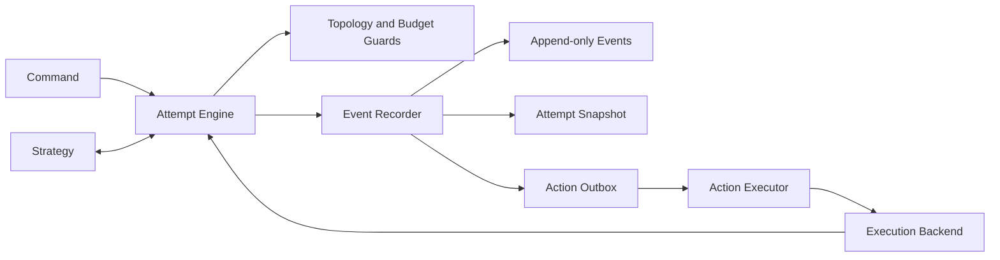

# Agent Orchestration State Design

**Status:** Approved

**Parent design:** [Multi-Agent Architecture Research Platform Design](2026-07-23-multi-agent-research-platform-design.md)

**Date:** 2026-07-23

**Priority:** Recoverability and control, then explicit orchestration, then shared memory

## 1. Context

AgentGraphInternet currently implements a directed Agent communication runtime. Each
normal Agent is both an HTTP server and client, configured peers form a local
capability allowlist, every hop receives an isolated conversation identity, and the
Responses tool loop preserves complete provider output. The runtime also has strict
per-conversation concurrency, atomic conversation archives, bounded topology
discovery, and deterministic protocol tests.

The current runtime already contains several unrelated forms of mutable state:

- `ChatSpace.messages` and `ChatSpace.context_items` hold conversation context.
- `AgentRemote.chat_spaces` holds active conversation branches in process memory.
- `_active_conversation_key`, `_pending_counts`, and conversation locks hold
  ephemeral concurrency state.
- `ToolRegistryState` holds process-resource lifecycle state.
- The approved research-platform design introduces trial lifecycle, strategy state,
  Action lifecycle, budgets, and append-only events.

These state categories have different owners, lifetimes, consistency requirements,
and recovery rules. Combining them in one LangGraph-like dictionary would make the
state explicit without making the system controllable.

This design adds an event-sourced orchestration state kernel. It complements the
approved `Multi-Agent Architecture Research Platform Design`; it does not replace
the existing Agent runtime or turn the project into a general workflow DSL.

## 2. Goals

- Make one Attempt pausable, inspectable, resumable at safe boundaries, cancellable,
  and auditable.
- Reconstruct control state from durable facts without invoking a model, tool, or
  Agent.
- Make every routing, budget, concurrency, approval, retry, and termination decision
  explicit.
- Prevent uncommitted decisions from producing side effects.
- Give Strategies a small interface for proposing actions without allowing them to
  bypass Engine policy.
- Preserve the current decentralized recursive runtime as a first-class strategy.
- Provide deterministic state replay, schema evolution, and crash recovery.
- Keep shared cross-Attempt memory outside orchestration state.

## 3. Non-Goals

- Reproducing a live model's interrupted internal execution.
- Persisting Python stacks, coroutines, locks, clients, exceptions, or SDK objects.
- Automatically retrying non-idempotent or outcome-unknown side effects.
- Replacing the existing HTTP protocol in the first state-kernel increment.
- Adding a general-purpose graph DSL.
- Making Blackboard or long-term memory part of the first release.
- Providing production multi-tenancy or distributed consensus.

## 4. Alternatives Considered

### 4.1 Shared mutable State with field reducers

Every node would receive a shared state schema and return partial field updates.
Per-field reducers would replace or combine values.

This is familiar and provides fast progress for simple routing, but it does not
define whether a remote side effect happened before a crash. Generic field merging
also hides conflicts in budgets, Action lifecycles, and approvals. It is rejected as
the orchestration source of truth.

### 4.2 Event-sourced Attempt aggregate

Commands are validated against the current Attempt state, accepted decisions become
immutable events, a pure reducer projects events into `AttemptState`, and committed
Actions execute through an outbox.

This requires more domain modeling and persistence work, but it directly supports
the selected priority: pause, recovery, audit, budget control, and explicit
orchestration. This is the selected approach.

### 4.3 Per-Agent actor state with a shared Blackboard

Each Agent would own durable local state and coordinate through versioned shared
memory. This fits later shared-memory experiments, but global pause, budget,
causality, and recovery would remain distributed. It is deferred as a collaboration
strategy and cross-Attempt Store, not used as the control plane.

## 5. Core Decisions

1. The orchestration aggregate is one execution Attempt, represented by
   `AttemptState`.
2. Events are the durable source of truth; `AttemptState` is a projection and
   checkpoint.
3. The Experiment Engine is the only logical writer of Attempt control state.
4. Strategies consume read-only views and committed events, then return proposed
   Actions plus private serializable state.
5. Every external side effect is represented by a committed Action before it runs.
6. Conversation/provider context is referenced from Attempt state but owned by the
   execution backend.
7. Runtime dependencies and locks are never persisted.
8. Shared memory is a separate Store with a different scope and consistency model.
9. Recovery resumes only from explicit committed boundaries.
10. Outcome-unknown side effects are never silently classified as cancelled or
    failed.

## 6. Architecture



The execution loop is:

1. Load `AttemptState` and its revision.
2. Deliver only committed information to the Strategy.
3. Receive a `StrategyDecision` containing proposed Actions and a new private
   strategy-state envelope.
4. Validate Attempt phase, topology, budget, permissions, concurrency, and approval
   policy.
5. Commit decision events, budget reservations, and accepted outbox Actions in one
   transaction.
6. Execute only committed Actions.
7. Normalize execution outcomes into Commands, commit outcome events, and project a
   new state.
8. Repeat until the Attempt pauses, waits for external input, or terminates.

If event persistence fails, the next transition and its side effects do not run.

## 7. State Boundaries

| State category | Examples | Persistence rule |
| --- | --- | --- |
| Immutable definition | ExperimentSpec, manifest, roster, topology, model policy | Persist separately; Attempt stores references and hashes |
| Attempt control state | phase, Actions, invocations, budget, approvals, terminal reason | Persist in events and snapshots |
| Strategy state | router queue, handoff owner, aggregation progress | Persist in a namespaced envelope |
| Invocation context | prompt, Responses items, conversation history | Persist as backend-owned artifacts; Attempt stores references |
| Runtime context | HTTP/OpenAI clients, locks, tasks, ToolRegistry instances | Never persist |
| Shared memory | Blackboard, user facts, reusable knowledge | Separate Store; not part of AttemptState |

`ChatSpace` remains useful as a local conversation implementation. It becomes an
adapter inside the live execution backend rather than the orchestration aggregate.
Its complete `messages` and `context_items` collections must not be copied into every
Attempt snapshot.

## 8. AttemptState

The conceptual model is:

```python
class AttemptState(BaseModel):
    model_config = ConfigDict(extra="forbid", frozen=True)

    schema_version: int
    experiment_id: str
    trial_id: str
    attempt_id: str
    strategy_id: str

    revision: int
    phase: AttemptPhase
    manifest_ref: ArtifactRef

    strategy: StrategyStateEnvelope
    budget: BudgetState
    actions: tuple[ActionState, ...]
    invocations: tuple[InvocationState, ...]
    pending_external: tuple[ExternalRequest, ...]

    result_ref: ArtifactRef | None
    terminal_error: ErrorSummary | None
    started_at: datetime | None
    finished_at: datetime | None
```

The implementation treats state as immutable. Reducers create new values rather
than mutating a state instance exposed to callers. Persisted collections use stable
ordering so canonical JSON and hashes are deterministic.

### 8.1 Attempt lifecycle

```text
PLANNED
  -> RUNNING
      -> PAUSE_REQUESTED -> PAUSED -> RUNNING
      -> WAITING_EXTERNAL -> RUNNING
      -> CANCEL_REQUESTED -> CANCELLED
      -> SUCCEEDED
      -> FAILED
      -> TIMED_OUT
      -> INTERRUPTED
```

`PAUSED` means an operator deliberately stopped execution at a safe boundary.
`WAITING_EXTERNAL` means execution requires an approval, additional input, or
reconciliation decision. They are distinct states with different resume commands.

Terminal Attempts reject further execution transitions. Evaluation and audit
annotations are separate records and cannot rewrite the execution terminal state.

### 8.2 BudgetState

Additive resources such as tokens, calls, and Action counts track:

```text
limit
reserved
consumed
```

The invariant is:

```text
0 <= reserved
0 <= consumed
reserved + consumed <= limit
```

`BudgetState` separately stores `deadline_at`, `max_call_depth`, and
`max_concurrent_actions`; these are guards rather than additive ledgers. The Engine
checks an Action's depth and the current accepted/in-flight count before acceptance.
Wall-clock expiry enters the reducer through an `ExpireAttempt` Command and Event;
the reducer never reads the clock itself.

An accepted Action reserves its maximum permitted additive usage before execution.
Completion settles the reservation exactly once. If a non-replayable Action becomes
outcome-unknown, its reservation remains held while the Attempt waits for
reconciliation. Terminating the Attempt without reconciliation conservatively
settles the reservation at its reserved upper bound and records usage uncertainty.

### 8.3 ActionState

An Action summary contains:

```text
action_id
action_type
actor_id
target_ids
status
causal_parent_id
invocation_id
payload_ref
result_ref
idempotency_key
recovery_policy
reservation_id
retry_of_action_id
error_code
```

Payloads and large results are artifacts. State contains only the data required to
validate future transitions and present a control-plane view.

### 8.4 InvocationState

An invocation summary contains:

```text
invocation_id
agent_id
conversation_id
parent_invocation_id
latest_context_ref
last_action_id
status
```

Conversation ids are runtime-owned. Controlled orchestration uses Engine-issued
stable ids. The existing decentralized adapter retains its hop-local conversation
identity because that behavior is part of the strategy under test.

### 8.5 StrategyStateEnvelope

```text
strategy_id
strategy_schema_version
value_or_artifact_ref
content_hash
byte_size
```

The Engine validates the envelope's strategy identity, schema version, byte limit,
JSON serializability, and hash. It treats the contents as opaque. A Strategy cannot
place platform-owned budget, Action, approval, or Attempt lifecycle fields in this
envelope and expect the Engine to honor them.

### 8.6 ErrorSummary

Persisted failures contain a stable error code, retryability classification, safe
message, and optional redacted detail artifact. Raw exceptions, tracebacks, request
headers, credentials, and full URLs are never state fields.

## 9. Read-Only Views

The complete state is not a public interface.

### 9.1 StrategyView

Contains remaining budget, legal topology, Action and invocation summaries,
Strategy-visible artifacts, and the latest committed event. It excludes credentials,
provider clients, hidden task fixtures, database handles, and unrelated strategy
data.

### 9.2 AgentView

Contains the current task, Agent definition, explicitly authorized context, and
artifact references. An Agent does not receive global control state unless a
specific strategy deliberately exposes a normalized subset.

### 9.3 OperatorView

Contains lifecycle phase, revision, progress, budget, pending external requests,
Action summaries, and redacted failures. It does not expose secrets or raw captured
content by default.

## 10. Commands

A Command requests a transition and may be rejected. Initial Command types are:

- `CreateAttempt`
- `StartAttempt`
- `PauseAttempt`
- `ResumeAttempt`
- `CancelAttempt`
- `SubmitExternalInput`
- `ApplyStrategyDecision`
- `ReportActionStarted`
- `ReportActionOutcome`
- `ExpireAttempt`
- `RecoverAttempt`

Every external Command contains:

```text
command_id
attempt_id
expected_revision
payload
```

`CreateAttempt` is the only Command accepted for a missing Attempt. It uses
`expected_revision = 0` and emits `AttemptPlanned` with `sequence_no = 1`, producing
the initial `PLANNED` state at revision 1. All later Events increment the revision by
one. This keeps `state.revision == last_event.sequence_no` for the entire lifecycle.

The command ledger has a unique `(attempt_id, command_id)` constraint. Repeating an
identical Command returns its stored result and committed revision. Reusing the same
id with a different request hash is rejected. Revision mismatches return a conflict
without appending events.

Internal Executor outcome Commands use the Action id as part of their idempotency
identity so duplicate delivery cannot produce a second outcome.

## 11. Events

An Event is an immutable committed fact. Event models form a strict, versioned
Pydantic discriminated union.

### 11.1 Event envelope

```text
schema_version
event_id
trial_id
attempt_id
sequence_no
event_type
command_id
strategy_id
agent_id
action_id
invocation_id
causal_parent_id
logical_time
wall_time_utc
payload
payload_artifact_ref
```

Fields that do not apply are omitted. `sequence_no` is continuous within one
Attempt. Except for the root planning event, `causal_parent_id` references an earlier
event in the same Attempt.

### 11.2 Event families

- Attempt planned, started, pause requested, paused, resumed, cancel requested, and
  terminal events.
- External input or approval requested, received, rejected, and expired.
- Strategy decision and strategy-state update.
- Action proposed, rejected, accepted, started, succeeded, failed, timed out,
  cancelled, and interrupted with outcome unknown.
- Action outcome reconciliation and operator abandonment of an unknown outcome.
- Invocation requested, started, completed, and failed.
- Message, coordination intent, handoff, critique, vote, and Blackboard references.
- Budget reservation, settlement, release, and conservative uncertain settlement.
- Fault planning and injection.

Corrections append compensating or superseding events. Recorded events are never
updated or deleted.

## 12. Reducer

The reducer has one conceptual interface:

```python
def apply_event(
    state: AttemptState | None,
    event: DomainEvent,
) -> AttemptState:
    ...
```

Rules:

- Every Event type has an explicit handler.
- Only `AttemptPlanned` may reduce from `state is None`.
- Generic `dict.update`, arbitrary state patches, and control-state JSON Patch are
  forbidden.
- The reducer performs no I/O and does not read a clock, random generator, model,
  tool, environment variable, or process state.
- Generated ids, timestamps, and logical time are values in the Event.
- Illegal transitions are rejected before commit and checked again during replay.
- An unknown event schema is passed through an explicit upcaster or fails loading.
- The same initial state and canonical Event sequence produce the same canonical
  state JSON and hash.

LangGraph-style partial updates are allowed only inside the private Strategy state
adapter. Platform control state always advances through domain Events.

## 13. Strategy Decisions

The Strategy interface remains:

```text
initialize(view)
    -> StrategyDecision

on_event(strategy_state, committed_event, view)
    -> StrategyDecision
```

`StrategyDecision` contains a new private state envelope and proposed standard
Actions. The Engine validates and records the decision before any Action executes.
Strategies cannot call a Backend, write the Event store, reserve budget, or update
metrics directly.

An intentional retry is a new Action with a new `action_id` and
`retry_of_action_id`. Duplicate delivery of the original Action keeps the original
id and idempotency key.

## 14. Action Lifecycle

```text
PROPOSED
  -> REJECTED
  -> ACCEPTED
      -> STARTED
          -> SUCCEEDED
          -> FAILED
          -> TIMED_OUT
          -> CANCELLED
          -> OUTCOME_UNKNOWN
```

`OUTCOME_UNKNOWN` is a terminal execution-observation status, not a claim that the
external side effect failed. A later reconciliation is a separate fact attached to
the Action; it does not erase the original loss of observation.

Rules:

- Budget is reserved before acceptance.
- The accepted event and outbox record commit in one transaction.
- The Executor sees only committed outbox rows.
- Every accepted Action reaches one terminal execution-observation status.
- Budget settlement or release occurs once.
- Parallelism is explicit: a Strategy proposes an Action batch with a stable
  `batch_id`, and the Engine reserves the whole batch atomically before accepting any
  member.
- The Engine never infers parallelism from list order.

## 15. Pause and External Input

`PauseAttempt` does not suspend a Python stack:

1. Append `PauseRequested`.
2. Stop accepting new Actions.
3. Apply the configured policy to in-flight Actions: wait, request cancellation, or
   require reconciliation.
4. Once no unsafe in-flight work remains, append `AttemptPaused` and checkpoint.
5. `ResumeAttempt` continues from the committed state revision.

An Action requiring approval produces `ExternalInputRequested` before execution.
The Attempt moves to `WAITING_EXTERNAL`. `SubmitExternalInput` uses a stable request
id and expected revision, then appends an approval or rejection event. Approval is a
new committed boundary; code before the wait is not re-executed.

## 16. Persistence

The initial store is SQLite in WAL mode plus an immutable, content-addressed
artifact directory.

### 16.1 Logical tables

```text
events
  UNIQUE(attempt_id, sequence_no)
  UNIQUE(event_id)
  canonical event_json, event_hash, previous_event_hash

attempt_heads
  attempt_id, revision, state_json, state_hash, schema_version
  latest_event_id, latest_event_hash

attempt_checkpoints
  UNIQUE(attempt_id, revision)
  state_json, state_hash, schema_version, latest_event_id, latest_event_hash

commands
  UNIQUE(attempt_id, command_id)
  request_hash, result_json, committed_revision, checkpoint_written

action_outbox
  UNIQUE(attempt_id, action_id)
  action_json, action_status, recovery_policy, idempotency_key
  accepted_sequence_no, delivery_state, lease_owner, lease_expires_at

artifacts
  artifact_key, nullable content_hash, media_type, byte_size
  nullable relative_path, capture_class with full/hashed/metadata_only checks

attempt_artifacts
  UNIQUE(attempt_id, artifact_key)
  UNIQUE(attempt_id, ordinal)
```

`artifact_key` is stable identity for the complete Artifact reference, not merely a
content digest. The Attempt mapping preserves first-registration order. Action ids
are scoped to an Attempt, matching the domain and outbox identity contract.

All writes pass through the Event Recorder/Attempt Repository Module. Strategies and
Backends receive no database handle.

### 16.2 Atomic transition

One SQLite transaction:

1. Checks `expected_revision`.
2. Checks or inserts the command ledger record.
3. Appends all transition Events.
4. Inserts or updates Action outbox rows.
5. Projects and writes the current Attempt head.
6. Writes an immutable checkpoint when the transition is a checkpoint boundary.
7. Stores the deterministic Command result.
8. Commits.

The Executor cannot claim an Action until this transaction commits. A response lost
after commit is recovered by repeating the same Command id.

### 16.3 Checkpoints

- Every committed transition updates the mutable current head.
- Immutable checkpoints are retained at `PAUSED`, `WAITING_EXTERNAL`, all Attempt
  terminal states, and configured event-count intervals.
- A checkpoint records the revision, canonical state, state hash, and latest Event
  id.
- Schema version 1 validates and replays the complete immutable Event stream before
  trusting a checkpoint, then verifies or rebuilds derived rows from Event-prefix
  states. A future checkpoint-tail optimization requires an independently
  revalidatable snapshot encoding and must not weaken fail-closed Event validation.
- A missing or corrupt snapshot can be rebuilt from the Event stream.
- Checkpoint retention may prune intermediate snapshots, but pause, external-wait,
  and terminal checkpoints remain according to the experiment retention policy.

`ChatSpace.save()` remains a compatible human-readable archive/export. It is not an
orchestration checkpoint because active chats are currently archived only on
explicit close and are not restored at process startup.

## 17. Recovery

Each Action type declares one recovery policy:

```text
REPLAY_SAFE
RECONCILABLE
NON_REPLAYABLE
```

Startup recovery reconstructs every nonterminal Attempt, validates its Event stream,
and reconciles nonterminal Actions.

| Last durable Action state | Recovery behavior |
| --- | --- |
| `ACCEPTED`, not `STARTED` | Continue with the same `action_id` |
| `STARTED + REPLAY_SAFE` | Reclaim with the same idempotency key |
| `STARTED + RECONCILABLE` | Query the external system, then record an outcome |
| `STARTED + NON_REPLAYABLE` | Record `OUTCOME_UNKNOWN`; never auto-replay |

User pause and process crash have different semantics:

- A deliberate pause at a safe boundary resumes the same Attempt.
- A deterministic Backend may replay from a committed boundary.
- An interrupted live model call is not resumed from its internal execution point.
- A non-replayable external effect with unknown outcome requires reconciliation or
  terminates the Attempt as interrupted.
- A live rerun after an interrupted Attempt creates a new `attempt_id` under the
  same Trial and preserves the old Attempt.

Recovery appends facts. It never edits pre-crash history.

## 18. Module Layout

```text
experiment_system/
  __init__.py
  contract.py
  spec.py
  planner.py
  state.py
  commands.py
  events.py
  actions.py
  reducer.py
  engine.py
  store.py
  executor.py
  budget.py
  topology.py
  backends/
    __init__.py
    deterministic.py
    live_llm.py
  strategies/
    __init__.py
    single_agent.py
    static_workflow.py
    central_supervisor.py
    router_aggregator.py
    parallel_subagents.py
    handoff.py
    decentralized_peer.py
    shared_blackboard.py
    debate_vote.py
```

The package depends on the current runtime through adapters. Existing runtime files
must not import the experiment package.

### 18.1 External interfaces

```python
AttemptEngine.handle(command: Command) -> CommandResult

AttemptRepository.load(attempt_id: str) -> LoadedAttempt
AttemptRepository.commit(
    transition: Transition,
    expected_revision: int,
) -> CommitResult

Strategy.initialize(view: StrategyView) -> StrategyDecision
Strategy.on_event(
    state: StrategyStateEnvelope,
    event: DomainEvent,
    view: StrategyView,
) -> StrategyDecision

Backend.execute(
    action: NormalizedAction,
    context: ExecutionContext,
) -> ActionOutcome
```

`AttemptEngine.handle()` is the primary control-plane interface. Storage,
idempotency, snapshot, outbox, and replay details stay behind the Engine and
Repository interfaces.

## 19. Integration with the Current Runtime

### 19.1 Separate control plane

The Engine is not added to `User.py`. `User` remains the no-model local human gateway.
Experiment control receives a separate CLI/process:

```text
agentgraph experiment run <spec>
agentgraph attempt status <attempt_id>
agentgraph attempt pause <attempt_id>
agentgraph attempt resume <attempt_id>
agentgraph attempt cancel <attempt_id>
```

The existing `Agent.py --config ...` process entry and HTTP contracts remain stable
while the state kernel is introduced.

### 19.2 ResponseRunner seam

`AgentRemote._run_response_loop()` currently combines provider execution, complete
Responses replay, function-call validation, tool execution, conversation mutation,
and recursive peer calls. Live controlled strategies need a second behavior at this
seam, so the mature extraction target is:

```python
ResponseRunner.run_turn(
    request: InvocationRequest,
    tool_dispatcher: ToolDispatcher,
) -> InvocationOutcome
```

Two adapters justify the seam:

- `DirectToolDispatcher` preserves existing `send`/`close` recursive behavior for
  `DecentralizedPeerStrategy`.
- `IntentToolDispatcher` normalizes model coordination calls into
  `CoordinationIntent` values returned to the Engine.

The extraction happens only after the deterministic state kernel is stable. It must
preserve complete Responses output replay, call-id pairing, atomic response batches,
tool limits, cancellation, and error-safety tests.

### 19.3 Explicit tool execution context

The current tool contract reads `agent.currentChatSpace`. The target interface is:

```python
ToolRegistry.dispatch(name, arguments, execution_context)
AgentTool.execute(arguments, execution_context)
```

`ExecutionContext` contains the invocation id, conversation reference, authorized
capabilities, artifact writer, and normalized cancellation/deadline context. Tools
return domain results or coordination intents. They never mutate `AttemptState`
directly.

Compatibility adapters may supply the existing ChatSpace behavior to old tools while
extensions migrate. No unmanaged background task may retain an execution context
after its Action ends.

## 20. Delivery Sequence

### Phase 1: State kernel

- Strict state, Command, Event, and Action models.
- Pure reducer and in-memory Repository fake.
- SQLite Event store, command ledger, snapshots, and outbox.
- Attempt Engine with budget and topology guards.

### Phase 2: Deterministic vertical slice

- Deterministic Backend.
- Single-Agent Strategy.
- One objectively validated task.
- Audit replay and machine-readable result.

### Phase 3: Control and recovery

- Pause/resume/cancel Commands.
- External approval/input.
- Executor leases and crash recovery.
- Recovery policies and fault injection.
- Static Workflow and explicit parallel Action batches.

### Phase 4: Live adapter

- ResponseRunner extraction.
- Explicit ToolExecutionContext.
- Intent ToolDispatcher.
- LiveLLM Backend.
- Decentralized Peer compatibility Strategy.

### Phase 5: Strategy expansion

- Router/Aggregator, Supervisor, Parallel Subagents, Handoff, Debate/Vote.
- Versioned Blackboard and shared-memory Strategy last.

This order implements recoverability before widening the strategy matrix, matching
the approved priority `A > B > C`.

## 21. Error, Retry, and Cancellation Semantics

- Errors are normalized into stable codes and safe summaries before persistence.
- Transport never automatically retries side-effecting Actions.
- A Strategy may propose an explicit recovery Action; it receives a new id and
  consumes budget.
- Cancellation is requested and observed as Events. A local task cancellation is not
  proof that an external effect did not happen.
- Timeouts create explicit outcomes and settle budget once.
- Evaluation failure never changes Attempt execution status and can be retried
  independently.

## 22. Security and Data Capture

- Event, snapshot, log, and artifact schemas have no credential fields.
- Authorization headers, API keys, raw exception objects, and complete URLs are
  never captured.
- Capture policy remains `full`, `hashed`, or `metadata_only`.
- Full capture is redacted before writing and is suitable only for controlled local
  research.
- Artifact references are content-addressed and constrained to the configured
  artifact root.
- Strategy and Agent views exclude hidden task fixtures and unrelated private data.
- Tracked Agent configuration must use environment-variable references for model
  credentials. Plaintext local overrides belong in ignored files and credentials
  exposed in a tracked working tree must be rotated.

## 23. Observability

The Event stream is the audit record. Structured runtime logs contain only:

```text
attempt_id
action_id
invocation_id
event_id
revision
duration
normalized_error_code
```

Logs do not duplicate prompts, messages, artifacts, secrets, or raw exceptions.
Metrics are derived from committed Events and cannot be supplied by a Strategy.

## 24. Testing Strategy

### 24.1 Reducer contracts

- Every legal and illegal transition.
- Revision and sequence continuity.
- Duplicate, out-of-order, and unknown-version Event rejection.
- Deterministic canonical state JSON and hash.
- Terminal-state immutability.
- Strategy-state schema and size enforcement.

Property-based or seeded generative tests cover:

```text
budget never becomes negative
reserved + consumed never exceeds limit
causal parents refer to earlier same-Attempt Events
every accepted Action reaches one terminal execution-observation status
an Attempt has at most one execution terminal Event
```

### 24.2 Repository contracts

- Competing commits at one expected revision yield one winner.
- Duplicate Commands return the stored result.
- Reusing a Command id with a different request hash fails.
- Events, snapshot, command result, and outbox commit or roll back together.
- A corrupt snapshot rebuilds from Events.
- Upcasters and snapshot migrations preserve final state hash.
- Parallel batch budget reservation is all-or-nothing.

The same contract suite runs against the in-memory fake and SQLite adapter.

### 24.3 Strategy and Backend contracts

Every Strategy proves:

- valid initialization and terminal behavior;
- serializable bounded private state;
- legal Actions only;
- no topology or budget bypass;
- deterministic decisions for deterministic inputs;
- replay-equivalent final strategy state;
- explicit handling of normalized failures.

Every Backend proves the same normalized `InvocationRequest -> ActionOutcome`
interface.

### 24.4 Crash-injection matrix

Each Action category is interrupted at:

```text
before transaction commit
after commit and before claim
after claim and before ActionStarted commit
after ActionStarted and before the external call
after the external call and before outcome commit
after outcome commit and before response delivery
```

Tests prove:

- uncommitted Actions never execute;
- replay-safe Actions reuse the same idempotency key;
- reconcilable Actions query before deciding;
- non-replayable Actions become outcome-unknown and never auto-retry;
- restart cannot double-settle budget or create a second terminal observation.

### 24.5 Existing regressions

The current tests for Responses output replay, function-call pairing, tool validation,
conversation isolation, FIFO/busy behavior, cancellation cleanup, HTTP error safety,
atomic conversation archive, topology budgets, and three-node integration remain
required.

## 25. Acceptance Criteria

The first controlled vertical slice is complete when one deterministic task can:

1. Create an Attempt and execute multiple committed Actions.
2. Pause at a safe boundary, stop the process, and restore the same Attempt.
3. Wait for external input and resume idempotently.
4. Survive every crash-injection boundary while preserving Event and budget
   invariants.
5. Replay to the same canonical final state hash.
6. Reject duplicate Commands without repeating model, tool, or Agent calls.
7. Explain every route, rejection, approval, failure, retry, and terminal decision
   from recorded Events.
8. Preserve all existing AgentGraphInternet regression tests.

## 26. Risks and Mitigations

| Risk | Consequence | Mitigation |
| --- | --- | --- |
| `AttemptState` becomes a global data dump | Large snapshots and broad coupling | Store content as artifacts; expose narrow read-only views |
| Generic state patches bypass policy | Corrupt budget and lifecycle semantics | Explicit Event union and reducer handlers |
| Event and side effect diverge | Duplicate or missing work | Transactional outbox and idempotent Commands |
| Crash after an external effect | Unknown outcome and unsafe retry | Per-Action recovery policy and explicit outcome-unknown status |
| Snapshot schema changes | Old Attempts cannot load | Versioned Events, upcasters, rebuildable snapshots |
| ResponseRunner extraction regresses protocol | Invalid provider replay or tool pairing | Delay extraction; retain all existing protocol tests |
| Engine contaminates current runtime | Existing strategy ceases to be a valid subject | One-way package dependency and compatibility adapter |
| Shared memory arrives too early | Hidden coupling and unfair strategy comparison | Implement Blackboard only after control state is stable |

## 27. External References

- [LangGraph Graph API: state and reducers](https://docs.langchain.com/oss/python/langgraph/graph-api)
- [LangGraph persistence: checkpointers versus stores](https://docs.langchain.com/oss/python/langgraph/persistence)
- [LangGraph interrupts and resume constraints](https://docs.langchain.com/oss/python/langgraph/interrupts)

The design borrows typed state, deterministic reduction, persistent cursors, and
interrupt discipline. It does not borrow the assumption that a field-reduced shared
state is sufficient to represent remote Action side effects.

## 28. Accepted Decisions Summary

- The root orchestration state is `AttemptState`.
- Events are authoritative; snapshots are rebuildable projections.
- Engine-controlled Commands and a transactional outbox guard side effects.
- Strategy state is isolated from platform control state.
- Conversation context is backend-owned and referenced through artifacts.
- Recovery is conservative and Action-specific.
- Existing decentralized recursion remains a compatibility Strategy.
- State kernel and deterministic recovery precede live integration and Blackboard.
