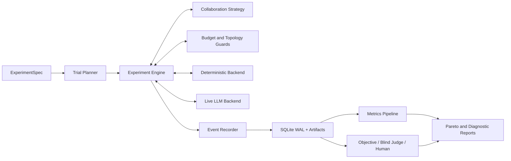
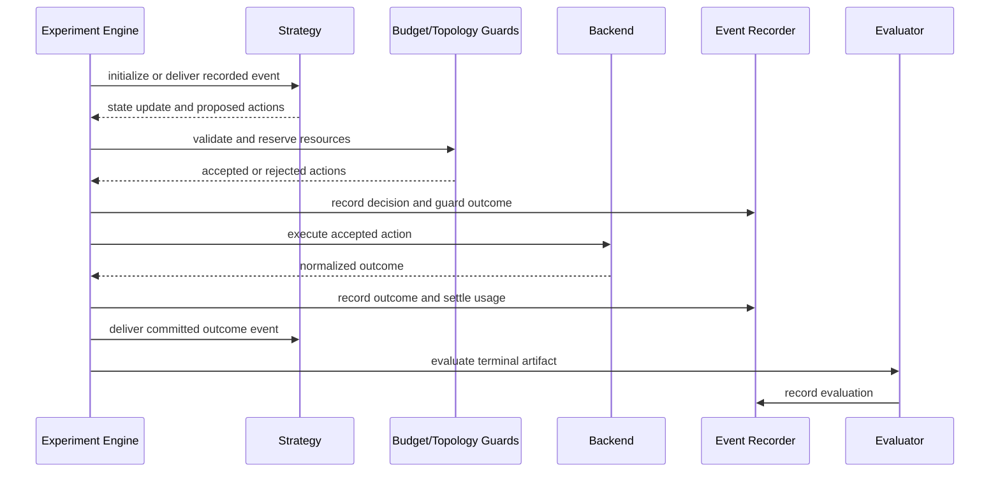

# Multi-Agent Architecture Research Platform Design

> **Document role:** This is the umbrella architecture for product direction,
> experiment structure, strategy comparison, evaluation, and reporting. Detailed
> Attempt state, persistence, outbox, pause, and recovery semantics are normative in
> [Agent Orchestration State Design](2026-07-23-agent-orchestration-state-design.md).

**Status:** Approved

**Date:** 2026-07-23

**Target:** A single-machine research platform for comparing collaboration
strategies across 3-20 live LLM Agents, with a deterministic backend that can
scale to larger simulated networks.

## 1. Context

AgentGraphInternet currently provides a directed Agent communication runtime:
each normal Agent is an HTTP server and client, each configured peer is a local
communication capability, the model can call only allowlisted peers, and each
hop receives an isolated conversation identity. The runtime also has a strict
OpenAI-compatible Responses tool loop, bounded topology discovery, atomic
conversation archiving, and deterministic protocol tests.

Those properties make the project a useful basis for studying decentralized
Agent networks, but the current runtime cannot make controlled comparisons
between collaboration mechanisms. Strategy decisions, HTTP transport, model
execution, mutable conversation state, and result collection are too closely
coupled. There is no experiment manifest, common strategy interface,
append-only event history, mixed evaluation pipeline, or statistically valid
comparison report.

This design adds a research layer without turning the project into a LangGraph
clone. The existing network remains one execution mechanism and one strategy
under test. The new platform owns experiment control, strategy isolation,
event capture, evaluation, and comparison.

## 2. Research Objective

The platform shall answer questions of the following form:

> With task, Agent capabilities, model policy, domain tools, budget, and random
> seed held constant, how do collaboration strategies differ in outcome
> quality, resource cost, latency, communication behavior, and reliability?

The initial comparison uses two benchmark layers:

1. A deterministic simulation layer for exact mechanism tests, repeatable
   traces, controlled faults, and larger synthetic networks.
2. A live LLM layer for measuring emergent behavior with the existing
   OpenAI-compatible Responses runtime.

The primary analysis is multi-objective. It preserves quality, token cost, and
latency as separate Pareto dimensions instead of collapsing them into one
weighted score.

## 3. Goals

- Run the same task suite against a canonical matrix of collaboration
  strategies.
- Hold non-strategy variables fixed and make unavoidable strategy overhead
  visible and billable.
- Execute one strategy implementation against both deterministic and live LLM
  backends.
- Record every strategy decision, invocation, message, tool call, failure, and
  budget change in an append-only causal event stream.
- Reconstruct a completed or failed trial from recorded events.
- Support objective validators, blinded LLM evaluation, and structured human
  review.
- Produce paired statistical comparisons and per-task-family Pareto reports.
- Inject deterministic communication, Agent, model, and tool failures.
- Preserve the existing decentralized peer runtime as a first-class strategy,
  not as the universal execution model.
- Keep the initial live deployment target to one machine and 3-20 Agents.

## 4. Non-Goals

- Production multi-tenancy, public-network federation, billing, or user-facing
  authentication.
- Exact regeneration of historical live LLM output.
- A general-purpose workflow DSL comparable to LangGraph.
- Hundreds of simultaneous live LLM Agent processes.
- A writable remote administration console.
- Dynamic strategy code loading from untrusted packages.
- Exhaustive variants of every strategy in the first release.
- A single composite leaderboard score that hides metric trade-offs.

## 5. Core Distinctions

The research model separates three concepts that the current configuration
partly combines:

### 5.1 Agent capability

An Agent capability describes the stable experimental subject:

- Agent id and role
- base instructions
- model policy
- private context or knowledge fixture
- domain tools
- tool and context limits

Capabilities do not define experiment scheduling or result aggregation.

### 5.2 Communication topology

The communication topology states which logical message exchanges are allowed
inside a trial. It is distinct from physical process reachability. The local
machine may be able to contact every Agent process while a trial exposes only a
chain, star, tree, or peer-neighbor graph.

The Experiment Engine, not the model or strategy implementation, enforces this
logical topology.

### 5.3 Collaboration strategy

A collaboration strategy decides:

- which Agent acts first
- which context an Agent can see
- which legal action should execute next
- whether actions run sequentially or concurrently
- how control moves between Agents
- how partial results are combined
- when a trial terminates

A strategy cannot directly invoke a model, execute a domain tool, write metrics,
or bypass the budget and topology guards.

## 6. Architecture



### 6.1 Experiment control layer

The control layer validates an immutable experiment definition, expands it into
paired trials, assigns stable identifiers, orders trials, and owns lifecycle
state. It is the only module allowed to start, cancel, or finalize a trial.

### 6.2 Strategy layer

Strategies are adapters behind one small interface. They consume recorded
events and produce proposed actions plus serializable state updates. They are
not model or transport adapters.

### 6.3 Execution layer

Backends execute normalized Agent invocations:

- `DeterministicBackend` runs seeded programmable Agent policies.
- `LiveLLMBackend` invokes the existing Responses-based Agent runtime.

Both return the same normalized outcome type.

### 6.4 Event and storage layer

An append-only event stream is the trial source of truth. Mutable views,
strategy state, metrics, visualizations, and reports are derived from events.

### 6.5 Evaluation layer

Evaluation runs only after an execution terminal state. Evaluation failures are
independent from execution failures and may be retried without rerunning the
trial.

## 7. Recommended Module Layout

The research layer should begin as a new package so that it can consume the
current runtime through adapters before any large file move:

```text
experiment_system/
  __init__.py
  contract.py
  spec.py
  planner.py
  engine.py
  budget.py
  topology.py
  events.py
  store.py
  backends/
    __init__.py
    deterministic.py
    live_llm.py
  strategies/
    __init__.py
    single_agent.py
    static_workflow.py
    central_supervisor.py
    router_aggregator.py
    parallel_subagents.py
    handoff.py
    decentralized_peer.py
    shared_blackboard.py
    debate_vote.py
  evaluation/
    __init__.py
    objective.py
    blind_judge.py
    human_review.py
  metrics/
    __init__.py
    derive.py
    pareto.py
    statistics.py
  reporting/
    __init__.py
    export.py
    static_report.py
```

The initial adapter may import `AgentRemote`, `ChatSpace`, and `ToolRegistry`.
The existing runtime must not import the experiment package.

## 8. Experiment Contract

### 8.1 ExperimentSpec

`ExperimentSpec` is a versioned, immutable Pydantic model loaded from JSON in
the first release. It contains:

```text
schema_version
experiment_id
task_suite
agent_roster
domain_tools
strategies
backend
model_policy
budget
replications
seed_schedule
execution_policy
fault_scenarios
evaluation_policy
capture_policy
```

Unknown fields are rejected. References to tasks, Agents, tools, strategies,
and evaluators are resolved during validation. An invalid experiment cannot
create trials or artifacts.

### 8.2 TaskCase

A task case contains:

- stable task id and version
- task-family tags
- public input
- hidden fixtures
- objective validator reference, when available
- expected output contract
- optional Judge rubric
- task-specific resource ceiling that may only reduce the experiment budget

Hidden fixtures are never included in Agent or strategy context.

### 8.3 AgentDefinition

An Agent definition contains stable capabilities and no strategy-specific
state. Domain tools are separate from coordination actions.

The same Agent definitions are reused across strategy cells. A strategy may add
only the minimum protocol instructions necessary to explain its coordination
surface. Those instructions are captured and their tokens count toward cost.

### 8.4 BudgetPolicy

A trial budget contains hard upper bounds for:

- input and output tokens
- model calls
- domain-tool calls
- coordination actions
- wall-clock duration
- maximum call depth
- maximum concurrent actions

The Engine reserves budget before accepting an action and settles against
actual usage after completion. Budget can never become negative.

### 8.5 RunManifest

Before a trial executes, the platform persists an immutable manifest containing:

- experiment and trial ids
- Git commit and dirty-worktree flag
- Python, dependency, OS, and architecture versions
- model provider type, model id, and sampling parameters
- hashes of prompts, tool schemas, task fixtures, and strategy parameters
- backend, seed, repetition, and budget
- evaluation and capture policies

Secrets, Authorization headers, and model API keys are never manifest fields.

## 9. Trial Identity and Pairing

The Trial Planner creates a stable trial id from the fully resolved experiment
inputs:

```text
trial_id = hash(
    experiment_spec_hash,
    strategy_id,
    task_case_id,
    seed,
    repetition
)
```

Every `task_case_id + seed + repetition` block is run across all selected
strategies. Statistical comparison uses these paired blocks rather than
unpaired global averages.

A rerun of a live trial creates a new `attempt_id` under the same trial id. It
never overwrites a prior completed, failed, or interrupted attempt.

## 10. Strategy Interface

The conceptual strategy interface is:

```text
initialize(experiment_context)
    -> strategy_state + proposed_actions

on_event(strategy_state, recorded_event)
    -> strategy_state_update + proposed_actions

finalize(strategy_state)
    -> final_result
```

Requirements:

- strategy state is JSON serializable
- every proposed action has a stable action id and causal parent
- decisions are deterministic for the same state and event in the simulation
  backend
- all decisions are recorded before an action executes
- strategies receive read-only experimental views
- strategies cannot access provider clients, credentials, the event database,
  or hidden task fixtures

### 10.1 Standard actions

The first release defines:

- `InvokeAgent`
- `SendMessage`
- `BroadcastMessage`
- `HandoffControl`
- `WriteBlackboard`
- `RequestCritique`
- `RequestVote`
- `FinishRun`

Each action includes actor, target or targets, payload artifact reference,
invocation/conversation id, causal parent, and requested timeout. The Engine
validates the action against topology, budget, trial state, and strategy rules.

### 10.2 Coordination intents from Agents

A live or simulated Agent may return provider-specific tool calls, but the
backend normalizes model-visible coordination calls into strategy-neutral
intents. The intent becomes an event. The strategy decides whether that intent
produces a standard action; the backend never recursively contacts another
Agent on its own.

The existing recursive `send` behavior is preserved inside the
`DecentralizedPeerStrategy` adapter, where its nested call-return semantics are
part of the strategy under test.

## 11. Canonical Strategy Matrix

The platform implements one canonical version of each strategy before adding
variants:

| Strategy | Canonical behavior | Research role |
| --- | --- | --- |
| Single Agent | One designated generalist handles the task | Non-collaboration reference |
| Static Workflow | A declared sequence or DAG runs without model routing | Deterministic control baseline |
| Central Supervisor | A central model iteratively delegates and synthesizes | Dynamic centralized coordination |
| Router + Aggregator | One routing step fans out, one aggregation step returns | Low-interaction centralized routing |
| Parallel Subagents | Fixed fan-out/fan-in across eligible specialists | Pure parallelism baseline |
| Handoff | The active Agent transfers control and visible context | Stateful control-transfer pattern |
| Decentralized Peer | Each Agent can invoke only logical neighbors | Existing project mechanism |
| Shared Blackboard | Agents coordinate through versioned shared state | Shared-memory collaboration |
| Debate + Vote | Proposal, critique, revision, and counted adjudication | Deliberative collaboration |

The Single Agent reference is not automatically part of strict strategy-only
causal claims. It is comparable only when the task suite defines a generalist
with an explicitly equivalent capability set. Reports must label it as a
reference baseline when equivalence cannot be established.

Control Agents such as supervisors, routers, aggregators, and internal debate
judges use the configured model policy. Their calls, prompts, tokens, and
latency count against the strategy budget. Post-trial evaluation Judge calls
are reported separately and do not affect execution metrics.

## 12. Strict Comparison Rules

Within a strategy comparison block, the following remain fixed:

- task instance and hidden fixtures
- Agent capability definitions
- domain tools and tool implementations
- base instructions and task information
- model provider, model id, and sampling policy
- hard budget ceilings
- seed and repetition index
- timeout, transport retry, and concurrency policy
- fault scenario

The following may differ because they constitute the strategy treatment:

- coordination actions and schemas
- protocol-only prompt additions
- logical communication topology
- scheduling and aggregation behavior
- strategy-owned model invocations

Every difference is captured in the manifest and counted in execution metrics.

## 13. Backends

### 13.1 DeterministicBackend

The deterministic backend executes programmable Agent policies keyed by task,
visible context, seed, and invocation count. It supports:

- exact repeated traces for the same inputs
- controlled response delays using a logical clock
- deterministic coordination intents
- deterministic malformed output and tool failures
- networks larger than the live 3-20 Agent target

It must not depend on wall-clock scheduling for behavior decisions.

### 13.2 LiveLLMBackend

The live backend adapts the current Responses runtime and preserves its safety
properties:

- `store=False`
- complete response-output replay
- strict tool schemas and local Pydantic validation
- one output per accepted function-call id
- bounded response and tool loops
- secret-safe model and tool errors
- runtime-owned conversation identifiers

The adapter returns a normalized `AgentOutcome` containing visible output,
coordination intents, domain-tool observations, usage, timing, and artifact
references.

Live output is not considered deterministic even when a provider accepts a
seed. Reproducibility means preserving inputs, outputs, versions, and causal
history, not promising identical regeneration.

## 14. Event Model

Every event contains:

```text
event_id
trial_id
attempt_id
sequence_no
event_type
strategy_id
agent_id
action_id
invocation_id
causal_parent_id
logical_time
wall_time_utc
payload_artifact_id
usage_delta
error_code
```

Optional fields are omitted rather than populated with misleading null values.
`sequence_no` is continuous within an attempt. `causal_parent_id` must refer to
an earlier event in the same attempt, except for the root start event.

Initial event families include:

- experiment and trial lifecycle
- strategy decision and state update
- action proposal, rejection, acceptance, start, success, and failure
- Agent invocation and outcome
- message send and delivery
- model request and completion
- domain-tool request and completion
- coordination intent
- handoff, blackboard update, critique, and vote
- budget reservation and settlement
- fault planning and injection
- execution terminal state
- evaluation and metric derivation

Events are append-only. Corrections create new compensating or superseding
events; they never mutate history.

## 15. Storage

The first release uses SQLite in WAL mode plus an immutable artifact directory.
This matches the single-machine target without introducing a database service.

Suggested logical tables:

- `experiments`
- `trials`
- `attempts`
- `events`
- `artifacts`
- `metrics`
- `evaluations`

All SQLite writes pass through one `EventRecorder` task. Strategies and
backends receive no database handle.

Large prompts, model outputs, tool payloads, and human-review packages are
stored as content-addressed artifacts. The database stores hashes, media type,
byte size, capture classification, and relative path.

The capture policy supports:

- `full`: secret-redacted content suitable for local controlled research
- `hashed`: hashes and sizes without recoverable content
- `metadata_only`: timing, usage, types, and causal structure

Request headers, Bearer tokens, API keys, and raw exception objects are never
captured in any mode.

## 16. Execution Data Flow



The Engine delivers only committed events to a strategy. If event persistence
fails, the next strategy transition does not run.

## 17. Replay and Recovery

The platform distinguishes:

### 17.1 Deterministic execution replay

The simulation backend may execute again from the same manifest and seed. The
resulting semantic event sequence must match, excluding explicitly documented
environment timestamps.

### 17.2 Audit replay

Any trial can reconstruct its strategy state, causal message graph, timing,
budget, and result from recorded events without calling a model or tool.

### 17.3 Live rerun

A live rerun creates a new attempt. It uses the frozen manifest but does not
claim identical output.

An interrupted live model request is not resumed from its middle. The attempt
remains `INTERRUPTED`; the operator may create a new attempt. This preserves
evidence and avoids ambiguous duplicate side effects.

When the Engine starts, a recovery pass finds attempts that have no execution
terminal event. It appends an `INTERRUPTED` attempt event and closes each
accepted but non-terminal action with a `CANCELLED` event whose reason is
`ENGINE_RESTARTED`. Recovery adds events; it never edits the pre-crash history.

## 18. Action Lifecycle and Error Semantics

Every proposed action follows:

```text
PROPOSED
  -> REJECTED
  -> ACCEPTED
      -> STARTED
          -> SUCCEEDED
          -> FAILED
          -> TIMED_OUT
          -> CANCELLED
```

Standard failure codes include:

- `STRATEGY_ERROR`
- `BACKEND_ERROR`
- `PROTOCOL_ERROR`
- `AGENT_UNAVAILABLE`
- `TOOL_ERROR`
- `ACTION_TIMEOUT`
- `BUDGET_EXHAUSTED`
- `DEADLOCK_DETECTED`
- `EVALUATION_ERROR`

Evaluation failure never changes an execution terminal state. Evaluation can be
retried independently.

Transport does not automatically retry side-effecting actions. Strategies
receive the same normalized failure events and may propose recovery actions;
those actions consume budget. Alternative retry policies are explicit
experiment factors, not hidden strategy behavior.

## 19. Concurrency

- The Engine owns the global per-trial concurrency limit.
- Each stateful Agent allows one in-flight invocation by default.
- Parallel invocations use distinct invocation and conversation ids.
- A strategy must explicitly propose parallel actions; the Engine never infers
  parallelism from a list order.
- Budget is reserved for the full accepted parallel batch before any member
  starts.
- Cancellation and timeout are recorded per action.
- The Engine derives a wait-for graph from invocation dependencies and emits
  `DEADLOCK_DETECTED` when a cycle cannot make progress.

The current behavior in which recursive re-entry into a busy peer returns 409
remains measurable behavior of `DecentralizedPeerStrategy`; it is not imposed
on every strategy.

## 20. Fault Injection

`FaultScenario` is an Engine-owned, seedable experiment input. It supports:

- permanently or intermittently unavailable Agents
- fixed or sampled response latency
- model timeout, rate limit, and malformed output
- domain-tool failure
- message loss, duplication, and delayed delivery
- blackboard write conflict
- incorrect or adversarial Agent output
- node failure after a specified invocation count

Each fault has a stable id, target selector, trigger condition, parameters, and
seed. The plan and actual injection are both recorded.

Formal experiments first establish a no-fault baseline. Each subsequent cell
adds one fault family unless the experiment explicitly studies interactions.

## 21. Evaluation

### 21.1 Objective validation

Tasks with exact answers, executable outputs, or structured constraints use an
objective validator as the primary quality score. Validators run against hidden
fixtures and produce structured sub-scores and evidence.

### 21.2 Blinded LLM Judge

Open-ended tasks use a versioned Judge rubric. The Judge input excludes:

- strategy names
- original Agent ids when they reveal strategy roles
- event types unique to one strategy
- execution-order labels not needed to assess the result

Candidate order is randomized. Judge model, prompt, parameters, raw result, and
reasoning summary are captured as evaluation artifacts. Judge cost is reported
separately from execution cost.

### 21.3 Human review

Human-review exports use stratified sampling:

- largest strategy-score disagreements
- objective/Judge conflicts
- trials near a Pareto boundary
- failure and timeout cases
- a random control sample

Human results use a versioned rubric. The report surfaces Judge/human agreement
and does not silently merge inconsistent labels.

## 22. Metrics

Metrics are derived from events, never accepted from a strategy.

### 22.1 Primary Pareto dimensions

1. Quality, maximized
2. Total execution token usage, minimized
3. Trial wall-clock latency, minimized

Provider price is a versioned derived metric because price tables can change.
Model and tool call counts remain raw metrics.

### 22.2 Diagnostic metrics

- input, output, and total tokens
- model, tool, and coordination call counts
- total and critical-path latency
- queue and idle time
- messages, message tokens, and bytes
- actual edge utilization
- maximum depth and parallel width
- handoff, blackboard, critique, and vote counts
- coordination overhead as a fraction of tokens, calls, and latency
- Agent utilization and load imbalance
- repeated request and redundant-information rates
- timeout, error, budget-exhaustion, and completion rates

### 22.3 Failure scoring

Failed, timed-out, deadlocked, or unfinished trials remain in the dataset and
receive zero task quality. Failure reason remains a separate diagnostic
dimension. Reports cannot drop failed attempts when aggregating a strategy.

## 23. Statistical Analysis

- Comparisons are paired by task, seed, and repetition.
- Results are reported per task family before macro aggregation.
- Each metric includes sample count, median, distribution, and a reproducible
  bootstrap confidence interval.
- Strategy order is randomized within each paired block.
- The report distinguishes statistical uncertainty from run-to-run model
  instability.
- No claim of superiority is made from a point estimate alone.
- Pareto fronts are computed for each task family and for macro-averaged primary
  dimensions.

The platform does not put all diagnostic dimensions into one Pareto
calculation. Doing so would make nearly every strategy non-dominated and render
the result uninformative.

## 24. CLI and Reports

The initial workflow is local and scriptable:

```text
agentgraph experiment validate experiment.json
agentgraph experiment run experiment.json
agentgraph experiment status <experiment_id>
agentgraph experiment report <experiment_id>
agentgraph trial replay <trial_id>
```

Machine-readable exports include JSON and CSV. The static report includes:

- experiment manifest and comparability warnings
- quality-versus-token and quality-versus-latency plots
- token-versus-latency plots
- three-dimensional Pareto data
- paired differences and confidence intervals
- per-task-family rankings
- trial completion and failure distributions
- actual communication topology
- causal message graph
- Agent invocation timeline

A read-only local Dashboard is deferred until event and report schemas are
stable. Configuration editing and remote administration are not part of the
research Dashboard.

## 25. Security and Research Integrity

- Literal credentials are prohibited in experiment definitions and committed
  Agent configuration.
- Provider credentials come from environment or an external secret source.
- Strategy code cannot access secrets, transport headers, or hidden fixtures.
- Full capture is allowed only for controlled local experiments after secret
  redaction.
- Peer metadata and model output remain untrusted data.
- Logical topology checks execute in code, never only in prompts.
- Reports disclose dirty worktrees, missing artifacts, evaluator failures, and
  incomplete paired blocks.
- Historical attempts are immutable to prevent selective result replacement.

## 26. Testing Strategy

### 26.1 Contract tests

Every strategy runs against a shared suite that verifies:

- valid initialization and terminal behavior
- JSON-serializable state
- legal actions only
- topology enforcement
- budget accounting
- replay-equivalent final state
- normalized failure handling

Every backend runs against a shared suite that verifies the normalized outcome
contract.

### 26.2 Event invariants

- one terminal state per attempt
- continuous event sequence numbers
- valid same-attempt causal parents
- no updates or deletes of recorded events
- no negative budget
- every accepted action reaches a terminal action state
- strategy state reconstructed from events matches the recorded final state

### 26.3 Deterministic golden traces

Small synthetic tasks have reviewed golden semantic traces. The same spec and
seed must reproduce the trace. Timestamps and generated UUID representations
are normalized before comparison.

### 26.4 Evaluation tests

- objective validators reject malformed outputs
- Judge packages contain no strategy labels
- candidate ordering is randomized reproducibly
- evaluation retries do not rerun execution
- failed trials remain in aggregate metrics
- Pareto and bootstrap functions match known synthetic datasets

### 26.5 Fault and concurrency tests

- planned faults trigger exactly under their seed and conditions
- parallel batches reserve budget atomically
- timeout and cancellation settle budget once
- wait-for cycles produce a deadlock terminal event
- delayed or duplicated messages remain causally identifiable

### 26.6 Existing regression tests

Current tests for Responses output replay, function-call pairing, tool
validation, conversation isolation, HTTP error safety, atomic archive, topology
budgets, and three-node integration remain required. They become regression
coverage for `LiveLLMBackend` and `DecentralizedPeerStrategy`.

Live-model tests remain behind an explicit environment switch and are not a
stable offline CI requirement.

## 27. Delivery Phases

### Phase 1: Minimal vertical experiment

Deliver:

- validated `ExperimentSpec`
- Trial Planner and stable identities
- Event Recorder and SQLite/artifact store
- Budget and topology guards
- Deterministic backend
- Single Agent, Static Workflow, and Decentralized Peer strategies
- one objectively graded task family
- primary metrics and a machine-readable Pareto result
- audit replay

Acceptance criterion:

> One experiment file runs the same tasks through three strategies, preserves a
> replayable causal event history, and emits quality/token/latency results while
> proving that only declared strategy variables changed.

### Phase 2: Complete strategy matrix

Deliver the remaining canonical strategies and deterministic task families for:

- routing
- parallel aggregation
- multi-step dependency
- conflict resolution

All strategies must pass the same contracts before live comparisons begin.

### Phase 3: Live LLM and mixed evaluation

Deliver:

- LiveLLMBackend adapter over the current Responses runtime
- paired repeated execution
- objective, blinded Judge, and human-review pipelines
- confidence intervals and task-family reports
- static causal, timing, and Pareto visualizations

### Phase 4: Fault research and local Dashboard

Deliver:

- seedable FaultScenario execution
- deadlock and failure diagnostics
- comparative fault-tolerance reports
- read-only local Dashboard over stable event/report interfaces

## 28. Risks and Mitigations

| Risk | Consequence | Mitigation |
| --- | --- | --- |
| Strategy-specific prompts invalidate fairness | Results measure prompt quality | Limit additions to protocol instructions, hash and bill them |
| Simulation diverges from live execution | Mechanism conclusions do not transfer | One strategy interface, shared backend contracts, paired live validation |
| Too many strategy variants | Matrix becomes unmanageable | One canonical implementation per strategy before parameter variants |
| LLM Judge bias | Quality axis becomes unreliable | Blind labels, randomize order, validate against objective and human samples |
| Live model drift | Historical comparisons become misleading | Freeze manifests, preserve raw artifacts, report model/provider versions |
| High-dimensional Pareto analysis | Almost every strategy appears optimal | Use only quality, tokens, and latency as primary dimensions |
| Event logging changes behavior | Measured latency includes instrumentation | Measure recorder overhead and separate queue/critical-path timing |
| Current recursive runtime constrains all strategies | Comparison favors existing semantics | Put recursion only in DecentralizedPeer adapter |
| Secrets enter research artifacts | Credential exposure | Separate capture policy, strict redaction, never record headers or keys |
| Flat current modules become harder to maintain | Research code tangles production runtime | Add an inward-dependent experiment package before selective extraction |

## 29. Accepted Decisions

- The product direction is a multi-Agent architecture research platform, not a
  production Agent federation layer.
- The first research focus is collaboration-strategy comparison.
- Benchmarks use deterministic and live LLM layers.
- The target strategy set is the complete canonical matrix in this document.
- Formal comparisons use strict controlled variables.
- Evaluation uses objective validation, blinded Judge, and human sampling.
- Analysis is multi-objective Pareto with quality, tokens, and latency as the
  primary dimensions.
- The initial live scale is one machine with 3-20 Agents.
- The architecture is an experiment kernel with strategy plugins and two
  execution backends.
- The initial interface is CLI plus static reports; the Dashboard is deferred.

## 30. Design Completion Criteria

The design is implemented when:

- all canonical modules communicate only through the interfaces described here
- the Phase 1 acceptance criterion passes in deterministic and fake-live tests
- every strategy passes the common contract suite
- live and deterministic backends return the same normalized outcome shape
- a trial can be reconstructed from events without provider calls
- mixed evaluation produces blinded, versioned evidence
- failed attempts remain visible in every aggregate report
- Pareto results are reproducible from stored metrics and analysis seed
- existing AgentGraphInternet protocol tests remain green
