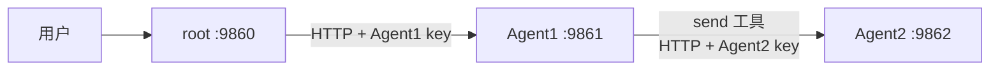

# AgentGraphInternet 中文入门教程

> 面向读者：会使用电脑和命令行，但对 Python、异步编程、FastAPI 或 Agent 工具调用还不熟悉的学习者。
> 教程目标：不只“把项目跑起来”，还要理解消息为什么这样流动、代码为什么这样设计，以及如何安全地修改它。

## 目录

1. [先建立整体认识](#1-先建立整体认识)
2. [准备开发环境](#2-准备开发环境)
3. [本项目用到的 Python 基础](#3-本项目用到的-python-基础)
4. [认识项目目录](#4-认识项目目录)
5. [读懂 Agent JSON 配置](#5-读懂-agent-json-配置)
6. [先运行离线测试](#6-先运行离线测试)
7. [启动三个真实进程](#7-启动三个真实进程)
8. [追踪一次完整对话](#8-追踪一次完整对话)
9. [ChatSpace：一段对话如何保存上下文](#9-chatspace一段对话如何保存上下文)
10. [FastAPI：程序如何提供 HTTP 接口](#10-fastapi程序如何提供-http-接口)
11. [httpx：Agent 如何调用另一个 Agent](#11-httpxagent-如何调用另一个-agent)
12. [Responses API：模型如何调用工具](#12-responses-api模型如何调用工具)
13. [并发控制：FIFO、锁与 409](#13-并发控制fifo锁与-409)
14. [拓扑发现：如何递归认识整张图](#14-拓扑发现如何递归认识整张图)
15. [原子保存：如何避免写坏聊天记录](#15-原子保存如何避免写坏聊天记录)
16. [测试体系：为什么不需要真实模型也能验收](#16-测试体系为什么不需要真实模型也能验收)
17. [常见问题与排错](#17-常见问题与排错)
18. [循序渐进的练习](#18-循序渐进的练习)
19. [术语表](#19-术语表)
20. [下一步学习路线](#20-下一步学习路线)

## 1. 先建立整体认识

### 1.1 这个项目解决什么问题

普通聊天机器人通常是：

```text
用户 -> 一个模型 -> 回复
```

AgentGraphInternet 想做的是：

```text
用户 -> Agent1 -> Agent2 -> ...
```

每个 Agent 有自己的：

- 身份和职责说明；
- 模型服务配置；
- HTTP 监听端口；
- 入站通信 key；
- 可以访问的下一跳 Agent 列表；
- 按 `(from_id, conversation_id)` 隔离的聊天上下文。

关键点是“有向”：如果 Agent1 的配置允许调用 Agent2，只代表 `Agent1 -> Agent2`，不代表 Agent2 自动拥有反向权限。

### 1.2 示例网络

项目自带三个配置：



三个角色不同：

- `root`：代表顶层用户，不调用模型。
- `Agent1`：接收 root 的请求，可以调用模型，并且只看得见 Agent2。
- `Agent2`：接收 Agent1 的请求并调用自己的模型，没有下一跳。

### 1.3 你最终会学会什么

完成教程后，你应该能够：

- 用 uv 安装并运行 Python 项目；
- 看懂项目中的类、类型标注和异步函数；
- 修改或新增一个 Agent JSON；
- 启动 root、Agent1、Agent2；
- 解释 `user`、`assistant`、`function_call`、`function_call_output` 的顺序；
- 解释为什么工具结果必须使用原 `call_id`；
- 解释为什么同 `ConversationKey` 排队、不同会话键返回 409；
- 查看保存的聊天 JSON；
- 使用 pytest 和 fake Responses 验证完整链路；
- 在不泄漏 key 的前提下排查常见错误。

## 2. 准备开发环境

### 2.1 需要什么

最低要求：

- Python 3.12 或更高版本；
- uv；
- PowerShell；
- 可选：监听 `http://localhost:20128/v1` 的 Responses API 兼容模型服务。

本项目开发时验证过的主要版本：

| 组件 | 验证版本 |
| --- | --- |
| Python | 3.13.13 |
| FastAPI | 0.139.0 |
| HTTPX | 0.28.1 |
| OpenAI Python SDK | 2.45.0 |
| Pydantic | 2.13.4 |
| Uvicorn | 0.51.0 |

锁文件 `uv.lock` 才是安装时的权威版本来源。

### 2.2 检查 uv

```powershell
uv --version
```

如果命令不存在，按 uv 官方文档安装：

- [uv 官方安装说明](https://docs.astral.sh/uv/getting-started/installation/)

### 2.3 安装项目依赖

进入仓库目录后运行：

```powershell
uv sync --locked
```

这条命令的含义：

- `sync`：让本地虚拟环境和项目依赖保持一致；
- `--locked`：严格使用现有 `uv.lock`，不偷偷更新依赖版本；
- `.venv`：uv 默认创建或复用的虚拟环境目录。

### 2.4 检查 Python

```powershell
uv run python --version
```

`uv run` 表示“在项目虚拟环境中运行命令”，因此一般不需要手动激活 `.venv`。

## 3. 本项目用到的 Python 基础

这一章不试图讲完 Python，只讲读懂本项目所需的最小知识。

### 3.1 模块和 import

一个 `.py` 文件就是一个 Python 模块。例如：

```python
from AgentRemote import AgentRemote
from core import AgentConfig, ChatSpace
```

意思是：

- 从 `AgentRemote.py` 导入 `AgentRemote` 类；
- 从 `core.py` 导入 `AgentConfig` 和 `ChatSpace`。

`Agent.py` 是统一入口，但真正的领域逻辑主要在 `AgentRemote.py`、`User.py` 和 `core.py`。

### 3.2 变量、列表和字典

列表保存一组有顺序的值：

```python
peer_ids = ["Agent1", "Agent2"]
```

字典保存键值对：

```python
message = {
    "role": "user",
    "content": "你好",
}
```

项目中的 HTTP JSON、配置数据、Responses items 最终都可以表示成列表和字典。

### 3.3 类和对象

类可以理解为“对象的设计图”：

```python
class SimpleAgent:
    def __init__(self, agent_id: str) -> None:
        self.id = agent_id

    def describe(self) -> str:
        return f"我是 {self.id}"
```

创建对象：

```python
agent = SimpleAgent("Agent1")
print(agent.describe())
```

本项目中的重要类：

- `AgentConfig`：一个 Agent 的配置模型；
- `PeerConfig`：一个直接邻居的配置模型；
- `ChatSpace`：一段对话的上下文；
- `ConversationKey`：由直接上游 id 和上游本地会话 UUID 组成的入站分支键；
- `AgentRemote`：普通模型 Agent；
- `User`：特殊 root 网关；
- `Agent`：根据 JSON 选择 `User` 或 `AgentRemote` 的统一入口。

### 3.4 `self` 是什么

类方法中的 `self` 代表“当前对象”：

```python
self.id
self.chat_spaces
self.config
```

例如 `AgentRemote.response(...)` 中的 `self.chat_spaces`，就是当前这个 Agent 自己维护的会话表，不是全局共享变量。

### 3.5 类型标注

```python
def get_history(self, to_id: str) -> list[dict[str, object]]:
    ...
```

可以读成：

- `to_id` 应该是字符串；
- 返回值是一个列表；
- 列表中每项是字典。

类型标注主要帮助人、编辑器和静态工具理解代码。Python 运行时不会因为写了类型标注就自动完成全部校验，所以外部输入仍要用 Pydantic 或显式判断。

### 3.6 `None`

`None` 表示“当前没有值”：

```python
self.currentChatSpace: ChatSpace | None = None
```

这里表示 Agent 空闲时没有正在处理的会话。

### 3.7 异常

异常表示程序无法按正常路径继续：

```python
try:
    data = response.json()
except ValueError:
    data = None
```

项目自定义了 `AgentGraphError`，它带有：

- 稳定错误码；
- 安全的人类可读消息；
- HTTP 状态码；
- 可选重试秒数。

重要安全习惯：不要把底层异常原文直接返回给用户，因为原文可能包含 URL、请求头或 key。

### 3.8 `Path`

`pathlib.Path` 用来安全地组合文件路径：

```python
from pathlib import Path

history = Path("chat_history") / "Agent1" / "root"
```

比手动拼接 `"chat_history/Agent1/root"` 更适合跨平台代码。

### 3.9 深拷贝

如果返回内部列表本身，调用者可以意外修改对象状态：

```python
history = chat.messages
history.clear()  # 会把内部消息也清掉
```

因此项目使用 `deepcopy()`：

```python
return deepcopy(chat.messages)
```

这样调用者拿到的是独立副本。

### 3.10 `async` 和 `await`

网络请求、模型调用和等待锁都需要时间。如果普通函数一直阻塞，服务器就不能同时处理其它请求。

异步函数写法：

```python
async def ask_peer(client, url: str):
    response = await client.get(url)
    return response.json()
```

理解方式：

- `async def`：定义一个可暂停的异步任务；
- `await`：等待另一个异步操作，同时把事件循环让给其它任务；
- 事件循环：负责安排多个异步任务轮流推进。

项目中的网络、模型、锁和 Uvicorn 生命周期都使用异步代码。

官方入门材料：

- [Python asyncio](https://docs.python.org/3/library/asyncio.html)
- [FastAPI async/await](https://fastapi.tiangolo.com/async/)

## 4. 认识项目目录

```text
AgentGraph/
├─ Agent.py
├─ AgentRemote.py
├─ User.py
├─ core.py
├─ README.md
├─ HANDOFF.md
├─ pyproject.toml
├─ uv.lock
├─ agents_setting/
│  ├─ root.json
│  ├─ Agent1.json
│  └─ Agent2.json
├─ docs/
│  └─ 中文入门教程.md
└─ tests/
   ├─ helpers.py
   ├─ test_config.py
   ├─ test_chat_space.py
   ├─ test_agent_remote.py
   ├─ test_agent_api.py
   ├─ test_user.py
   ├─ test_agent_entry.py
   ├─ test_integration_chain.py
   └─ test_live_chain.py
```

推荐阅读顺序：

1. `agents_setting/root.json`：先看最简单的 root 配置。
2. `core.py` 中的 `AgentConfig`、`PeerConfig`、`ChatSpace`。
3. `User.py` 的 `talk_to()`。
4. `AgentRemote.py` 的 `response()` 和 `_run_response_loop()`。
5. `Agent.py` 的统一入口和 CLI。
6. `tests/test_integration_chain.py`：用一个完整场景串起所有模块。

## 5. 读懂 Agent JSON 配置

### 5.1 root 配置

```json
{
  "id": "root",
  "introduction": "本地用户入口，负责把请求转给 Agent1。",
  "host": "127.0.0.1",
  "port": 9860,
  "agents": [
    {
      "id": "Agent1",
      "ip": "127.0.0.1",
      "protocol": "http",
      "port": 9861,
      "key": "dev-agent1-key"
    }
  ]
}
```

root 没有模型字段，因为它不调用模型。它只知道 Agent1 的访问方式。

### 5.2 普通 Agent 配置

```json
{
  "id": "Agent1",
  "introduction": "协调请求，并在需要时询问 Agent2。",
  "host": "127.0.0.1",
  "port": 9861,
  "key": "dev-agent1-key",
  "openai_baseurl": "http://localhost:20128/v1",
  "openai_key": "${OPENAI_API_KEY}",
  "model": "gpt-5.6-luna",
  "agents": [
    {
      "id": "Agent2",
      "ip": "127.0.0.1",
      "protocol": "http",
      "port": 9862,
      "key": "dev-agent2-key"
    }
  ]
}
```

区别：

- 顶层 `key`：别人访问当前 Agent 时使用的入站 key；
- `agents[].key`：当前 Agent 访问目标邻居时使用的目标 key；
- `openai_key`：访问模型服务的 key，和 Agent 间 key 不是一回事。

### 5.3 环境变量占位符

```json
{
  "openai_key": "${OPENAI_API_KEY}"
}
```

启动前设置：

```powershell
$env:OPENAI_API_KEY = '<your-key>'
```

配置加载器会递归替换 `${变量名}`。如果变量缺失，会得到类似：

```text
配置错误: 缺少环境变量: OPENAI_API_KEY
```

错误只报告变量名，不会把配置 JSON 或其它 secret 打印出来。

### 5.4 常用可选字段

| 字段 | 默认值 | 说明 |
| --- | --- | --- |
| `http_timeout_seconds` | `60` | Agent 间 HTTP 超时 |
| `openai_timeout_seconds` | `600` | 模型请求超时 |
| `include_encrypted_reasoning` | `true` | 是否请求并回放加密 reasoning item |
| `tools.extensions` | `[]` | 选择受信任外部工具：`"all"`、`"none"` 或名称列表 |
| `max_tool_calls_per_turn` | `200` | 单轮工具调用上限 |
| `max_response_steps_per_turn` | `256` | Responses 循环步数上限 |
| `topology_max_nodes` | `1000` | 拓扑节点和不可信记录预算 |
| `topology_max_depth` | `64` | 拓扑递归深度上限 |

### 5.5 可扩展工具

普通 Agent 的工具由 `tool_system` 中的 `ToolRegistry` 在启动时一次构建。内置的 `send`、`close` 仍然兼容原有行为；只有在当前 Agent 有直接邻居时，它们才会出现在模型工具列表中。

外部工具集中在 `ToolExtension/__init__.py` 的 `EXTENSION_TOOLS` 类元组。配置可以选择其中的工具：

```json
{
  "tools": {
    "extensions": ["text_stats", "agent_info", "get_weather"]
  }
}
```

- 省略 `tools` 或 `extensions` 等价于 `[]`，两者和 `"none"` 都不启用外部工具；
- `"all"` 按目录顺序启用 `text_stats`、`agent_info`、`get_weather`，`"none"` 不启用扩展；
- 也可以写名称列表，例如 `{"extensions": ["text_stats", "agent_info", "get_weather"]}`；名字不能重复，且必须已在 `EXTENSION_TOOLS` 中列出。加入目录只是注册，不等于启用；
- `root` 只能使用省略、`[]` 或 `"none"`，它不会加载外部工具。

仓库默认登记但不默认启用三个教学工具：

- `text_stats` 接收必填的 1 到 10000 字符 `text`，返回 `character_count`、非空白 `non_whitespace_character_count`、按空白分词的 `word_count` 和 `splitlines()` 的 `line_count`；文本末尾的换行不会多算一个空行。`character_count` 使用 Python `len(text)` 统计 Unicode code point，不是用户感知的字素簇，也不是 UTF-8 字节数。
- `agent_info` 没有参数，成功结果固定含 `ok: true`，只从 `get_profile()` 的结果再次白名单取出 `agent_id` 与 `introduction` 两个身份字段，不会泄漏配置、keys、模型 URL、peer、client 或 session。
- `get_weather` 接收必填的 `location` 与 `units`，其中 `units` 只能是 `celsius` 或 `fahrenheit`。它只访问代码中固定的 Open-Meteo 地理编码与天气端点：先把地点解析为经纬度，再读取当前温度；模型不能传入或改写 URL。该工具还展示资源生命周期：模块导入和注册表构建阶段不创建客户端，只有启用后才在 `startup()` 创建 `httpx.AsyncClient`，并在 `shutdown()` 中关闭。

`get_weather` 最终交给 OpenAI Responses API 的完整工具声明严格等于下面的 JSON：

```json
{
  "type": "function",
  "name": "get_weather",
  "description": "Retrieves current weather for the given location.",
  "parameters": {
    "type": "object",
    "properties": {
      "location": {
        "type": "string",
        "description": "City and country e.g. Bogotá, Colombia"
      },
      "units": {
        "type": "string",
        "enum": ["celsius", "fahrenheit"],
        "description": "Units the temperature will be returned in."
      }
    },
    "required": ["location", "units"],
    "additionalProperties": false
  },
  "strict": true
}
```

这里有两个相互配合、但用途不同的层次：`GetWeatherTool.parameters_schema()` 精确控制模型看见的 `parameters` JSON，避免 Pydantic 自动加入 `title` 等额外字段；`GetWeatherArguments` 仍负责工具真正执行前的本地严格校验。注册表再把 `ToolSpec` 中的 `name`、`description` 与固定的 `type: "function"`、`strict: true` 组合起来，得到上面的完整对象。精确 schema 与参数模型必须同步维护，并通过完整字典等值测试防止漂移。

要添加一个新外部工具，先复制一个独立教学模块；定义继承 `ToolArguments` 的参数模型（每个 schema 属性必填、禁止额外字段），再定义 `frozen ToolSpec` 和返回严格 JSON `dict` 的 `execute()`。需要精确控制模型可见 JSON 时覆写 `parameters_schema()`，但不能删除对应的 Pydantic 参数模型。有资源时可实现 `startup()` / `shutdown()`；随后把工具类按稳定顺序加入 `EXTENSION_TOOLS`，在普通 Agent JSON 中明确启用，并补充参数、结果、选择、生命周期与安全边界测试。工具会获得当前 Agent 的独立实例和 `self.agent` 引用；全过程不需要修改 `AgentRemote`。注册表的工具集合与 schema 在启动后冻结，`startup()` 按顺序执行，`shutdown()` 按逆序执行。

## 6. 先运行离线测试

在启动真实模型前，先证明项目环境正确：

```powershell
$env:UV_CACHE_DIR = '.uv-cache'
$testTemp = Join-Path $env:TEMP ('agentgraph-tutorial-' + [guid]::NewGuid().ToString('N'))
uv run pytest -q -p no:cacheprovider --basetemp=$testTemp
```

你应该看到：

```text
200 passed, 1 skipped
```

数字会随着未来测试增加而变化；关键是：

- 没有 failed 或 error；
- 默认 skip 的是 live 测试；
- 默认测试不会访问外网或真实模型。

如果只想验证三节点固定链路：

```powershell
uv run pytest -q -p no:cacheprovider tests/test_integration_chain.py
```

## 7. 启动三个真实进程

### 7.1 确认模型服务

示例期望：

```text
http://localhost:20128/v1
model = gpt-5.6-luna
```

`gpt-5.6-luna` 是本项目用户指定的本地模型标识，不要把它当成 OpenAI 公共模型名称。

如果你没有这个模型服务，可以跳过本章，继续使用确定性集成测试学习架构。

### 7.2 设置 key

在要启动普通 Agent 的 PowerShell 窗口中设置：

```powershell
$env:OPENAI_API_KEY = '<your-key>'
```

不要把真实 key 写入 JSON、Markdown、Git 提交或截图。

### 7.3 启动顺序

先启动下游，再启动上游，便于第一次请求时所有服务已就绪。

窗口 1：

```powershell
uv run python Agent.py --config agents_setting/Agent2.json --no-interactive
```

窗口 2：

```powershell
uv run python Agent.py --config agents_setting/Agent1.json --no-interactive
```

窗口 3：

```powershell
uv run python Agent.py --config agents_setting/root.json --interactive
```

### 7.4 使用 root CLI

```text
/talk Agent1 请询问Agent2在干嘛
/topology
/history Agent1
/close Agent1
/quit
```

命令含义：

- `/talk`：向一个直接可见 Agent 发消息；
- `/topology`：递归发现可见拓扑；
- `/history`：查看 root 本地可读历史；
- `/close`：请求远端保存/关闭，再保存 root 本地会话；
- `/quit`：设置 Uvicorn 退出标志并等待 lifespan 清理完成。

## 8. 追踪一次完整对话

用户输入：

```text
请询问Agent2在干嘛
```

### 8.1 root 视角

root 创建或复用与 Agent1 的 `ChatSpace`：

```python
root_chat.messages == [
    {"role": "user", "content": "请询问Agent2在干嘛"}
]
```

然后 root 向 Agent1 发送：

```json
{
  "from_id": "root",
  "conversation_id": "root_chat.conversation_id",
  "message": "请询问Agent2在干嘛",
  "request_id": "一个 UUID"
}
```

### 8.2 Agent1 视角

Agent1 把 root 当作当前会话的“用户”：

```text
owner = Agent1
peer = root
received message role = user
```

模型可能返回：

```json
{
  "type": "function_call",
  "call_id": "call_agent2_status",
  "name": "send",
  "arguments": "{\"msg\":\"你在干嘛？\",\"to_id\":\"Agent2\"}"
}
```

### 8.3 Agent2 视角

Agent1 的 `send()` 使用 Agent2 的本地 allowlist 配置发出 HTTP 请求。模型只提供 `msg` 与 `to_id`，运行时还会自动附加 Agent1 当前本地 `ChatSpace.conversation_id`。Agent2 看见：

```text
owner = Agent2
peer = Agent1
inbound key = (Agent1, Agent1 当前本地 conversation_id)
received message role = user
```

Agent2 回复：

```text
我正在整理今天的任务。
```

### 8.4 工具结果回到 Agent1

Agent1 必须使用同一个 `call_id`：

```json
{
  "type": "function_call_output",
  "call_id": "call_agent2_status",
  "output": "{\"ok\":true,\"to_id\":\"Agent2\",\"message\":\"我正在整理今天的任务。\"}"
}
```

如果 call id 不一致，模型无法知道哪个结果对应哪个调用。

### 8.5 最终回复

Agent1 再次请求模型，得到：

```text
Agent2说它正在整理今天的任务。
```

root 把它记录为 `assistant`：

```python
root_chat.messages == [
    {"role": "user", "content": "请询问Agent2在干嘛"},
    {"role": "assistant", "content": "Agent2说它正在整理今天的任务。"},
]
```

## 9. ChatSpace：一段对话如何保存上下文

### 9.1 为什么需要两套视图

`ChatSpace` 同时维护：

```text
messages       -> 给人和前端看的简单文本
context_items  -> 给 Responses API 回放的完整 item
```

每个 `ChatSpace` 还拥有当前节点生成的本地 `conversation_id`。接收请求时，运行时用请求中的 `(from_id, conversation_id)` 查找入站会话；继续调用下游时，则发送当前本地 ChatSpace 自己的 id。逐跳使用本地 id 可以让汇聚拓扑中的分支继续保持独立。

简单视图可能是：

```json
[
  {"role": "user", "content": "帮我问 Agent2"},
  {"role": "assistant", "content": "Agent2 回复了……"}
]
```

完整视图可能是：

```text
message(user)
reasoning
function_call
function_call_output
message(assistant)
```

如果只保存最终文本，下一轮模型就看不到工具调用与 reasoning 的完整历史。

### 9.2 `add_msg()`

```python
chat.add_msg("你好", "user")
chat.add_msg("你好，有什么可以帮你？", "assistant")
```

兼容角色 `agent` 会被规范化为 `assistant`。

不允许随意角色：

```python
chat.add_msg("错误示例", "admin")  # ValueError
```

### 9.3 `append_response_items()`

这个方法保存 SDK 返回的完整 output item，并从 assistant message 中提取可读文本。

设计重点：

- 完整 item 只写一次；
- reasoning 和 function call 不进入人类可读 `messages`；
- assistant 文本进入 `messages`；
- SDK 对象通过公开的 `model_dump(exclude_none=True)` 转成字典。

### 9.4 `append_tool_output()`

```python
chat.append_tool_output(
    call_id="call_123",
    output='{"ok":true,"message":"完成"}',
)
```

这个方法不增加人类可读消息，因为工具结果是模型内部上下文的一部分。

### 9.5 `save()`

保存路径：

```text
chat_history/<owner_id>/<peer_id>/<conversation_id>.json
```

文件包含：

- schema version；
- owner / peer；
- conversation id；
- UTC 保存时间；
- instructions；
- tools；
- messages；
- context items。

## 10. FastAPI：程序如何提供 HTTP 接口

### 10.1 最小 FastAPI 例子

```python
from fastapi import FastAPI

app = FastAPI()

@app.get("/healthz")
async def healthz():
    return {"data": {"status": "ok"}}
```

装饰器 `@app.get(...)` 把函数注册为 HTTP 路由。

项目没有把路由散落在很多文件，而是让 `User.create_app()` 和 `AgentRemote.create_app()` 分别创建自己的应用。

### 10.2 Pydantic 请求模型

```python
class UserMessageRequest(BaseModel):
    message: str = Field(min_length=1, max_length=65536)
    request_id: UUID | None = None
```

FastAPI 会把 JSON body 转成这个模型。如果字段错误，统一返回 422 envelope。

### 10.3 成功和失败 envelope

成功：

```json
{"data": "回复文本"}
```

失败：

```json
{
  "error": {
    "code": "AGENT_BUSY",
    "message": "该Agent正在进行其它对话，请等待1min后重试",
    "retry_after_seconds": 60
  }
}
```

统一格式让前端不必猜测每个接口的错误结构。

### 10.4 Bearer 认证

普通 Agent API 要求：

```http
Authorization: Bearer dev-agent1-key
```

服务端同时检查：

- URL 中的 `target_id` 是否等于当前 Agent id；
- header 是否是 Bearer；
- token 是否与当前 Agent 的入站 key 常量时间相等。

root API 没有 Bearer，因此默认只能绑定回环地址。

## 11. httpx：Agent 如何调用另一个 Agent

### 11.1 异步客户端

```python
import httpx

async with httpx.AsyncClient(timeout=60.0) as client:
    response = await client.post(
        "http://127.0.0.1:9861/v1/agents/Agent1/messages",
        headers={"Authorization": "Bearer ..."},
        json={
            "from_id": "root",
            "conversation_id": "调用方本地 ChatSpace UUID",
            "message": "你好",
            "request_id": "...",
        },
    )
```

官方资料：

- [HTTPX Async Support](https://www.python-httpx.org/async/)

### 11.2 为什么不能让模型提供 URL 和 key

错误设计：

```python
await client.post(model_arguments["url"], headers={"Authorization": model_arguments["key"]})
```

模型输出是不可信输入。这样会产生 SSRF、越权和 secret 泄漏风险。

正确设计：

```python
peer = self._peers[to_id]
url = self._peer_url(peer, "messages")
key = peer.key.get_secret_value()
```

模型只提供 `to_id` 和消息；程序从本地 allowlist 解析真实地址和 key。

### 11.3 为什么不自动重试消息

请求超时不代表远端一定没有执行。它可能已经调用模型或工具，只是响应在网络中丢失。

自动重试可能导致：

- 模型重复扣费；
- 消息重复发送；
- 工具副作用执行两次。

因此 MVP 将错误返回给调用者，由更高层决定是否重试。

## 12. Responses API：模型如何调用工具

### 12.1 Responses API 的输入

项目每次调用大致使用：

```python
response = await client.responses.create(
    model=config.model,
    input=chat.get_context_messages(),
    instructions=chat.instructions,
    tools=chat.tools,
    store=False,
    parallel_tool_calls=False,
)
```

字段解释：

- `model`：模型名；
- `input`：完整上下文 items；
- `instructions`：当前 Agent 的可信职责与会话说明；
- `tools`：模型可调用的函数工具；
- `store=False`：不依赖 OpenAI 服务端保存响应；
- `parallel_tool_calls=False`：一次按顺序处理副作用。

### 12.2 工具定义

简化后的 `send`：

```json
{
  "type": "function",
  "name": "send",
  "description": "向一个直接可见的 Agent 发送消息。",
  "parameters": {
    "type": "object",
    "properties": {
      "msg": {"type": "string", "minLength": 1},
      "to_id": {"type": "string", "enum": ["Agent2"]}
    },
    "required": ["msg", "to_id"],
    "additionalProperties": false
  },
  "strict": true
}
```

`enum` 来自本地 allowlist，所以模型无法合法选择任意 Agent。

### 12.3 一次工具循环

伪代码：

```python
while True:
    response = await responses.create(input=chat_context, ...)
    save_all(response.output)

    calls = validate_function_calls(response.output)
    if not calls:
        return final_assistant_text

    results = []
    for call in calls:
        result = await tool_registry.dispatch(call.name, call.arguments)
        results.append((call.call_id, result))

    for call_id, result in results:
        append_function_call_output(call_id, result)
```

### 12.4 为什么要保存完整 output

Responses output 不只有文本，还可能有：

- reasoning；
- assistant message；
- function call；
- 未来 SDK 新 item。

完整回放能保持模型推理连续性。只把最终文本拼回上下文，会破坏工具协议。

`ToolRegistry` 负责严格解析参数、调用当前 Agent 绑定的工具实例并检查返回结果。每个 Agent 都有自己的工具实例，工具 schema 和名称映射在启动后不可运行时替换；`schemas()` 给 `ChatSpace` 的是深拷贝，所以会话不能改写注册表。

### 12.5 `call_id` 配对

官方流程要求工具结果引用具体工具调用：

```json
{
  "type": "function_call_output",
  "call_id": "原工具调用的 call_id",
  "output": "工具结果"
}
```

项目还做了更强保护：

- 批次写入前检查 call id 非空；
- 拒绝重复 call id；
- 拒绝模型自己返回 `function_call_output`；
- 写 output 失败时回滚当前模型批次；
- 取消时给已持久化调用补确定性取消结果。

官方资料：

- [OpenAI Function calling](https://developers.openai.com/api/docs/guides/function-calling)
- [OpenAI Responses create API](https://developers.openai.com/api/docs/api-reference/responses/create)

## 13. 并发控制：FIFO、锁与 409

### 13.1 为什么需要锁

假设同一个完整 `ConversationKey` 同时发送两条消息：

```text
消息 A: 先问天气
消息 B: 再总结天气
```

如果并发执行，B 可能先完成，上下文顺序会错乱。因此同会话键必须串行。

### 13.2 三个状态

普通 Agent 使用：

- `_active_conversation_key`：当前整台 Agent 正在服务哪个完整会话键；
- `_pending_counts`：该会话键有多少执行中或排队请求；
- `_conversation_locks`：每个会话键的 FIFO 锁。

### 13.3 同 ConversationKey

```text
(caller A, conversation X) 请求 1 -> 获得锁 -> 执行
(caller A, conversation X) 请求 2 -> 等待同一把锁 -> 请求 1 完成后执行
```

### 13.4 不同 ConversationKey

```text
(caller A, conversation X) 正在占用 Agent
(caller A, conversation Y) 或 caller B 到达 -> 立即 409 AGENT_BUSY
```

为什么不让 B 也排队？

因为一个普通 Agent 当前只服务一个完整会话分支。立即 409 能让上游知道应该稍后重试，而不是把另一个上下文排进错误队列。

### 13.5 取消

异步任务可能在等待锁时被取消。如果 pending count 没有在 `finally` 中清理，Agent 会永远以为某个会话键仍占用它。

这就是为什么并发代码必须同时测试：

- 正常完成；
- 等待时取消；
- 模型异常；
- 工具异常；
- close 和 response 竞争。

## 14. 拓扑发现：如何递归认识整张图

### 14.1 为什么 root 不直接访问所有 Agent

root 只保存 Agent1 的 key。如果 root 想知道 Agent2，应请求 Agent1 继续递归，而不是要求 root 持有所有深层 key。

这叫逐级委托：

```text
root -> Agent1 -> Agent2
```

### 14.2 visited 防环

如果图是：

```text
A -> B -> C -> A
```

没有 visited 会无限递归。

请求中携带：

```json
{
  "visited_ids": ["root", "Agent1"],
  "depth": 2,
  "max_depth": 64,
  "max_nodes": 100
}
```

节点发现已访问 id 后不会再次递归。

### 14.3 多种预算

拓扑是外部输入，不能只相信对方“会返回小数据”。项目限制：

- 节点数量；
- 深度；
- 不可信 nodes/edges/errors 处理数量；
- 请求体原始字节；
- 响应 `Content-Length`；
- 实际 raw stream 累计字节。

### 14.4 为什么拒绝压缩

压缩数据可能在线上传输很小，解压后极大。拓扑请求发送：

```http
Accept-Encoding: identity
```

如果对方仍返回 gzip 等压缩编码，程序在读取 body 前拒绝。

### 14.5 部分失败

Agent2 不可达时，结果仍可包含 root 和 Agent1：

```json
{
  "nodes": [
    {"id": "root", "status": "reachable"},
    {"id": "Agent1", "status": "reachable"},
    {"id": "Agent2", "status": "unreachable"}
  ],
  "edges": [
    {"from_id": "root", "to_id": "Agent1"},
    {"from_id": "Agent1", "to_id": "Agent2"}
  ],
  "errors": [
    {"peer_id": "Agent2", "code": "DOWNSTREAM_UNAVAILABLE", "message": "..."}
  ]
}
```

这比让整个请求失败更适合前端展示网络局部状态。

## 15. 原子保存：如何避免写坏聊天记录

### 15.1 直接覆盖的风险

错误做法：

```python
with open(target, "w") as file:
    json.dump(data, file)
```

如果程序写到一半崩溃，目标文件会变成半截 JSON。

### 15.2 本项目的流程

```text
1. 在目标目录创建临时文件
2. 写完整 JSON
3. flush
4. fsync
5. os.replace(临时文件, 目标文件)
```

临时文件和目标文件在同一目录，`os.replace` 才能在同一文件系统上可靠原子切换。

### 15.3 为什么 close 必须先保存

错误顺序：

```text
先从内存删除 -> 保存失败 -> 会话永久丢失
```

正确顺序：

```text
保存成功 -> 再从内存删除
```

root 还要携带自己本地 ChatSpace 的 `conversation_id`，先确认远端对应分支已关闭，再保存并删除自己的一侧。普通 Agent 的 `close(to_id)` 同样由运行时附加当前本地会话 id，模型不能选择该字段。

## 16. 测试体系：为什么不需要真实模型也能验收

### 16.1 单元测试和集成测试

单元测试关注一个模块：

- 配置错误是否脱敏；
- ChatSpace 是否深拷贝；
- call id 是否配对；
- 取消是否释放状态。

集成测试关注完整链路：

```text
root FastAPI
  -> Agent1 FastAPI
    -> fake Responses function_call
      -> Agent2 FastAPI
        -> fake Responses assistant
      -> function_call_output
    -> Agent1 final assistant
  -> root response
```

### 16.2 HostRoutingASGITransport

测试 transport 按 `host:port` 把 HTTP 请求路由给真实 FastAPI app，因此仍然经过：

- URL；
- Bearer header；
- Pydantic schema；
- API envelope；
- HTTP 状态码；
- 路由函数。

它只记录 method、host、port、path，不记录 header 和 body，避免测试诊断保存 key 或消息。

### 16.3 fake Responses 状态机

fake 不只是“随便返回字符串”。它会检查：

- Agent1 第一次 input 是否只有 root 的 user 消息；
- Agent1 是否调用 `send`；
- Agent2 是否收到正确问题；
- Agent1 第二次 input 是否包含原 function call；
- 是否存在相同 call id 的 output；
- output 是否包含 Agent2 的真实 HTTP 回复。

只有这些条件全部满足，fake 才返回最终文本。

### 16.4 live smoke

默认：

```powershell
uv run pytest -q -p no:cacheprovider tests/test_live_chain.py
```

会 skip。

显式运行：

```powershell
$env:RUN_LIVE = '1'
$env:OPENAI_API_KEY = '<your-key>'
uv run pytest -q -p no:cacheprovider -m live tests/test_live_chain.py
```

live 只作为本地诊断，不应该成为稳定 CI 门禁，因为真实模型选择工具具有一定不确定性。

## 17. 常见问题与排错

### 17.1 `缺少环境变量: OPENAI_API_KEY`

原因：普通 Agent JSON 使用 `${OPENAI_API_KEY}`，当前 PowerShell 没有设置。

解决：

```powershell
$env:OPENAI_API_KEY = '<your-key>'
```

每个新 PowerShell 进程都可能需要单独设置。

### 17.2 `目标 Agent 暂时不可达`

检查：

```powershell
Test-NetConnection 127.0.0.1 -Port 9861
Test-NetConnection 127.0.0.1 -Port 9862
```

常见原因：

- 下游进程未启动；
- 端口错误；
- 协议写成 https 但服务只启动 http；
- 防火墙或监听地址不匹配。

### 17.3 `认证失败`

检查调用方 `agents[].key` 是否等于目标 Agent 顶层 `key`。

例如：

```text
root.agents[Agent1].key == Agent1.key
Agent1.agents[Agent2].key == Agent2.key
```

不要在错误日志中打印两个真实 key 来比较；可以比较配置是否来自同一 secret manager 条目。

### 17.4 `AGENT_BUSY`

说明另一个 caller 正在占用普通 Agent。响应包含：

```http
HTTP 409
Retry-After: 60
```

它不是服务崩溃。等待建议时间后由上游决定是否重新发起。

### 17.5 `MODEL_ERROR`

检查：

- 20128 服务是否启动；
- base URL 是否带 `/v1`；
- 模型名是否存在；
- key 是否正确；
- `openai_timeout_seconds` 是否足够。

生产错误故意不回显底层模型异常，以免泄漏 URL 或凭据。需要调试时，应在本地以脱敏方式检查模型服务，而不是放宽公共 API 错误。

### 17.6 pytest 报 `.pytest_cache` 权限错误

在 Windows/Codex 环境中，不同账户可能创建过缓存目录。不要为了跑测试就递归删除不确定归属的目录；使用独立临时目录：

```powershell
$testTemp = Join-Path $env:TEMP ('agentgraph-test-' + [guid]::NewGuid().ToString('N'))
uv run pytest -q -p no:cacheprovider --basetemp=$testTemp
```

### 17.7 close 后找不到内存会话

这是正常行为。成功 close 会保存 JSON，然后删除 `chat_spaces` 中对应项。

查看：

```powershell
Get-ChildItem -Recurse chat_history
```

### 17.8 topology 结果含局部 error

拓扑是“尽力返回部分结果”。某个节点不可达不会让整体请求失败。检查 `errors[]` 的安全错误码和对应 `peer_id`。

## 18. 循序渐进的练习

### 练习 1：只读配置

问题：为什么 Agent2 不需要保存 Agent1 的 key？

<details>
<summary>参考答案</summary>

因为示例图只允许 `Agent1 -> Agent2`。Agent2 的顶层 key 用于验证入站请求；只有调用 Agent2 的 Agent1 需要保存这个目标 key。没有配置反向边，就不需要 Agent2 保存 Agent1 的 key。

</details>

### 练习 2：新增 Agent3

目标：创建 `Agent3.json`，让 Agent2 能调用 Agent3。

步骤：

1. 给 Agent3 选择未占用端口；
2. 配置 Agent3 顶层入站 key；
3. 在 Agent2 的 `agents[]` 增加 Agent3 地址和同一目标 key；
4. 启动 Agent3；
5. 运行 `/topology`；
6. 添加测试，断言出现 `Agent2 -> Agent3`。

检查点：不要给 root 或 Agent1 添加 Agent3 key，除非你明确想增加直接边。

### 练习 3：观察保存文件

1. 完成一次 `/talk`；
2. 运行 `/close Agent1`；
3. 打开 `chat_history/root/Agent1/...json`；
4. 找出 `messages` 和 `context_items` 的区别。

### 练习 4：写一个失败测试

在 `tests/test_config.py` 中先写测试：当 `agents` 包含重复 id 时应该失败。先确认测试 RED，再检查现有实现是否已经满足；如果测试直接 GREEN，说明这是已有行为，不需要修改生产代码。

### 练习 5：模拟不同 ConversationKey 冲突

阅读 `tests/test_agent_remote.py` 与 `tests/test_conversation_isolation.py` 中的 409 测试，画出：

```text
(caller A, conversation X) 取得 active reservation
(caller A, conversation Y) 到达
为什么 Y 不能进入 X 的 conversation lock
```

### 练习 6：设计一个新工具（只设计，不实现）

假设增加 `lookup_status(to_id)`：

- 它是否有副作用？
- 需要哪些 JSON Schema 字段？
- `to_id` 是否仍应使用 enum？
- 失败结果能否包含下游原文？
- 需要什么测试证明 call id 配对？

如果这些问题没有答案，不要开始写生产代码。

## 19. 术语表

| 术语 | 初学者解释 |
| --- | --- |
| Agent | 能调用模型、维护上下文并执行受控工具的程序节点 |
| root | 特殊用户网关，不调用模型 |
| caller / from_id | 当前向 Agent 发起请求的一方 |
| conversation_id | 调用方当前本地 ChatSpace 的 UUID；由运行时传给下一跳 |
| ConversationKey | `(from_id, conversation_id)`，普通 Agent 的入站会话与并发键 |
| peer | 当前 Agent 配置中直接可访问的邻居 |
| allowlist | 明确允许访问的目标集合 |
| Bearer key | 放在 Authorization header 中的目标共享密钥 |
| Responses API | 本项目使用的模型响应与工具调用 API |
| item | Responses 上下文中的一项，如 message、reasoning、function call |
| `call_id` | 标识一次具体工具调用的 id |
| tool output | 应用执行工具后返回给模型的结果 |
| ChatSpace | 当前节点为一个入站 ConversationKey 创建的本地会话上下文 |
| event loop | 调度异步任务的循环 |
| FIFO | 先到先执行 |
| atomic write | 要么完整成功，要么保持旧文件，不留下半截目标文件 |
| topology | Agent 节点与有向边组成的网络结构 |
| partial result | 某些分支失败时仍返回其它成功部分 |
| ASGI | Python 异步 Web 服务器与应用之间的接口标准 |
| smoke test | 快速确认真实依赖基本可用的测试 |

## 20. 下一步学习路线

建议顺序：

1. **Python 基础**：函数、类、异常、文件 I/O、类型标注。
2. **异步 Python**：协程、任务、锁、取消和 context manager。
3. **FastAPI + Pydantic**：路由、依赖注入、请求校验、错误处理。
4. **HTTPX**：异步客户端、超时、transport 和 TLS。
5. **Responses API**：input/output items、function calling、严格 schema。
6. **测试**：pytest、fixture、fake、ASGI 集成、故障注入。
7. **安全**：认证、SSRF、secret 管理、prompt injection、资源上限。
8. **分布式系统**：幂等性、重试、持久化、服务发现和可观测性。

推荐官方资料：

- [Python 教程](https://docs.python.org/zh-cn/3/tutorial/)
- [Python asyncio](https://docs.python.org/3/library/asyncio.html)
- [uv 文档](https://docs.astral.sh/uv/)
- [FastAPI 文档](https://fastapi.tiangolo.com/)
- [Pydantic 文档](https://docs.pydantic.dev/latest/)
- [HTTPX 文档](https://www.python-httpx.org/)
- [OpenAI Function calling](https://developers.openai.com/api/docs/guides/function-calling)
- [OpenAI Responses create API](https://developers.openai.com/api/docs/api-reference/responses/create)

学习时最有效的方法不是一次读完，而是：

```text
读一个小节 -> 运行一个命令 -> 改一个很小的地方 -> 写一个测试 -> 解释结果
```

遇到不理解的代码时，可以把具体函数名、测试名和错误输出交给 Agent，请它先解释，不要直接要求它大规模重写。
