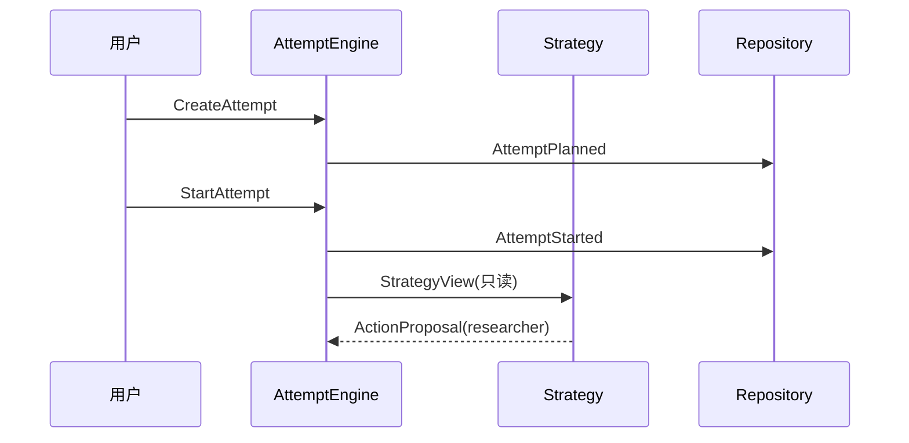

# 为什么需要状态编排

> 上一章：无（阅读起点） · [目录](README.md) · 下一章：[核心词汇](02-core-vocabulary.md)

## 本章学习目标

- 看出“让模型自己循环”与“由控制面编排尝试（Attempt）”的差别。
- 理解状态编排（state orchestration）要保护的确定性、审计和恢复边界。
- 能说出普通共享 state 方案在副作用和崩溃场景中的具体缺口。

## 从一个看似简单的 Agent 开始

假设研究 Agent 收到问题：“比较两种数据库，并给出建议。”它可能先调用
`researcher`，再调用 `reviewer`。如果程序只有一个可变字典，流程大概是：

```text
state["next"] = "researcher"
调用远端
state["research"] = 返回值
state["next"] = "reviewer"
```

这在没有故障时很直观，但有三个时间窗口：调用前进程崩溃、远端已经成功而本地还没
写回、两个操作员同时修改同一份字典。字典无法回答“这个决定是否已提交”和“副作用
是否可能已经发生”。

## 生活化比喻：机场登机牌与广播

把一次尝试（Attempt）想成一位旅客的一次航程：命令（Command）是“请求改签”的申请，事件（Event）是
柜台盖章后的事实，状态投影（AttemptState）是当前登机屏幕上的投影。屏幕坏了可以用盖章记录
重建；没有盖章的口头决定不能让行李车先出发。这个比喻的重点是：**控制状态先留下
可验证事实，副作用再发生**。

## 正式定义

状态编排是一个控制面（control plane），负责把外部请求、策略决定、权限/预算检查、
副作用执行和终止条件串成持久化状态转换。数据面（data plane）才真正调用模型、
工具或远端 Agent。本项目把两者隔离：`experiment_system` 不直接改现有 Agent runtime
的 `ChatSpace`。

事件溯源（event sourcing）把不可变 Event 序列当作真相源；Reducer 纯函数地把序列投影
成 `AttemptState`。事务 outbox 则保证“接受 Action”与“留下待执行记录”在同一事务中
提交。

## 本项目怎样解决三个问题

| 问题 | 直接做法 | 代码事实 |
| --- | --- | --- |
| 决定是否落盘 | `AttemptEngine.handle(Command)` 先校验再 commit | [`engine.py`](../engine.py) |
| 谁能写状态 | Engine 是唯一逻辑写入者；Strategy 只有只读 View | [`contract.py`](../contract.py)、[`state.py`](../state.py) |
| 崩溃后怎么判断 | 读取 Event、重放、按 recovery policy 处理 | [`reducer.py`](../reducer.py)、[`recovery.py`](../recovery.py) |

错误做法是让 Strategy 直接调用 Backend、让 Backend 改 `AttemptState`，或在超时后随意
补写 `FAILED`。正确做法是把这些动作变成受 Engine 验证的 Command/Event。

## 贯穿示例的第一小步

研究流程先提出一个调用：`researcher`。此时还没有外部调用，只有一个待验证的意图：



这里的动作提案（ActionProposal）还不是批准执行的规范化动作（NormalizedAction）。这条界线会在第 6 章展开。

## 常见误解

1. **“事件溯源就是把日志写到文件。”** 日志可以丢、改、无序；本项目 Event 有序号、
   因果父、schema 和 reducer 校验，且由 Repository 原子提交。
2. **“暂停就是把一个 Python task `await` 住。”** 暂停是持久化的 `PAUSE_REQUESTED`
   和安全边界后的 `ATTEMPT_PAUSED`，进程可以退出再恢复。
3. **“有了不可变 state 就不需要 Engine。”** 不可变只防止事后修改；Engine 仍要决定
   哪个 Command 合法、预算是否够、outbox 是否同步落盘。

## 本章小结

普通 Agent 循环擅长产生内容，却不能单独提供副作用的提交语义。状态编排用 Command、
Event、纯 Reducer、Engine 和 outbox 把“想做什么”与“已经允许什么”分开，并为暂停、
审计和崩溃恢复留下证据。

## 思考题与练习

1. 如果远端调用成功后本地进程立即断电，单一可变字典能证明什么？不能证明什么？
2. 为什么 `AttemptState` 适合作为投影而不是唯一真相源？
3. 找出一个你熟悉的 Agent 工具，把它的“请求、提交、执行、观察”四步写出来。
