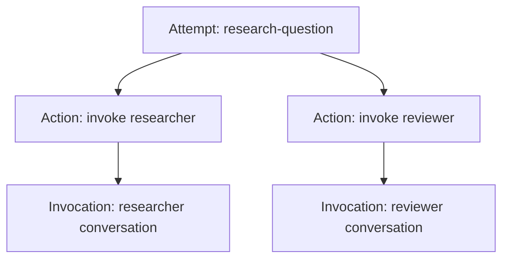
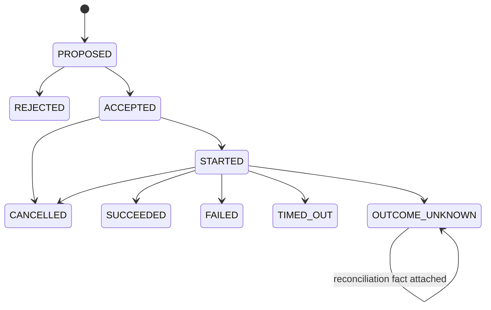

# 核心词汇：Attempt、Action 与 Invocation

> 上一章：[为什么需要状态编排](01-why-state-orchestration.md) · [目录](README.md) · 下一章：[架构总览](03-architecture-overview.md)

## 本章学习目标

- 区分尝试（Attempt）、动作（Action）、调用（Invocation）、提案（Proposal）和事件（Event）。
- 读懂 Action 与 Invocation 的双生命周期。
- 识别 `FAILED`、`OUTCOME_UNKNOWN` 和“重试”的不同含义。

## 先用研究场景建立直觉

“研究一个问题”是一次尝试（Attempt），不是一个 Agent 对话。策略（Strategy）可能提出两个
动作（Action）：调用 `researcher`、调用 `reviewer`。每个动作关联一个调用上下文（Invocation）：
目标 Agent、会话 id、父调用和最近上下文引用。

| 中文名称 | English Term | 一句话 |
| --- | --- | --- |
| 尝试 | Attempt | 一个 trial 的一次可独立恢复的执行实例 |
| 动作 | Action | 受 Engine 控制、最终必须有观察结果的副作用单元 |
| 调用 | Invocation | Action 关联的 Agent 会话/上下文生命周期 |
| 动作提案 | ActionProposal | Strategy 想做什么的不可变请求 |
| 规范化动作 | NormalizedAction | 守卫通过后补齐 reservation 与幂等键的动作 |
| 领域事件 | DomainEvent | 已提交的事实 |

## Attempt 与 Invocation 不一样

一个 Attempt 可以先后拥有多个 Invocation；一个 Invocation 通常由一个 `INVOKE_AGENT`
Action 所拥有。Attempt 的 `phase`（如 `RUNNING`）回答“整次执行在哪里”，Invocation
的 `status`（如 `REQUESTED`、`COMPLETED`）回答“某个 Agent 调用在哪里”。不要用
Invocation 的完成代替 Attempt 的完成。

代码中的联合约束在 [`state.py`](../state.py) 的 `AttemptState` 校验器：Invocation 必须
有唯一 owner Action，目标必须一致；调用成功要求 Invocation `COMPLETED`。

## Action 状态机

`OUTCOME_UNKNOWN` 是“观察不到结果”，不是“远端一定失败”。如果外部系统后来可查，
会追加 `ActionOutcomeReconciled`，但原始 unknown 事实仍保留。`FAILED` 才表示系统已经
观察到规范化失败。

## 为什么 Proposal 与 NormalizedAction 分两层

Proposal 可能违反拓扑、预算、并发或审批规则；它只能进入 `ACTION_PROPOSED`。守卫通过
后 Engine 生成 `NormalizedAction`，补上 `reservation_id` 和 `idempotency_key`，再产生
`ACTION_ACCEPTED`。这就是“模型可以提议，控制面决定能否执行”。

重试也有专门语义：**retry 是新 Action**，有新 `action_id`，并通过 `retry_of_action_id`
指向旧 Action；**replay 是同一 Action 的再次投递**，保留原 `action_id` 与
`idempotency_key`。

## 逐步示例

1. Strategy 产生 `research-0` Proposal，状态 `PROPOSED`。
2. Engine 通过守卫，生成带 reservation/idempotency key 的 NormalizedAction，状态 `ACCEPTED`。
3. Executor 报告 `ACTION_STARTED`，Invocation 变为 `RUNNING`。
4. Backend 返回 artifact 引用，产生 `ACTION_SUCCEEDED` 和 Invocation `COMPLETED`。
5. Strategy 收到 committed terminal Event，再提出 `reviewer` Action。

关键模型和 outcome union 位于 [`actions.py`](../actions.py)，相关构造约束测试见
[`tests/test_experiment_actions.py`](../../tests/test_experiment_actions.py)。

## 常见误解

- **Attempt 是 Invocation 的别名。** 错；前者是控制聚合，后者是一次 Agent 上下文。
- **ActionAccepted 就是 ActionSucceeded。** 错；Accepted 只代表“已批准且可投递”。
- **超时就是失败。** 对本地等待可记录 `TIMED_OUT`，但若远端副作用可能已发生，恢复
  路径必须允许 `OUTCOME_UNKNOWN`。
- **重试可以复用所有字段。** 可复用输入和 `retry_of_action_id`，但必须新 Action id；
  复用原 id 是重复投递/幂等，不是策略重试。

## 本章小结

Attempt 组织全局生命周期，Action 表示受控副作用，Invocation 描述 Agent 调用上下文。
Proposal 是意图，NormalizedAction 是守卫批准后的执行契约，Event 则是已经落盘的事实。

## 思考题与练习

1. 一个 Attempt 中有两个并行 Action 时，为什么不能只保存一个 `invocation_id`？
2. 请给“支付请求”分别设计 `FAILED` 和 `OUTCOME_UNKNOWN` 的安全消息。
3. 画出 retry 新 Action 与 replay 原 Action 的 id 关系。
