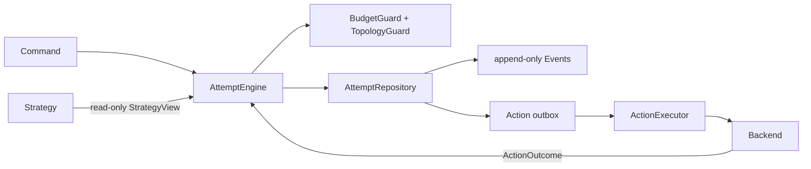
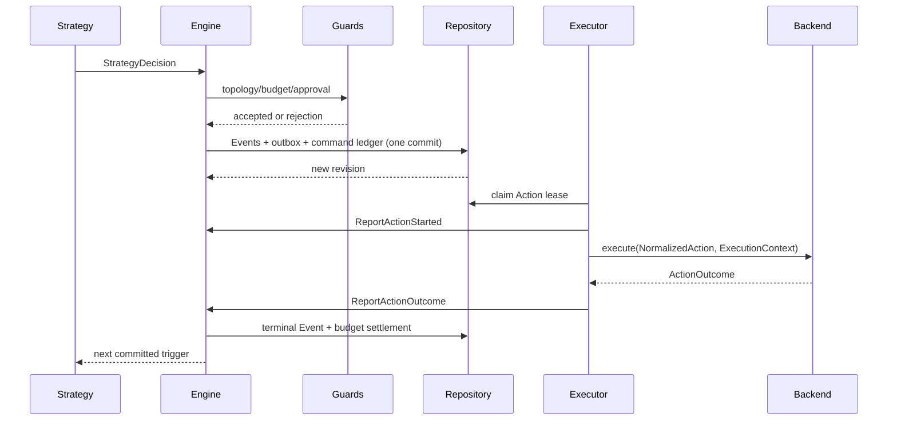

# 架构总览：控制面、调用链与不变量

> 上一章：[核心词汇](02-core-vocabulary.md) · [目录](README.md) · 下一章：[Attempt 状态与只读视图](04-attempt-state-and-views.md)

## 本章学习目标

- 从模块职责看懂一次控制面循环。
- 理解引擎（Engine）、策略（Strategy）、后端（Backend）、仓储（Repository）、执行器（Executor）的依赖方向。
- 用核心不变量判断一段新代码是否越界。

## 控制面和数据面

控制面（control plane）决定“是否、何时、以什么预算执行”；数据面（data plane）执行
已经批准的模型、工具或 Agent 调用。当前仓库的既有 `Agent.py`/HTTP/Responses runtime
仍是数据面候选实现，`experiment_system` 是独立控制面。它们目前没有互相导入。

## 核心角色的职责

| 角色 | 负责 | 不负责 |
| --- | --- | --- |
| Command | 表达请求和 expected revision | 证明请求已提交 |
| Event | 记录已提交事实 | 直接调用外部系统 |
| Reducer | 纯函数投影与重放校验 | I/O、时钟、模型、随机数 |
| Action | 描述一个受控副作用及其结果 | 自己调 Backend |
| Strategy | 根据受限 View 提议 Action/私有状态 | 写状态、扣预算、调 Backend |
| Backend | 执行 NormalizedAction 并返回规范 outcome | 改 Attempt、绕过守卫 |
| AttemptEngine | 校验 Command、构造 Event、原子提交 | 被 Strategy/Backend 绕过 |
| Repository | 保存 Event/ledger/checkpoint/outbox 并管理 lease | 决定领域转换是否合法 |
| Executor | claim 已接受 Action、提交 Started/Outcome | 规划策略或猜测远端结果 |

代码接口集中在 [`contract.py`](../contract.py)；Engine 构造这些角色之间的提交边界，
实现见 [`engine.py`](../engine.py) 和 [`executor.py`](../executor.py)。

## 核心不变量

1. `AttemptEngine` 是 `AttemptState` 唯一逻辑写入者。
2. `state.revision == 最后一个 Event.sequence_no`。
3. Command 可能被拒绝；只有 commit 成功才有新 Event。
4. Reducer 对相同 Event 序列给出相同 canonical state/hash。
5. 每个已开始 Action 最终有一个观察终态（成功、失败、超时、取消或 unknown）。
6. ActionAccepted、预算 reservation 和 outbox 必须同事务提交。
7. terminal Attempt 不留开放 reservation/outbox。

正确做法：Strategy 返回值交给 Engine，Engine 先 `replay_events` 验证候选状态，再让
Repository 原子提交。错误做法：Strategy 直接写 SQLite，或 Backend 先发 HTTP 再补
`ActionAccepted`；后一种顺序会制造“副作用已发生但控制面没有记录”的黑洞。

## 一次循环的时序

## 逐步检查一个新模块

当你要加入模块时依次问：

1. 它是否能只通过一个小接口获得必要信息？
2. 它是否把副作用放在 Engine 提交之后？
3. 它是否能从 Event 重放，而不用保存 Python 对象、锁或 coroutine？
4. 失败时是否返回安全、稳定的错误代码？

如果答案是否定的，先回到模块边界，而不是把更多字段塞进 `AttemptState`。

## 常见误解

- **Repository 是 Reducer 的替代品。** Repository 保存并协调事务；Reducer 决定事件
  在领域状态上是否合法，两者契约不同。
- **Runner 就是 Engine。** Runner 驱动确定性策略循环；Engine 只处理一个 Command 的
  领域转换和提交。
- **这就是 LangGraph 的共享 state。** 本项目借鉴只读视图和持久游标，但控制状态以
  immutable Event、事务和副作用边界为核心，不是把所有节点合并到一个可变 state。

## 本章小结

控制面把“决策、验证、提交、投递、观察”拆成可审计的模块。Engine 是写入闸门，Reducer
是纯投影，Repository 是持久化契约，Executor 是 outbox 消费者，Backend 只做已批准的
工作。围绕不变量阅读代码，比记住类名更可靠。

## 思考题与练习

1. 把一个会发送邮件的函数标注为 Strategy、Engine、Executor 或 Backend，并说明理由。
2. 哪条不变量能阻止“接受 Action 但没有 outbox 行”？
3. 如果要支持并行调用，应该由谁显式表达并行，而不是谁推断？
