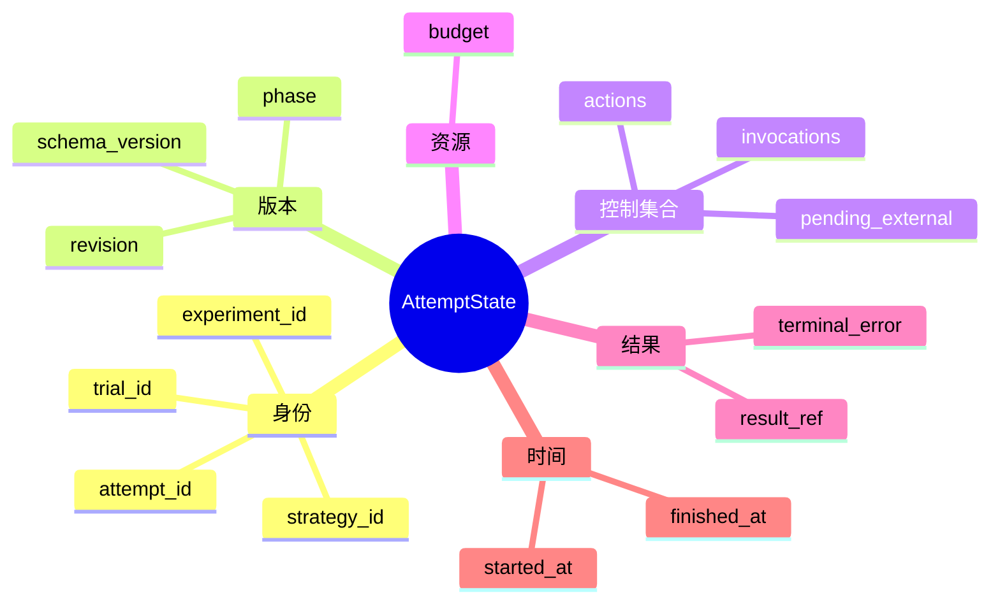
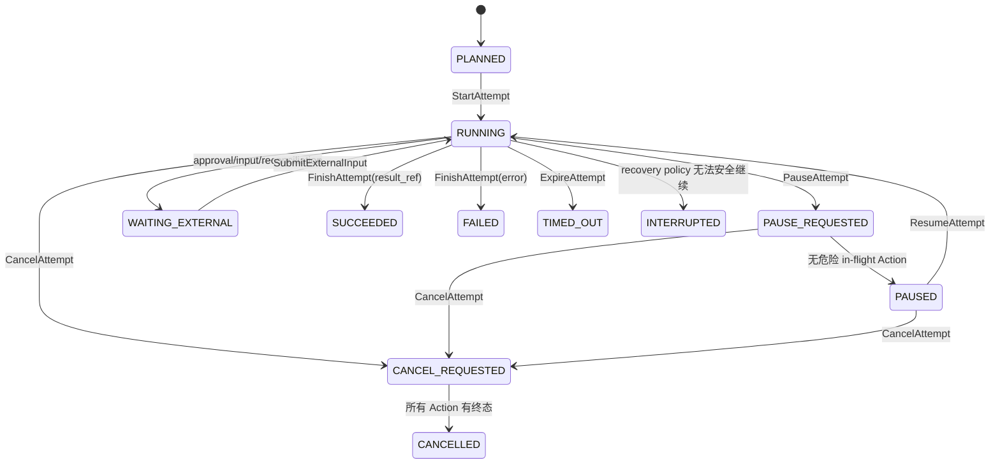

# AttemptState、生命周期与只读视图

> 上一章：[架构总览](03-architecture-overview.md) · [目录](README.md) · 下一章：[Command、Event 与 Reducer](05-command-event-reducer.md)

## 本章学习目标

- 从零理解不可变状态（immutable state）。
- 读懂 `AttemptState` 的生命周期字段和合法阶段。
- 区分 `StrategyView`、`AgentView`、`OperatorView`，以及 `AttemptState` 与 `ChatSpace`。

## 为什么状态要不可变

想象策略（Strategy）正在检查“剩余预算”，另一个协程同时把预算减掉。若两者共享可变字典，
前者可能基于已经过期的数字提出 Action。不可变状态的直觉是：拿到的快照不会在你
阅读期间改变；新事实到来时创建一个新值，并把 revision 加一。

在代码里，`FrozenModel` 设置 `extra="forbid"`、`frozen=True`，集合使用 tuple，嵌套
JSON 也递归冻结。Reducer 不修改旧对象，而是构造下一份 `AttemptState`。这不是为了
“函数式风格好看”，而是让同一个输入序列可重算、可比较、可哈希。

## AttemptState 的地图



实现字段和聚合校验见 [`state.py`](../state.py) 的 `AttemptState`；状态测试从
[`tests/test_experiment_state.py`](../../tests/test_experiment_state.py) 开始。

## 生命周期不是一个布尔值



`PAUSE_REQUESTED` 与 `PAUSED` 有意分开：前者是请求已记录但可能仍有 STARTED Action，
后者才是安全边界。`WAITING_EXTERNAL` 也不是暂停，它保证恰好一个待处理请求；恢复
命令要提交对应 request id 和 response kind。

## 三种视图与两个相似对象

| 对象 | 面向谁 | 可见内容 | 易错点 |
| --- | --- | --- | --- |
| `AttemptState` | Engine/Repository | 完整控制投影 | Strategy 不应直接拿到它写入 |
| `StrategyView` | Strategy | 剩余预算、合法拓扑、Action/Invocation 摘要、可见 artifact、最新 Event | 不含凭据、数据库句柄、隐藏 fixture |
| `AgentView` | Agent 适配层 | 当前任务、Agent 定义、授权上下文、artifact 引用 | 不是全局 Attempt 状态 |
| `OperatorView` | CLI/操作员 | phase、revision、进度、预算、待输入、失败摘要 | 默认不含原始内容 |
| `ChatSpace` | 现有 Agent runtime | messages/context_items/instructions/tools/会话 id | 是数据面会话，不是 Attempt aggregate |

`to_strategy_view` 会计算 `limit - reserved - consumed`，而不是把完整预算对象暴露给
策略；`to_operator_view` 则保留操作员所需的进度。构造函数位于 [`state.py`](../state.py)。

## 逐步示例：从 PLANNED 到 WAITING_EXTERNAL

1. `CreateAttempt` 提供 manifest、strategy envelope 和预算；投影为 `PLANNED`。
2. `StartAttempt` 追加 `AttemptStarted`；`started_at` 出现，phase 变 `RUNNING`。
3. Strategy 提议需要人工批准的 reviewer Action；Engine 追加 `ExternalInputRequested`。
4. 投影变为 `WAITING_EXTERNAL`，`pending_external` 恰好一个。
5. 操作员提交正确 request id 后，追加 received/approved 事实并回到 `RUNNING`。

## 正确与错误做法

```text
正确：读取 StrategyView -> 返回决策 -> Engine 校验 -> Event -> 新 AttemptState
错误：StrategyView.actions[0].status = "SUCCEEDED"
错误：把 ChatSpace.messages 全量复制到每次 Attempt 快照
```

后两种做法分别绕过不可变约束、混淆控制面与数据面，并扩大敏感数据边界。

## 常见误解

- **不可变意味着永远不能改变。** 改变的是“版本”：旧值保留，新 Event 产生新值。
- **PAUSED 和 WAITING_EXTERNAL 可以共用一个 flag。** 它们的后续命令、待处理对象和
  恢复安全条件不同，必须是不同 phase。
- **OperatorView 是调试用的完整 dump。** 它是有意裁剪、脱敏的公共投影。

## 本章小结

`AttemptState` 是一个有严格不变量的不可变聚合投影；生命周期阶段表达可恢复边界，
视图则把“谁能看什么”变成接口。`ChatSpace` 仍可作为现有 runtime 的会话实现，但
不应成为控制面真相源。

## 思考题与练习

1. 为什么 `WAITING_EXTERNAL` 要求恰好一个请求，而不是允许一个列表？
2. 设计一个 StrategyView 字段，说明它为什么不会泄露全局控制状态。
3. 找到代码里 terminal Attempt 要求所有 Action terminal 的校验，并解释它防止了什么。
