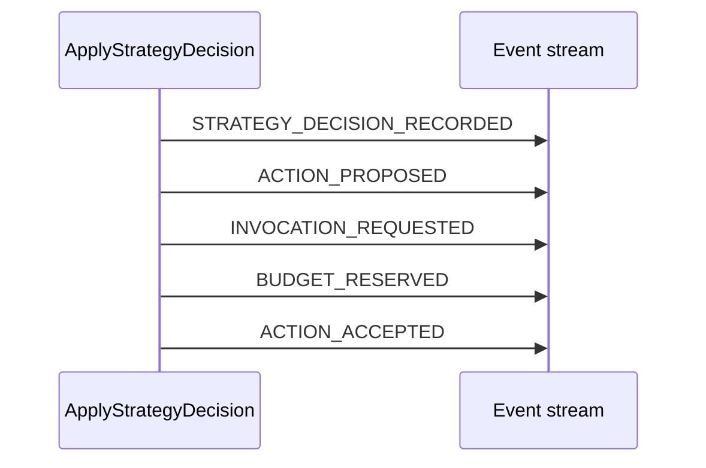

# Command、Event、Reducer 与事件溯源

> 上一章：[Attempt 状态与只读视图](04-attempt-state-and-views.md) · [目录](README.md) · 下一章：[Action 与 Invocation 生命周期](06-action-and-invocation.md)

## 本章学习目标

- 从零理解事件溯源（event sourcing）和重放（replay）。
- 分清命令（Command）“请求”与事件（Event）“事实”。
- 看懂纯归约器（reducer）如何拒绝非法顺序、重复和因果错误。

## 生活化例子：银行流水

“请转账 100 元”是命令（Command）；银行确认扣款并记账后才有事件（Event）。余额是流水的投影，
不是比流水更权威的另一份事实。若余额表损坏，可以从流水重算；若有人直接改余额，
审计就失去依据。

Attempt 采用同样结构：`CreateAttempt` 请求创建，Engine 提交 `AttemptPlanned`；
`AttemptState.revision` 是由 Event 序号投影出来的当前余额式视图。

## 正式定义

- **Command（命令）**：要求系统尝试一个状态转换的输入，可能被拒绝。
- **Event（事件）**：已经通过校验、写入持久化的不可变事实。
- **Reducer（归约器）**：纯函数 `apply_event(state, event) -> new_state`，只根据旧状态
  和事件计算下一状态。
- **Event sourcing**：保存事件序列作为真相源，把当前状态视为可重建投影。
- **Replay**：按 sequence_no 依次把事件交给 reducer，重新得到状态。

## Command 的 revision 预条件

每个后续 Command 带 `expected_revision`。假设当前 revision 为 7：

```text
客户端读到 revision=7
客户端发送 expected_revision=7
另一个客户端先提交，revision 变 8
本次请求被拒绝为 REVISION_CONFLICT，不追加 Event
```

这是一种乐观并发（optimistic concurrency）：不先锁住整个世界，而是在提交时检查版本。
`command_request_hash` 和 `(attempt_id, command_id)` 账本还会区分“同请求重发”和“同 id
换内容”。具体 Command union 在 [`commands.py`](../commands.py)。

## Event 的因果链与批次

除了 `AttemptPlanned`，每个 Event 都有更早的 `causal_parent_id`。同一个 Command 生成的
多个 Event 会在线性因果链上连续追加，例如一次接受 Action 的批次可能是：



Repository 会验证 command/attempt identity、事件 id 唯一、序号连续、父事件已出现且
来自同一 Attempt。事件类型与验证函数见 [`events.py`](../events.py)。

## Reducer 为什么必须纯

纯 reducer 不能读时钟、随机数、环境变量、模型、工具或数据库；时间和 id 必须已经在
Event 中。这样同一序列每次 replay 都得到相同 canonical JSON/hash，也能在没有 Backend
的情况下审计或恢复。

```python
# 伪代码：展示接口，不是新的可运行 API
def apply_event(state, event):
    if event.type == "ACTION_STARTED":
        return replace_action(state, event.action_id, status="STARTED")
    raise IllegalTransition()
```

当前实现的 `apply_event`、`replay_events` 和错误码见 [`reducer.py`](../reducer.py)；
非法转换与重放测试见 [`tests/test_experiment_reducer.py`](../../tests/test_experiment_reducer.py)。

## 逐步示例：同一事实的两种读取方式

1. Repository 读取事件 `[AttemptPlanned, AttemptStarted, ...]`。
2. `replay_events` 先验证整条流，再逐个调用具体 handler。
3. 得到 `state.revision == 最后 sequence_no`。
4. `StrategyView` 和 `OperatorView` 从该状态派生；它们不是另一条写入通道。
5. SQLite 的 head/checkpoint 若缺失，也可由这条 Event 流重建。

## 正确与错误做法

| 正确 | 错误 |
| --- | --- |
| 新需求定义 Command，Engine 生成 Event | 外部代码直接 patch `state.phase` |
| 通过追加补偿/澄清 Event 修正历史 | UPDATE/DELETE 已写入的 Event |
| replay 前验证 schema、父事件和序号 | 只信任 snapshot，不检查 Event |
| 重试相同 Command 时返回已存结果 | 每次 HTTP 重试都再执行副作用 |

## 常见误解

- **Command 被构造出来就等于发生了。** 只有 Repository commit 成功才发生。
- **Reducer 是业务服务，可以顺便写数据库。** 这会让 replay 产生新副作用，破坏确定性。
- **Replay 是 retry。** Replay 只是重建状态；retry 是 Strategy 提出的新 Action。

## 本章小结

事件溯源把历史事实放在中心，Command 负责请求，Reducer 负责纯投影，revision 和因果链
负责并发与审计。只要事件流可信，当前状态、视图和 checkpoint 都能重建。

## 思考题与练习

1. 同一个 Command id 重发但 payload 改变，为什么必须拒绝而不是覆盖旧结果？
2. 给 `ActionAccepted` 设计一个缺失 `BudgetReserved` 的错误事件流，说明 replay 应何时拒绝。
3. 为什么 reducer 读取 wall clock 会让 crash recovery 难以复现？
