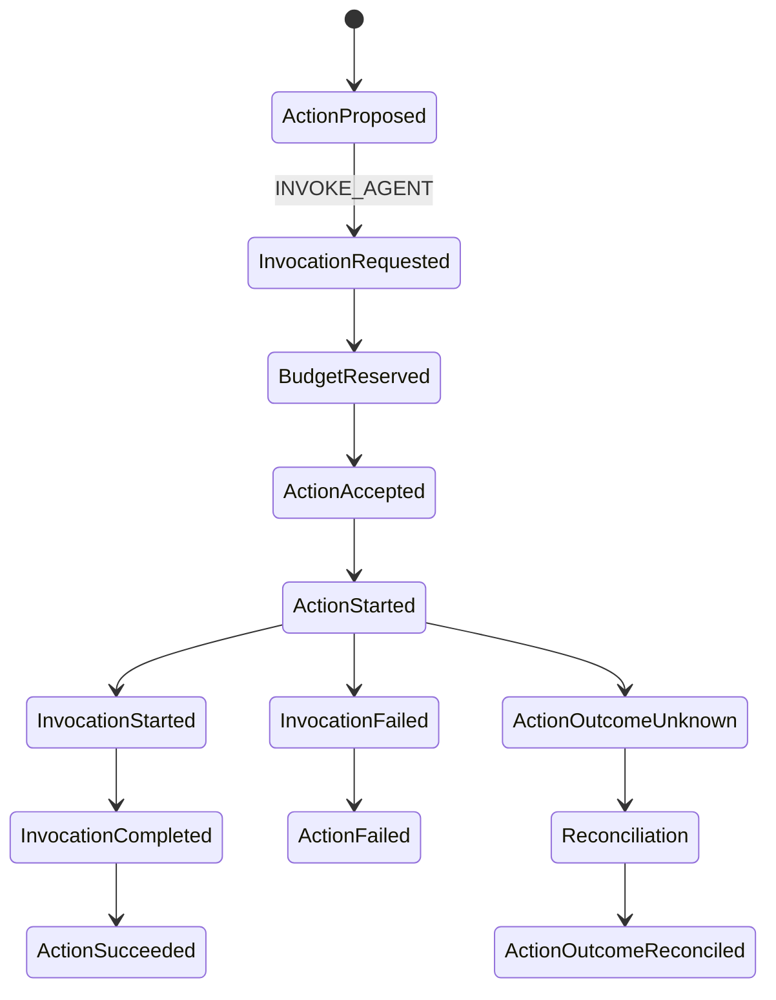

# Action 与 Invocation 的完整生命周期

> 上一章：[Command、Event 与 Reducer](05-command-event-reducer.md) · [目录](README.md) · 下一章：[Strategy、Backend、预算与拓扑守卫](07-strategy-backend-and-guards.md)

## 本章学习目标

- 逐事件追踪一个 Agent 动作（Action）从提案到终态。
- 理解调用（Invocation）为什么与动作分开记录。
- 知道每个已开始动作必须得到明确终态观察。

## 研究示例的两次调用

问题进入一次尝试（Attempt）后，策略（Strategy）先提出 `researcher`，成功后再提出 `reviewer`。
每次调用都可能包含后端上下文 artifact 引用，但 Attempt 只保存引用，不保存原始 prompt。



## 四层含义不要混在一起

1. **Proposal**：Strategy 的声明，“我想调用 researcher”。
2. **Accepted/Normalized**：Engine 已分配预算、校验拓扑并生成稳定幂等键。
3. **Started**：Executor 持有有效 lease，并已提交 `ActionStarted`；这一步之后不能假设
   没有外部副作用。
4. **Outcome**：Backend 返回并经 Engine 规范化的观察；成功用 `result_ref`，非成功用
   `ErrorSummary`。

Invocation 记录 Agent-specific 的 `conversation_id`、`agent_id`、父调用和 context ref。
`INVOKE_AGENT` Action 的状态与 Invocation 状态有联合校验：例如 Action `SUCCEEDED` 必须
对应 Invocation `COMPLETED`。

## Engine 产生的事件批次

普通无审批调用的典型批次如下：

```text
STRATEGY_DECISION_RECORDED
ACTION_PROPOSED
INVOCATION_REQUESTED       # INVOKE_AGENT 才有
BUDGET_RESERVED
ACTION_ACCEPTED            # 同一 commit 也写 outbox
```

Executor 后续提交：

```text
ACTION_STARTED
INVOCATION_STARTED
INVOCATION_COMPLETED        # 成功时
ACTION_SUCCEEDED
BUDGET_SETTLED
```

失败、超时、取消有对应终态 Event；`OUTCOME_UNKNOWN` 会紧接
`EXTERNAL_INPUT_REQUESTED(kind=OUTCOME_RECONCILIATION)`，保留 reservation 等待处理。

实现的事件类型位于 [`events.py`](../events.py)，Engine 的构造逻辑在
[`engine.py`](../engine.py)，状态联合校验在 [`state.py`](../state.py)。

## Backend 的边界

Backend 只接受已规范化的 `NormalizedAction` 和不可变 `ExecutionContext`，返回
`ActionOutcome`。它不能写 Event、扣预算、改变 phase 或读取完整 AttemptState。当前可用
实现是确定性的 [`ScriptedBackend`](../backends/deterministic.py)；production CLI 的
registry 为空，见 [`cli.py`](../cli.py)。

## 逐步示例：researcher 成功，reviewer 失败

1. `researcher` Action 被接受，outbox 出现一行。
2. Executor claim 并提交 Started；Backend 返回成功 artifact。
3. Engine 提交 terminal success 和 BudgetSettled。
4. Runner 把 `ActionSucceeded` 交给 StaticWorkflowStrategy。
5. Strategy 提出新的 `reviewer` Action；它有新的 action/invocation id。
6. reviewer Backend 返回规范化 `FAILED`；Strategy 决定 `FAIL`，Runner 执行 FinishAttempt。

注意：第 6 步不是把原始异常写入 state；只保存稳定 code、retryable 标志、安全消息和可选
的 detail artifact 引用。

## 正确与错误做法

```text
正确：ActionStarted commit 成功后才调用 Backend
正确：Outcome 的 action_id 必须等于被 claim 的 action_id
错误：Backend 返回后直接把 state.actions[0] 改成 SUCCEEDED
错误：一个 Action 失败后复用原 action_id 重新提案
错误：Started 但进程断电时补写 FAILED
```

## 常见误解

- **Invocation 完成就代表 Attempt 成功。** 还要等 Strategy 的终态决策和 FinishAttempt。
- **ActionOutcome 是 Event。** Outcome 是 Backend/Executor 的输入；提交后才包装成 terminal Event。
- **所有 Action 都必须有 Invocation。** `SEND_MESSAGE` 等类型可没有 Invocation；模型校验
  只对 `INVOKE_AGENT` 强制关联。

## 本章小结

Action 是受控副作用的账本单位，Invocation 是其中 Agent 调用的上下文账本。Accepted、
Started、Outcome 之间的顺序把批准、实际开始和观察结果分开，使失败与 unknown 都能被
审计和恢复。

## 思考题与练习

1. 为什么 `ActionStarted` 要在外部调用前提交？
2. 设计一个没有 Invocation 的 `SEND_MESSAGE` Action，并列出仍需保存的字段。
3. 如果 reviewer 的结果 artifact 已写入但 terminal Event 未提交，下一章的 Executor 应如何处理？
