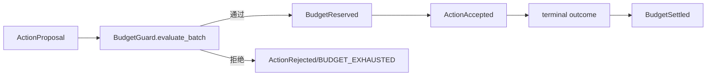
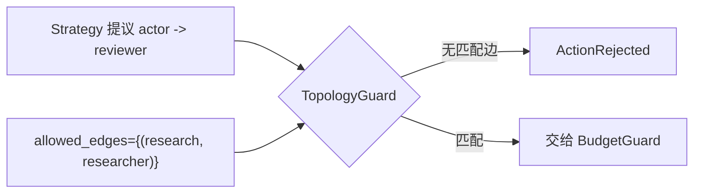

# Strategy、Backend、预算与拓扑守卫

> 上一章：[Action 与 Invocation 生命周期](06-action-and-invocation.md) · [目录](README.md) · 下一章：[AttemptEngine、revision 与幂等](08-engine-and-idempotency.md)

## 本章学习目标

- 明确策略（Strategy）与后端（Backend）的输入、输出和权限差异。
- 理解预算守卫（BudgetGuard）的 reservation/consumed 账本。
- 理解拓扑守卫（TopologyGuard）为什么必须在代码里检查，而不是交给提示词。

## 生活化例子：旅行社与司机

策略（Strategy）像旅行社规划路线：它可以建议“先去 researcher，再去 reviewer”，但不能直接
开车。后端（Backend）像司机，只能驾驶已经批准的路线。预算守卫检查油量和并发车数，拓扑守卫
检查这辆车是否被允许驶向该城市。模型的文字说“请访问任意 URL”不能扩大 allowlist。

## Strategy 合约

Strategy 有两个入口：

```text
initialize(StrategyView) -> StrategyDecision
on_event(strategy_state, committed_event, StrategyView) -> StrategyDecision
```

它只看到受限 `StrategyView` 和已经提交的触发 Event；不能拿 Repository、Backend、时钟
或完整 AttemptState。它返回新的 namespaced `StrategyStateEnvelope`、零个或多个提案及
`CONTINUE/SUCCEED/FAIL` 指令。

Backend 的接口则是：

```text
async execute(NormalizedAction, ExecutionContext) -> ActionOutcome
```

当前接口和协议在 [`contract.py`](../contract.py)，确定性实现见
[`backends/deterministic.py`](../backends/deterministic.py)。不要把未来的 `LiveLLMBackend`
写成当前能力。

## 预算：先预留，再消费

每种资源都有 `limit`、`reserved`、`consumed`：

```text
可用 = limit - reserved - consumed
接受 Action：reserved += 请求量
终态成功/失败/超时：reserved -= 请求量，consumed += 请求量
未开始取消：reserved -= 请求量，consumed 不变
```



`BudgetGuard.evaluate_batch` 对整批 Action 计算总量，按 deadline、call depth、并发数和
资源上限检查；任何一个成员失败，整批都不部分预留。实现与 rejection code 见
[`budget.py`](../budget.py)，守卫测试见 [`tests/test_experiment_guards.py`](../../tests/test_experiment_guards.py)。

## 拓扑：能力边界而不是装饰信息

`TopologyGuard` 检查精确的 `(actor, target)` 有向边。策略给出 `to_id` 只能说明意图，
真实地址或凭据不在 Action 中，也不会由模型提供。错误做法是只在 system prompt 写“请
不要调用 reviewer”；正确做法是 Engine 在提交前拒绝 `TOPOLOGY_EDGE_FORBIDDEN`。



## 逐步示例：研究流程的两次守卫

1. `research` Strategy 提出 `research -> researcher`，边存在，预算预留成功。
2. researcher 完成后，Strategy 提出 `research -> reviewer`。
3. 若配置只允许 researcher，TopologyGuard 产生拒绝 Event；Backend 根本不会被调用。
4. 若两条边都允许，BudgetGuard 再检查剩余 `MODEL_CALLS` 和并发上限。

## 正确与错误做法

| 正确做法 | 错误做法 |
| --- | --- |
| Strategy 只返回 Proposal | Strategy 直接 `await backend.execute` |
| Engine 生成 reservation/idempotency key | Strategy 自己伪造“已接受”字段 |
| 代码检查有向边 | 依赖模型遵守拓扑文字说明 |
| 并行批次带同一明确 `batch_id` | Engine 根据 list 顺序猜并行 |

## 常见误解

- **预算是统计报表。** 在本项目中它是提交前的硬门禁，reservation 会阻止竞态超支。
- **TopologyGuard 是网络层防火墙的替代品。** 它是领域能力守卫；网络认证仍属于数据面适配器。
- **Strategy 失败就能直接扣预算。** 只有 Engine 产生的 reservation/settlement Event 才改变账本。

## 本章小结

Strategy 负责提出下一步，Backend 负责执行已批准动作，BudgetGuard 和 TopologyGuard 把
资源与能力限制变成可测试的代码。这样模型的创造性不会变成未授权副作用。

## 思考题与练习

1. 为什么批量 Action 必须先整体 reservation，再接受任何成员？
2. 设计一个 `MAX_CALL_DEPTH_EXCEEDED` 的诊断信息，哪些细节应保留、哪些不应写入？
3. 如果上游想调用未配置的 Agent，应该由 Strategy、Backend 还是 TopologyGuard 拒绝？
