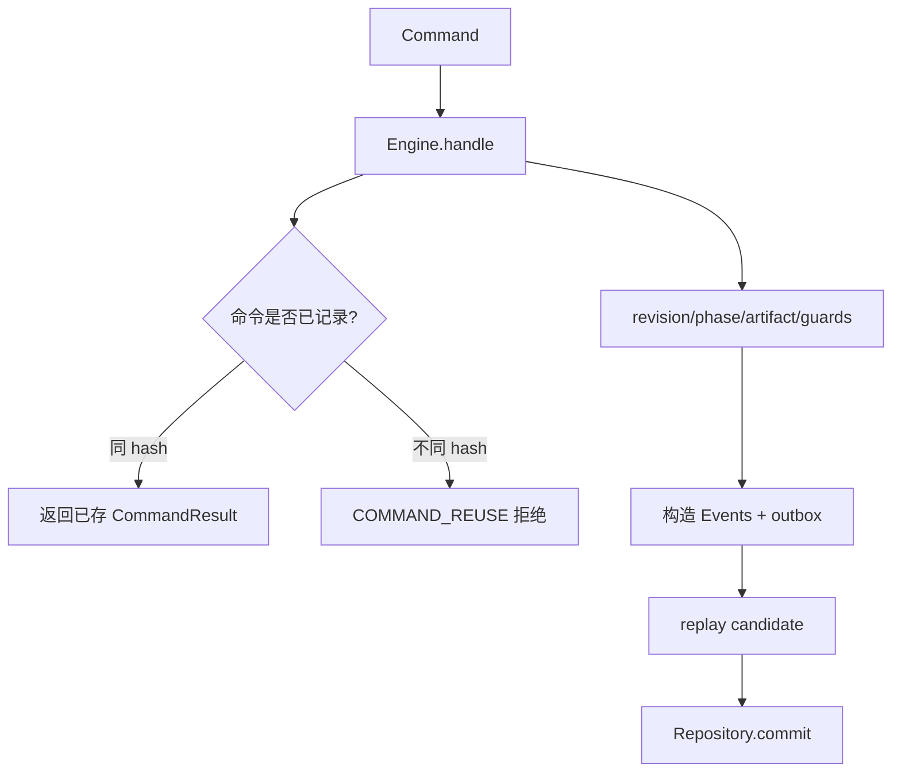

# AttemptEngine、revision、确定性 ID 与幂等

> 上一章：[Strategy、Backend、预算与拓扑守卫](07-strategy-backend-and-guards.md) · [目录](README.md) · 下一章：[Repository、事务、SQLite WAL 与 checkpoint](09-repository-and-sqlite.md)

## 本章学习目标

- 看懂尝试引擎（AttemptEngine）`handle` 的单一写入边界。
- 从零理解幂等（idempotency）和乐观并发（optimistic concurrency）。
- 解释确定性 Command id 为什么能安全处理响应丢失。

## Engine 像唯一的总账柜台

所有控制变更都经过尝试引擎（AttemptEngine）的 `handle(command)`。它先计算 request hash、查找命令
账本、加载当前投影、检查 revision 和 artifact，然后构造候选 Event，先 replay 验证，
最后交给 Repository commit。Strategy、Backend、CLI 都不能绕过这条路写 state。



## 幂等的直观定义

一个操作执行一次或重复提交，**持久化可观察结果相同，且副作用不会多一份**，就称为
幂等。注意“HTTP 请求重发”与“策略想重试”不同：

- 相同 `command_id` + 相同 canonical request hash：返回原结果，不再追加 Event。
- 相同 `command_id` + 不同 payload：`COMMAND_REUSE`，防止身份偷换。
- 策略 retry：新 Action/new id，`retry_of_action_id` 指向旧 Action。

`action_command_id(action_id, "started")` 与 `action_command_id(action_id, "outcome")`
是 UUIDv5 确定性 id。Executor 若在提交后丢失响应，可重发同一 outcome Command；账本会
返回原 revision，而不是创建第二个终态。

## revision 的竞态例子

```text
读到 revision=12
请求 A expected_revision=12
请求 B expected_revision=12
A 先 commit -> revision=13
B 被拒绝 REVISION_CONFLICT，不产生 Event
```

这就是乐观并发：冲突很短且可重试，但重试前必须重新 load，并重新验证 Action/claim。
Repository 还用按 Attempt 的 `command_scope` 串行化同一聚合的处理。

## Engine 的核心不变量

1. `CreateAttempt` 只能在缺失 Attempt 上接受，expected revision 为 0。
2. 所有后续 Event 的 sequence 是当前 revision + 1，不能跳号。
3. accepted Command 的结果 revision 必须等于 `expected_revision + len(events)`。
4. 一个 Command 产生的 Event、outbox、artifact registration 一起提交或一起失败。
5. `FinishAttempt` 必须匹配 Strategy 已提交的 `SUCCEED`/`FAIL` 决策，且没有未观察 Action。

## 逐步示例：响应丢失

1. Executor 发送 `ReportActionOutcome`，SQLite commit 成功。
2. 进程在把 `CommandResult` 交给调用者前崩溃。
3. 重启后 Executor 用同 `action_command_id(action,"outcome")` 再提交。
4. Repository 命令账本发现同 hash，返回原结果；outbox 已被删除，Backend 不再调用。

## 正确与错误做法

```text
正确：先查 command ledger，再按 expected_revision 构造候选转换
正确：冲突后 reload，再重试有限次数
错误：捕获 REVISION_CONFLICT 后盲目重复原 payload
错误：每次 retry 都生成新的随机 outcome command id
错误：把 UUID 随机性当作“幂等”本身；幂等依赖稳定身份和账本约束
```

## 常见误解

- **幂等等于“函数返回值一样”。** 还必须考虑外部副作用和持久化重复。
- **revision 是数据库自增主键。** 它是 Attempt 内连续的领域版本，与 Event sequence 对齐。
- **确定性 ID 会降低安全性。** 输入包含 Attempt/Action/phase 的命名空间；换内容仍会被
  request hash 拒绝。

## 本章小结

Engine 把预条件、候选 replay 和 Repository 原子 commit 组织成唯一写入边界；revision
防止并发覆盖，命令账本和确定性 id 让重发可安全处理。

## 思考题与练习

1. 为什么 `ReportActionStarted` 和 `ReportActionOutcome` 要使用不同 phase 名称生成 id？
2. 如果同一 command id 的第二次请求只改变 wall clock，应该如何处理？
3. 你会把“策略重试”放在 Engine 还是 Strategy？为什么必须是新 Action？
