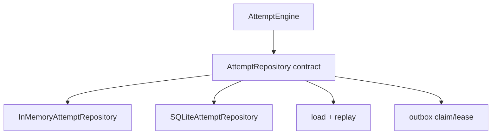
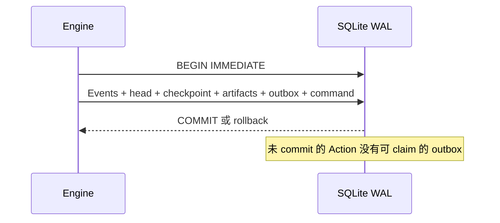

# Repository、事务、SQLite WAL 与 checkpoint

> 上一章：[AttemptEngine、revision、确定性 ID 与幂等](08-engine-and-idempotency.md) · [目录](README.md) · 下一章：[ArtifactRef 与数据边界](10-artifacts-and-data-boundaries.md)

## 本章学习目标

- 理解持久化仓储（Repository）接口隐藏了哪些持久化责任。
- 看懂 SQLite `BEGIN IMMEDIATE`、WAL 和事务原子性在本项目中的作用。
- 区分 Event 真相源、head 和 checkpoint。

## Repository 是什么

持久化仓储（Repository）是 Attempt 的持久化契约，不是归约器（Reducer），也不是“把每个字段存起来”的薄包装。
它提供 `load`、`commit`、命令账本、Event 列表、outbox claim/lease 和非终态枚举。接口
定义在 [`store.py`](../store.py)，InMemory 与 SQLite 都必须遵守同一契约。



## 一次 SQLite commit 做什么

事务（transaction）是一组写入的全有或全无边界。SQLite adapter 在写入时使用
`BEGIN IMMEDIATE`，在同一事务中：

1. 检查 expected revision 和 command ledger。
2. 追加 canonical Event、hash chain 和 attempt head。
3. 写 checkpoint（若到达边界）。
4. 注册 artifact 引用。
5. 插入/更新/删除 action_outbox。
6. 保存 CommandResult，最后 commit。



WAL（write-ahead logging，预写日志）让读写并发更适合单机服务；代码还开启
`foreign_keys=ON`、`busy_timeout`，并拒绝无法启用 WAL 的连接。SQLite 细节和迁移代码见
[`stores/sqlite.py`](../stores/sqlite.py)。当前数据库 schema 是 v2，打开 v1 数据库时执行
事务迁移；未知版本会 fail-closed。

## Event、head、checkpoint 的三角关系

| 对象 | 角色 | 能否作为唯一真相 |
| --- | --- | --- |
| `events` | append-only 事实流；sequence、hash/previous hash 由存储层随事件记录 | 是 |
| `attempt_heads` | 当前可快速读取的 mutable projection | 否，可重建 |
| `attempt_checkpoints` | 特定 revision 的 immutable 快照 | 否，可重建 |

Checkpoint（检查点）是性能/运维边界，不是替代 Event 真相。加载时仍会验证完整事件流；
head 或 checkpoint 缺失/损坏可从事件前缀修复，Event 本体、hash chain 或 canonical JSON
损坏则 fail-closed，不能“猜一个状态”。

当前 Engine 的精确触发点是 `SubmitExternalInput`，或投影后的 phase 为 `PAUSED`、
`WAITING_EXTERNAL`、`CANCELLED`、`TIMED_OUT`、`INTERRUPTED`、`SUCCEEDED`、`FAILED`；
从 `WAITING_EXTERNAL` 执行 `CancelAttempt`/`ExpireAttempt` 时也会随控制转换写入检查点。
设计稿提到的“按事件数配置间隔”目前没有公开实现。

## InMemory 与 SQLite 的共同契约

InMemory repository 在内存中临时复制所有结构，通过 replay 和校验后一次替换；这模拟
事务 rollback。测试会用同一 contract suite 检查两种 adapter：同 revision 竞争只有一个
赢家、重复 Command 返回相同结果、claim lease 互斥、outbox 与 Event 原子一致。

见 [`stores/memory.py`](../stores/memory.py)、[`tests/test_experiment_store_contract.py`](../../tests/test_experiment_store_contract.py)
和 [`tests/test_experiment_sqlite_store.py`](../../tests/test_experiment_sqlite_store.py)。

## 逐步示例：checkpoint 损坏

1. Attempt 在 revision 20 写入 checkpoint。
2. 外部因素使 checkpoint 行缺失，但 Event 1..20 完整。
3. `load` 重放 Event 1..20，算出 canonical state/hash。
4. Repository 修复派生 checkpoint；审计仍以原 Event 为准。
5. 若 Event hash chain 不一致，则抛安全的 `CorruptEventStream`，不修改历史。

## 正确与错误做法

```text
正确：让 Strategy/Backend 只拿接口，不拿 sqlite3.Connection
正确：把 outbox 和 Event 放进同一个 BEGIN/COMMIT
错误：先 commit ActionAccepted，稍后另一个事务插 outbox
错误：发现 head 与 Event 不一致就信 head
错误：用 checkpoint 覆盖或删除旧 Event
```

## 常见误解

- **WAL 等于分布式共识。** WAL 解决单机 SQLite 的读写日志，不提供多机共识。
- **checkpoint 是快照真相。** 它是可验证缓存；事件流才是审计源。
- **InMemory 只是测试玩具。** 它刻意模拟锁、幂等、outbox 和 rollback 契约，帮助测试
  不依赖具体数据库。

## 本章小结

Repository 把事件、命令账本、head、checkpoint、artifact 引用和 outbox 组合成原子持久化
契约。SQLite WAL 适合当前单机目标，但不改变事件溯源和 fail-closed 校验原则。

## 思考题与练习

1. 为什么 head 损坏可以修复，而 Event hash chain 损坏必须拒绝加载？
2. `BEGIN IMMEDIATE` 对同 Attempt revision 竞争解决了哪一步，不能解决哪一步？
3. 为 InMemory adapter 写一条与 SQLite 相同的 contract 断言。
