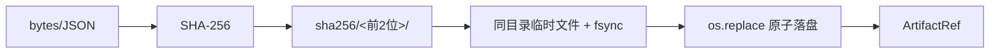
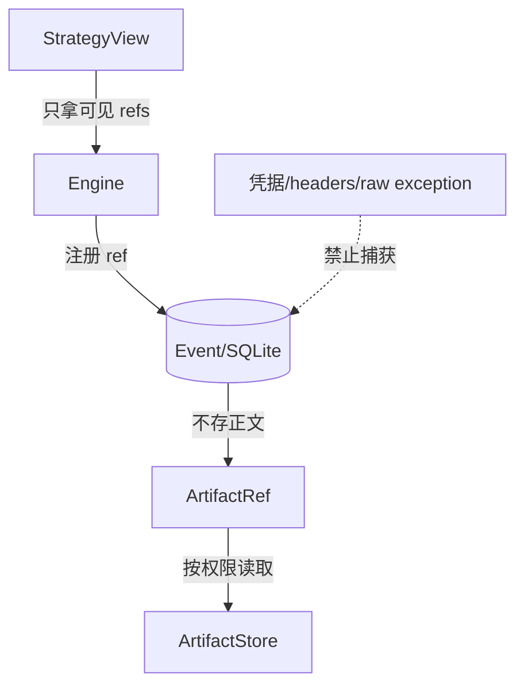

# ArtifactRef、内容寻址与数据安全边界

> 上一章：[Repository、事务、SQLite WAL 与 checkpoint](09-repository-and-sqlite.md) · [目录](README.md) · 下一章：[Transactional outbox、lease 与 Executor](11-outbox-and-executor.md)

## 本章学习目标

- 理解制品引用（ArtifactRef）为什么与实际内容分离。
- 区分 `full`、`hashed`、`metadata_only` 三种 capture class。
- 解释内容寻址、路径约束和安全错误消息如何共同防止泄露与篡改。

## 生活化例子：图书馆索引卡

Attempt/Event 像索引卡：它记录书的指纹、类型、大小和位置，不把整本书塞进每张卡。
索引卡可以审计“哪个版本被引用”，而 artifact store 负责内容生命周期。这样控制状态
不会因为一段很大的模型输出膨胀，也不会在普通 OperatorView 中意外显示秘密。

## ArtifactRef 的正式定义

制品引用（ArtifactRef）是安全引用，不是内容本身。它包含：

- `capture_class`：`full`、`hashed` 或 `metadata_only`。
- `content_hash`：需要内容寻址时的 64 位小写 SHA-256。
- `media_type`、`byte_size`。
- `relative_path`：只允许 artifact root 下的安全 POSIX 相对路径。

契约在 [`state.py`](../state.py)；`ArtifactStore` 实现见 [`artifacts.py`](../artifacts.py)。

| capture class | 可恢复内容 | 必须有 | 禁止 |
| --- | --- | --- | --- |
| `full` | 可读原始（已按策略脱敏） | hash + relative_path | 缺任一字段 |
| `hashed` | 不可读，只能比对指纹 | hash | relative_path |
| `metadata_only` | 不可读 | media_type + size | hash/path |

## 内容寻址如何工作



相同内容得到相同地址，重复写入会验证已有文件而不是盲目覆盖。临时文件与目标同目录，
`flush`/`fsync` 后 `os.replace`，避免进程中断留下半个 artifact。

## 为什么状态和 Event 只保存引用

1. Event 保持小而稳定，replay 不需要加载全文。
2. 控制面不必知道 prompt、模型响应或工具 payload 的内部格式。
3. capture policy 可以按敏感度选择；日志和 OperatorView 默认只出现 hash/size。
4. 内容可独立归档、验证和权限控制。

`StrategyStateEnvelope` 也要求 inline JSON 或 artifact ref 二选一，并校验 canonical hash
与 byte size；策略私有状态不会偷偷变成可变 Python 对象。

## 数据边界图



## 逐步示例：三种 capture 的选择

1. 研究报告正文需本地复核：使用 `full`，先脱敏，再保存 hash/path。
2. 只需证明两个输出相同：使用 `hashed`，不保存可读路径。
3. 只做延迟/大小统计：使用 `metadata_only`，连 hash/path 也不保存。
4. Engine 在 commit 前验证所有 `full` ref 可验证；不能验证则拒绝 Command。

## 正确与错误做法

```text
正确：Event.payload_ref 指向 artifact，正文由 ArtifactStore 管理
正确：拒绝 ../、绝对路径、反斜杠和带盘符路径
正确：错误只返回稳定安全摘要，不回显原始异常/URL/凭据
错误：把 API key、Bearer、完整请求 URL 写进 artifact 或 Event
错误：用 content hash 直接当完整 ArtifactRef identity，忽略 media/path/capture class
错误：hashed/metadata_only 通过“猜路径”读取内容
```

## 常见误解

- **content-addressed 等于加密。** SHA-256 提供完整性和去重，不自动提供机密性。
- **relative_path 只是字符串。** 代码会按 POSIX 规则重新验证，防目录穿越。
- **metadata_only 仍可 replay 内容。** 它只能支持结构与指标审计，不能恢复正文。

## 本章小结

ArtifactRef 让控制状态保存“可验证的指针”而非大段或敏感内容；capture class、内容寻址、
原子写入和安全路径验证共同维护数据边界。事件可审计不等于必须暴露原文。

## 思考题与练习

1. 为一段含用户隐私的研究输出选择 capture class，并说明取舍。
2. 为什么同一 content hash 的两个不同 media type 不能无条件共用 ArtifactRef identity？
3. 篡改 full artifact 后，Engine/Store 应在哪一步发现？
