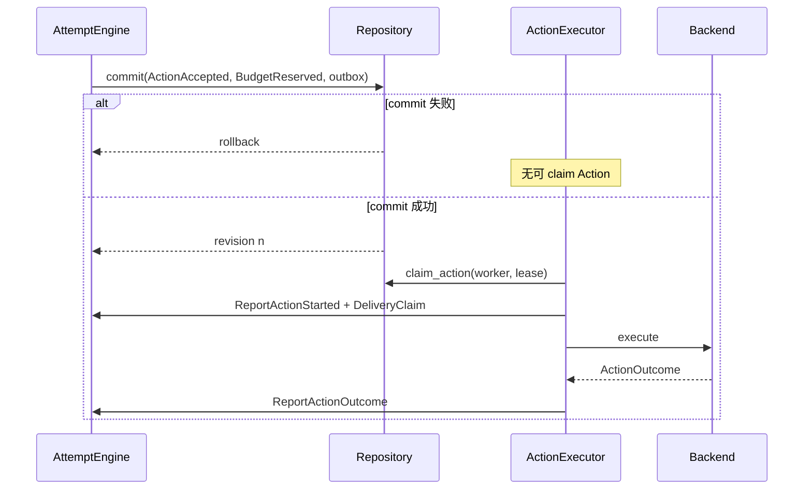

# 事务 outbox（transactional outbox）、租约（lease）与副作用执行

> 上一章：[ArtifactRef 与数据边界](10-artifacts-and-data-boundaries.md) · [目录](README.md) · 下一章：[确定性 Runner 与两个示例 Strategy](12-deterministic-runner.md)

## 本章学习目标

- 从零理解事务 outbox（transactional outbox）。
- 理解租约（lease）不是永久锁，也不是执行成功证明。
- 逐步追踪 Executor 在调用 Backend 前后的持久化边界。

## 双写问题：最危险的两种顺序

假设 Engine 接受 Action，数据库和远端系统需要各写一次：

```text
先写数据库，进程崩溃，没调用远端 -> 丢工作
先调用远端，进程崩溃，没写数据库 -> 无记录的副作用
```

事务 outbox 的解法是：在**同一个数据库事务**里写 `ActionAccepted` 和一条待投递 outbox
记录。事务提交后，独立 Executor 才能 claim；若进程在 commit 后崩溃，outbox 仍在，
重启可继续。

## outbox 的原子边界



Repository 会验证本次 commit 的 `ActionAccepted` 集合与新增 `outbox_actions` 集合精确相同；terminal outcome
提交时删除对应 outbox；terminal Attempt 不允许残留 outbox。相关契约见
[`store.py`](../store.py) 与 [`stores/memory.py`](../stores/memory.py)。

## lease 是什么

Lease 是“在过期时间之前，worker 暂时拥有投递权”的持久化声明，包含 worker id 和
UTC expiry。它解决多个 Executor 同时抢同一 Action，但不声称 worker 一定活着，更不
声称外部调用成功。租约过期后可重新 claim；任何 Started commit 都必须证明 claim 的
owner、Action、status 和 expiry 仍匹配。

| 状态 | 可否普通执行 | 说明 |
| --- | --- | --- |
| outbox `ACCEPTED` + Attempt `RUNNING` | 可 claim 并启动 | 先提交 Started |
| outbox `STARTED` | 普通 `run_once` 不重放 | 返回 `RECOVERY_REQUIRED` |
| lease 未过期且别的 worker 持有 | 不可抢 | 等过期或原 worker 完成 |
| terminal Event 已提交 | 不可再 claim | outbox 已原子删除 |

## Executor 的完整步骤

1. `claim_action` 按 accepted sequence/action/attempt 的稳定顺序取一个。
2. 验证 claimed NormalizedAction 与 durable ActionState 每个关键字段一致。
3. 使用确定性 started Command id 提交 `ActionStarted`（以及 InvocationStarted）。
4. 再确认 lease/current status，构造 immutable `ExecutionContext`。
5. 调用对应 Backend。
6. 校验 outcome 的 action id，用确定性 outcome Command id 提交终态与 budget settlement。
7. 若 outcome commit revision 冲突，最多 reload/retry 一次；不能重复调用 Backend。

实现见 [`executor.py`](../executor.py)，行为测试见
[`tests/test_experiment_executor.py`](../../tests/test_experiment_executor.py)。

## 逐步示例：两个 worker 竞争 researcher

1. worker A 与 B 同时调用 `claim_action`。
2. SQLite `BEGIN IMMEDIATE` 让只有一方写入 LEASED owner/expiry。
3. A 持 claim 提交 Started；B 的 `claim_action` 返回 `None`，等待由调用方决定。
4. A 的 Backend 完成并提交 outcome，事务删除 outbox。
5. 即使 B 稍后拿旧 claim，`confirm_action_claim` 也会失败，不能二次执行。

## 正确与错误做法

```text
正确：ActionAccepted 与 outbox 同 commit
正确：Backend.execute 前 durable Action 已是 STARTED
正确：Backend 抛异常时保留 STARTED，交给 recovery policy
错误：catch Backend exception 后猜成 FAILED
错误：lease 过期就假设外部调用没发生
错误：缺少 Backend 时仍先把 Action 标成 STARTED
```

当前 CLI 的 Backend registry 为空；Executor 会 fail-closed，未配置的 Action 不会偷偷
调用 live LLM。

## 常见误解

- **Outbox 是消息队列。** 它是数据库中的事务待投递表；当前没有外部 broker。
- **Lease 是 exactly-once。** 它减少并发重复，但崩溃窗口仍需幂等键和恢复策略。
- **ActionStarted 表示远端已经收到。** 它只表示“本地已进入可能产生副作用的区间”。

## 本章小结

Transactional outbox 解决“批准记录与待执行工作”的原子性；lease 协调 worker；Executor
把 Started 与 outcome 分别持久化。三者组合让崩溃窗口显式化，而不是声称不存在。

## 思考题与练习

1. 为什么 ActionStarted 必须校验 DeliveryClaim，而 outcome commit 不应重新调用 Backend？
2. 如果 lease 在 Backend 执行期间过期，系统能立即断言什么？不能断言什么？
3. 找出测试中“Backend exception 后 durable state 仍为 STARTED”的场景。
