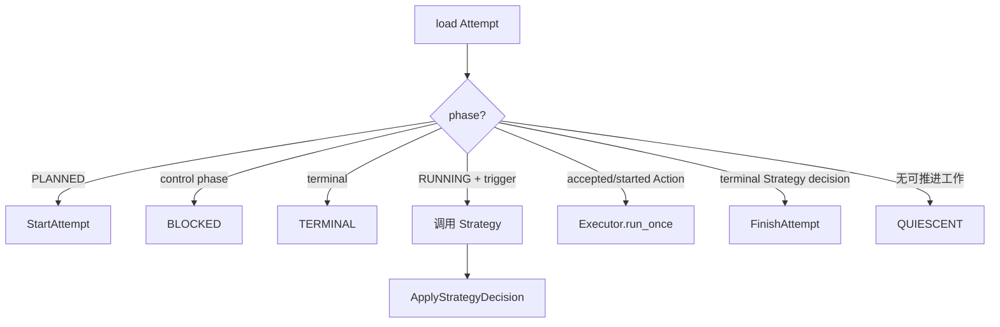
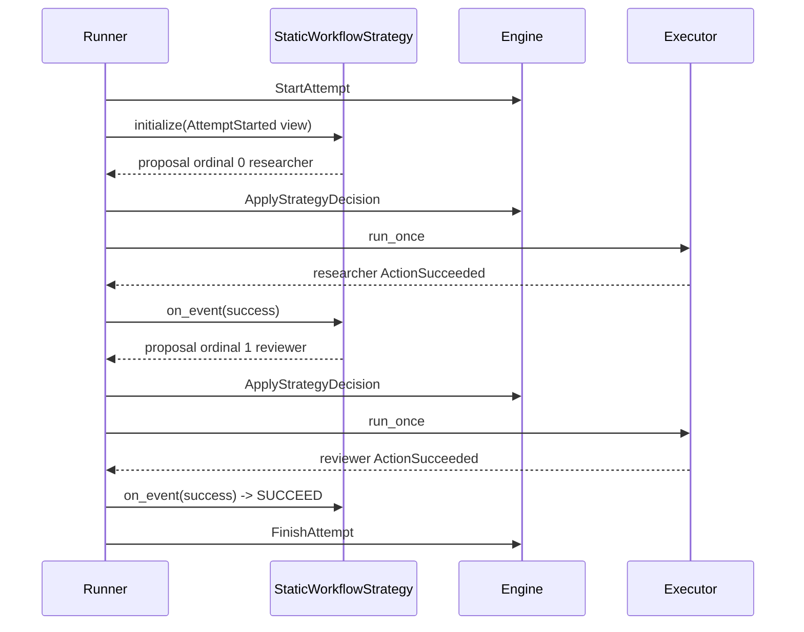

# Runner、确定性 Backend 与两种示例 Strategy

> 上一章：[Transactional outbox、lease 与 Executor](11-outbox-and-executor.md) · [目录](README.md) · 下一章：[暂停、恢复、取消、过期与外部输入](13-control-and-external-input.md)

## 本章学习目标

- 区分引擎（Engine）的单命令（Command）处理与运行器（Runner）的循环驱动。
- 理解脚本后端（`ScriptedBackend`）怎样用幂等键提供确定性测试。
- 看懂单 Agent 策略（`SingleAgentStrategy`）与静态工作流策略（`StaticWorkflowStrategy`）的触发方式。

## Engine 与 Runner 的差别

引擎（Engine）像一次数据库事务的领域处理器；运行器（Runner）像操作员，反复查看 durable state，决定
下一步是 Start、调用 Strategy、让 Executor 跑一个 Action，还是 Finish/阻塞。Runner
不能直接改 state，它仍然发送 Command 给 Engine。



`run_until_blocked(attempt_id, max_steps)` 返回 `BLOCKED`、`QUIESCENT` 或 `TERMINAL`；
步数达到上限会抛稳定的 `StepLimitExceeded`，防止确定性测试无界循环。实现见
[`runner.py`](../runner.py)。

## 哪些 Event 会触发 Strategy

Strategy 只消费业务上有意义的 committed trigger：`AttemptStarted`、Action rejection/终态、
Outcome reconciliation，以及 additional-input response。`ActionStarted`、`BudgetSettled`、
`StrategyDecisionRecorded` 等 bookkeeping 不会触发新决策。这样一次结果不会因多个内部
Event 被策略重复处理。

## ScriptedBackend

`ScriptedBackend` 接受 `action_id -> ActionOutcome` 映射。执行时校验 ExecutionContext 的
action/invocation/idempotency key，并按幂等键 memoize：同 key 重放返回同 outcome；同 key
指向不同 Action 则拒绝。它不调用模型或网络，所以输入相同可得到相同语义轨迹。

## 两个当前 Strategy

| Strategy | 行为 | 成功条件 |
| --- | --- | --- |
| `SingleAgentStrategy` | 用 UUIDv5 稳定生成一个 Agent Action | 该 Action succeeded/reconciled success |
| `StaticWorkflowStrategy` | 按 agent_ids 顺序逐个调用，允许重复角色 | 最后一个 Action 成功 |

两个 Strategy 都把 stage、next index/current ids 放进校验过的 `StrategyStateEnvelope`，并
仅对自己的 Action terminal Event 作出推进。源代码在
[`strategies/single_agent.py`](../strategies/single_agent.py) 和
[`strategies/static_workflow.py`](../strategies/static_workflow.py)。

## 贯穿示例：researcher -> reviewer



每个 Action/Invocation id 都由 Attempt/strategy/ordinal 稳定生成；Repository Event id 仍由
注入的 IdFactory 生成并记录。测试装配和 golden behavior 见
[`tests/test_experiment_runner.py`](../../tests/test_experiment_runner.py) 与
[`tests/test_experiment_strategies.py`](../../tests/test_experiment_strategies.py)。

## 正确与错误做法

```text
正确：Runner 每轮重新 load durable state
正确：Strategy 只处理未消费的 effective trigger cursor
正确：max_steps 明确限制循环
错误：Runner 直接把 phase 从 PLANNED 改 RUNNING
错误：把 BudgetSettled 当作一次新的策略输入
错误：把 ScriptedBackend 描述为 live LLM Backend
```

## 常见误解

- **确定性 Backend 让真实模型输出也可重复。** 它只为脚本 outcome 提供确定性；live 输出
  的可审计性依赖保存输入/输出版本，而不是保证再生成相同文本。
- **QUIESCENT 等于 terminal。** 它表示当前没有自动进展；可能等待 recovery/调和或外部驱动。
- **Runner 是 production CLI 的 live 执行器。** 当前 CLI 没有注册 Backend，也不装配 live Runner。

## 本章小结

Runner 用 durable state 驱动 Engine、Strategy 和 Executor；ScriptedBackend 与两个简单
Strategy 提供可重放的纵向切片。它们证明内核，而不是实现 live LLM 运行时。

## 思考题与练习

1. 为什么 Runner 应在每一步后重新 load，而不是长期持有旧 state？
2. StaticWorkflow 中 researcher 成功后，哪一个 Event 才触发 reviewer 提案？
3. `max_steps=0` 在 PLANNED Attempt 上应发生什么？
