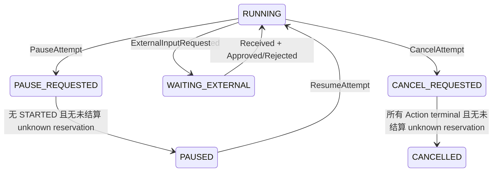

# 暂停、恢复、取消、过期与外部输入

> 上一章：[确定性 Runner 与两个示例 Strategy](12-deterministic-runner.md) · [目录](README.md) · 下一章：[崩溃恢复与 crash matrix](14-crash-recovery.md)

## 本章学习目标

- 区分暂停请求（pause request）与真正 `PAUSED`。
- 理解取消（cancel）、截止期过期（deadline expiry）和外部输入（external input）都是持久化转换。
- 读懂审批、补充输入与 outcome reconciliation 的 request/response 契约。

## 暂停不是内存开关

操作员点击暂停时，系统先提交 `PAUSE_REQUESTED`。如果没有 STARTED Action，可以在同一
Command 批次追加 `ATTEMPT_PAUSED`；如果还有外部调用，必须等它产生明确终态观察后，
Engine 才能追加 Paused；若 unknown 的 reservation 已通过
`BUDGET_UNCERTAIN_SETTLED` 结算，原 `OUTCOME_UNKNOWN` 状态仍可作为审计事实保留。
这样进程重启后仍知道暂停请求，而不是丢失一个内存 bool。



## Cancel 与 Expire 的安全边界

`CancelAttempt` 会先处理待外部输入的 expiry，再追加 `CancelRequested`：未开始的
`ACCEPTED` Action 可被明确取消并释放预算；已 STARTED Action 只追加
`ActionCancellationRequested`，不能声称远端已停止。所有 Action terminal 且没有未结算
unknown reservation 后才 `AttemptCancelled`；已经写入 `BUDGET_UNCERTAIN_SETTLED` 的
Action 仍可保留原 `OUTCOME_UNKNOWN` 状态，作为“结果从未被本地观察”的历史证据。

`ExpireAttempt` 还要求 Command 的 deadline 与 BudgetState 完全相等、当前时钟已经到达，
且没有仍在执行的 STARTED Action 或未结算的 unknown Action。否则拒绝
`UNSAFE_IN_FLIGHT_ACTIONS`。

## 三类 external input

| request kind | 用途 | 合法 response |
| --- | --- | --- |
| `ACTION_APPROVAL` | 批准或拒绝一个 PROPOSED Action | `APPROVE` / `REJECT` |
| `ADDITIONAL_INPUT` | Strategy 需要补充材料 | `PROVIDE_INPUT` + ArtifactRef |
| `OUTCOME_RECONCILIATION` | 外部副作用结果未知 | `CONFIRM_SUCCEEDED` / `CONFIRM_FAILED` / `ABANDON` |

Strategy 可以请求前两类，但 outcome reconciliation 由 Engine 在 `OUTCOME_UNKNOWN` 后自动
创建，使用稳定 request id。`WAITING_EXTERNAL` 恰好保存一个请求，响应必须带同 request id
和 expected revision。

## 审批流程的事件轨迹

```mermaid
sequenceDiagram
    participant S as Strategy
    participant E as Engine
    participant O as Operator
    S-->>E: Decision + ActionProposal + approval requirement
    E->>E: DecisionRecorded -> ActionProposed -> ExternalInputRequested
    Note over E: phase = WAITING_EXTERNAL; 没有 outbox
    O->>E: SubmitExternalInput(APPROVE)
    E->>E: Received -> Approved -> InvocationRequested -> BudgetReserved -> ActionAccepted + outbox
```

拒绝则追加 `ExternalInputRejected` 和 `ActionRejected`，不会执行 Backend。External input
批次的严格形状由 [`reducer.py`](../reducer.py) 校验，Engine 转换见
[`engine.py`](../engine.py)，控制测试见
[`tests/test_experiment_control.py`](../../tests/test_experiment_control.py)。

## 逐步示例：暂停 reviewer

1. researcher 已成功，reviewer 已 ACCEPTED 但尚未 STARTED。
2. 操作员 `PauseAttempt`；phase 进入 `PAUSED`，outbox 行仍可持久存在但普通 claim 在非
   RUNNING phase 不可派发。
3. 进程退出；重启后 Repository 重放同一状态。
4. `ResumeAttempt` 提交 `AttemptResumed`，phase 回 RUNNING；Executor 才能 claim reviewer。

若 reviewer 已 STARTED，则第 2 步只能到 `PAUSE_REQUESTED`，等待 outcome。

## 正确与错误做法

```text
正确：pause/cancel/input/recovery 都通过 Command -> Event
正确：真正 PAUSED 要求安全边界并写 checkpoint
错误：收到 CancelAttempt 就把 STARTED Action 改 CANCELLED
错误：恢复 WAITING_EXTERNAL 时重新执行等待点之前的代码
错误：把 action approval request 与 outcome reconciliation 混用
```

## 常见误解

- **pause request 等于 paused。** 前者可能仍有 in-flight 副作用。
- **cancel 是撤销历史。** 它追加取消请求与观察，不删除已发生 Event。
- **external input 只是一段 stdin。** 它有稳定 request id、类型、artifact/error 形状和 revision。

## 本章小结

控制操作被建模为持久化状态转换，因此可跨进程恢复。暂停尊重安全边界，取消不伪造远端
结果，过期遵守 deadline/unknown 约束，external input 则用严格 request/response 协议闭合。

## 思考题与练习

1. Accepted 但未 Started 的 Action 在 pause 和 cancel 下分别如何处理？
2. 为什么 `OUTCOME_RECONCILIATION` 不能由 Strategy 随意创建？
3. 画出 `REJECT` 审批不会出现 outbox 的证据链。
