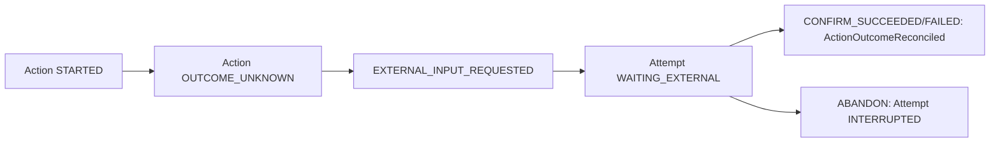

# 崩溃恢复、OUTCOME_UNKNOWN 与 crash matrix

> 上一章：[暂停、恢复、取消、过期与外部输入](13-control-and-external-input.md) · [目录](README.md) · 下一章：[Attempt CLI 动手实践](15-cli-hands-on.md)

## 本章学习目标

- 从零理解恢复策略（recovery policy）和结果未知（outcome unknown）。
- 区分重试（retry）与重放（replay），并能解释三种 Action policy。
- 使用六个故障注入点判断崩溃后最安全的动作。

## 最关键的崩溃分支

```text
外部调用成功
-> 进程在 outcome commit 前崩溃
-> durable state 只知道 Action STARTED
```

此时“没有 success Event”不等于“远端没有成功”。若直接补写 FAILED 或重放一个非幂等
动作，可能重复付款、重复发信或重复工具副作用。内核通过每 Action 的 recovery policy
选择安全行为。

## 三种 recovery policy

| policy | STARTED 后恢复 | 前提 |
| --- | --- | --- |
| `REPLAY_SAFE` | 同 action/idempotency key 再 `execute` | Backend 能以幂等键去重 |
| `RECONCILABLE` | 调 `reconcile` 查询远端 | Backend 实现 ReconcilableBackend |
| `NON_REPLAYABLE` | 不调 Backend，记录 `OUTCOME_UNKNOWN` | 不能安全重做或查询 |

`RECONCILABLE` 的 reconcile 返回 `None` 也会变成 unknown；缺少必要 Backend 能力则
fail-closed，而不是偷偷执行。

## 六点 crash matrix


| 故障点 | durable 证据 | 恢复原则 |
| --- | --- | --- |
| transaction commit 前 | 无新 Event/outbox | 什么都不执行 |
| commit 后、claim 前 | ACCEPTED + outbox | 正常 claim |
| claim 后、Started 前 | ACCEPTED + 可能过期 lease | 过期后重新 claim，同 Action |
| Started 后、外调前 | STARTED | 按 policy；不能仅靠时间判断 |
| 外调后、outcome commit 前 | STARTED，远端可能已成功 | replay-safe/reconcile/unknown |
| outcome commit 后、响应前 | terminal Event，outbox 已清 | 重发同 Command 得到原结果 |

测试通过 `FaultPoint` 精确注入这些边界，见
[`tests/test_experiment_crash_matrix.py`](../../tests/test_experiment_crash_matrix.py)。

## OUTCOME_UNKNOWN 的持久化处理



确认结果时追加 `ActionOutcomeReconciled`，在 ActionState 的
`reconciled_status`、`reconciled_result_ref`、`reconciled_error` 保存后续事实；原
`status` 仍是 `OUTCOME_UNKNOWN`。这保留“曾经失去观察”的审计证据。
`ABANDON` 会保守结算预算并使 Attempt `INTERRUPTED`。

## RecoveryCoordinator 做什么

1. 枚举 nonterminal Attempt，先追加 `AttemptRecoveryRequested` 审计事实。
2. 最多处理 `max_actions` 个 claim。
3. ACCEPTED Action 走正常 execute；STARTED Action 走 policy-specific `recover_once`。
4. 重新 load，分类为 recovered、waiting、terminal 或 failed；分类互斥、稳定排序。

实现位于 [`recovery.py`](../recovery.py) 和 [`executor.py`](../executor.py)，策略矩阵测试见
[`tests/test_experiment_recovery.py`](../../tests/test_experiment_recovery.py)。

## retry 与 replay 再比较

| 维度 | retry | replay/recovery delivery |
| --- | --- | --- |
| 谁决定 | Strategy | Executor/RecoveryCoordinator |
| Action id | 新 id | 原 id |
| idempotency key | 新接受时生成 | 保持不变 |
| budget | 新 Action 再申请 | 原 reservation 继续/结算 |
| 意义 | 新的业务尝试 | 完成/确认原尝试 |

## 正确与错误做法

```text
正确：恢复只追加新 Event，不改 pre-crash Event
正确：non-replayable Started -> OUTCOME_UNKNOWN
正确：replay-safe 保留原 idempotency key
错误：超时/断连 -> 一律 FAILED
错误：recovery 时生成新 action_id，掩盖重复副作用
错误：Action.status 从 UNKNOWN 改写为 SUCCEEDED，抹掉调和历史
```

## 常见误解

- **恢复等于从 Python 栈中间继续。** 内核只从 committed boundary 恢复，不持久化栈或 coroutine。
- **OUTCOME_UNKNOWN 是一种失败码。** 它是终态观察类别，专门表达不确定性。
- **幂等键能让任意 Backend 自动幂等。** Backend/外部系统必须实际遵守它；内核只能稳定传递。

## 本章小结

崩溃恢复的目标不是假装 exactly-once，而是保留证据、选择安全 policy，并把未知明确写成
unknown。六点 crash matrix 证明每个持久化边界，而 replay、reconcile、人工调和分别处理
不同的副作用性质。

## 思考题与练习

1. 给“创建云主机”选择一种 recovery policy，并说明外部 API 需要提供什么。
2. 为什么 crash point 4 和 5 都可能看到 STARTED，却风险不同？
3. 如果 outcome Event 已 commit 但客户端没收到，应该 retry 新 Action 还是重发原 Command？
