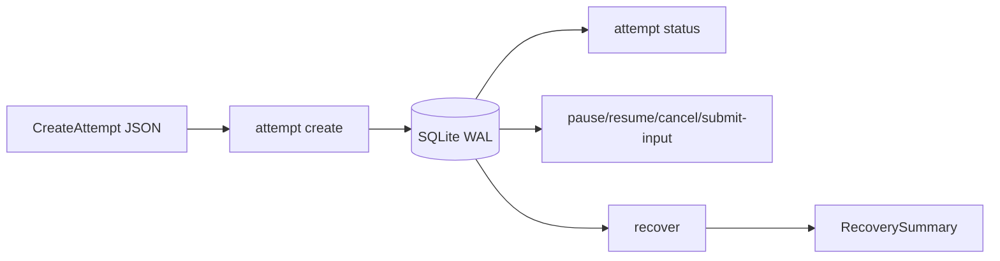

# 尝试命令行（Attempt CLI）的可运行入门实践

> 上一章：[崩溃恢复与 crash matrix](14-crash-recovery.md) · [目录](README.md) · 下一章：[测试与扩展](16-testing-and-extension.md)

## 本章学习目标

- 用当前 parser 创建并查看一个 `PLANNED` Attempt。
- 认识 CLI 能做什么、不能做什么及稳定 exit code。
- 在不泄露原始内容/凭据的情况下读取结构化输出。

## 先看真实命令面

当前入口是 `python -m experiment_system`，必须提供 SQLite 路径：

```text
--database DB attempt create --command-json FILE
--database DB attempt status ATTEMPT_ID
--database DB attempt pause ATTEMPT_ID
--database DB attempt resume ATTEMPT_ID
--database DB attempt cancel ATTEMPT_ID
--database DB attempt submit-input ATTEMPT_ID --request-id ID --response-kind KIND
--database DB recover
```

这是 [`cli.py`](../cli.py) 的实际 parser；对应测试见
[`tests/test_experiment_cli.py`](../../tests/test_experiment_cli.py)。当前没有 `attempt start`
子命令，create 只得到 `PLANNED`；启动/自动运行由 Engine/Runner 装配完成。



## 可运行练习：生成 CreateAttempt JSON

下面代码改写自 CLI 测试的公共模型装配。它只写临时目录，不含网络地址或秘密。

```powershell
# 可运行；在仓库根目录执行
$work = Join-Path $env:TEMP 'agentgraph-attempt-tutorial'
New-Item -ItemType Directory -Force $work | Out-Null
$commandFile = Join-Path $work 'create-attempt.json'
$database = Join-Path $work 'attempts.sqlite3'

@'
import json
import sys
from datetime import datetime, timezone
from hashlib import sha256
from uuid import UUID

from experiment_system.commands import CreateAttempt
from experiment_system.state import (
    ArtifactRef, BudgetState, ResourceBudget, StrategyStateEnvelope,
)

strategy_value = {"round": 0}
strategy_bytes = json.dumps(
    strategy_value, sort_keys=True, separators=(",", ":")
).encode("utf-8")
manifest_bytes = b"manifest"

command = CreateAttempt(
    schema_version=1,
    command_type="CREATE_ATTEMPT",
    command_id=UUID("10000000-0000-0000-0000-000000000001"),
    attempt_id="attempt-1",
    expected_revision=0,
    state_schema_version=1,
    experiment_id="experiment-1",
    trial_id="trial-1",
    strategy_id="router",
    manifest_ref=ArtifactRef(
        capture_class="hashed",
        content_hash=sha256(manifest_bytes).hexdigest(),
        media_type="application/json",
        byte_size=len(manifest_bytes),
    ),
    strategy=StrategyStateEnvelope(
        strategy_id="router",
        strategy_schema_version=1,
        value=strategy_value,
        content_hash=sha256(strategy_bytes).hexdigest(),
        byte_size=len(strategy_bytes),
    ),
    budget=BudgetState(
        resources=(ResourceBudget(resource="MODEL_CALLS", limit=10),),
        deadline_at=datetime(2099, 1, 1, tzinfo=timezone.utc),
        max_call_depth=4,
        max_concurrent_actions=2,
    ),
)
open(sys.argv[1], "w", encoding="utf-8").write(command.model_dump_json())
'@ | .venv\Scripts\python.exe - $commandFile
```

## 创建和查看

```powershell
# 可运行
.venv\Scripts\python.exe -m experiment_system `
  --database $database attempt create --command-json $commandFile

.venv\Scripts\python.exe -m experiment_system `
  --database $database attempt status attempt-1
```

create 输出的关键字段应为：

```json
{"accepted":true,"attempt_id":"attempt-1","phase":"PLANNED","revision":1}
```

实际输出还包含固定 `command_id`。status 是脱敏 `OperatorView`，会显示 `PLANNED`、预算、
空 actions/invocations/pending_external。对同一数据库重跑相同 create 是命令幂等重放；改
JSON 却复用 command id 会被拒绝。

## Recover 与控制命令

```powershell
# 可运行：当前 PLANNED Attempt 会写 recovery audit fact，但不会启动 live LLM
.venv\Scripts\python.exe -m experiment_system --database $database recover
```

`pause/resume/cancel` 只有在对应 phase 合法时才接受。例如 `pause` 需要 `RUNNING`，对本章
刚创建的 `PLANNED` Attempt 会结构化拒绝。`submit-input` 只适用于
`WAITING_EXTERNAL`，且 response shape 必须与 request kind 对应。

最重要的当前边界：production `_dependencies` 以 `backends={}` 构造 Executor，
`allowed_edges=frozenset()`。CLI 不会执行 live LLM Action；存在需要 Backend 的恢复工作时
会 fail-closed，输出 `failed_attempt_ids` 并返回非零码。

## Exit code

| code | 含义 |
| --- | --- |
| 0 | accepted Command、status 或无失败 recovery summary |
| 2 | parser/严格 JSON/参数形状错误 |
| 3 | Attempt 不存在 |
| 4 | revision conflict |
| 5 | 其它预期安全失败，包括缺 Backend 的恢复 |

stderr 使用固定安全消息，不回显无效命令正文、URL、凭据或原始异常。

## 常见误解

- **create 会自动 start。** 当前 CLI 没有 start 子命令。
- **recover 会配置一个 LLM Backend。** 不会；registry 明确为空。
- **status 可以导出 artifact 正文。** 它只输出 `OperatorView` 和引用/摘要。

## 本章小结

CLI 是本地、结构化且 fail-closed 的控制入口。它可创建、检查、控制和恢复 Attempt，但
当前不会接管现有 Agent runtime 或调用 live LLM。

## 思考题与练习

1. 重跑相同 create，比较 revision 是否增加。
2. 把 command id 保持不变、只改 experiment_id，观察安全拒绝。
3. 对 PLANNED Attempt 运行 pause，记录 exit code 并解释为何没有 Event。
