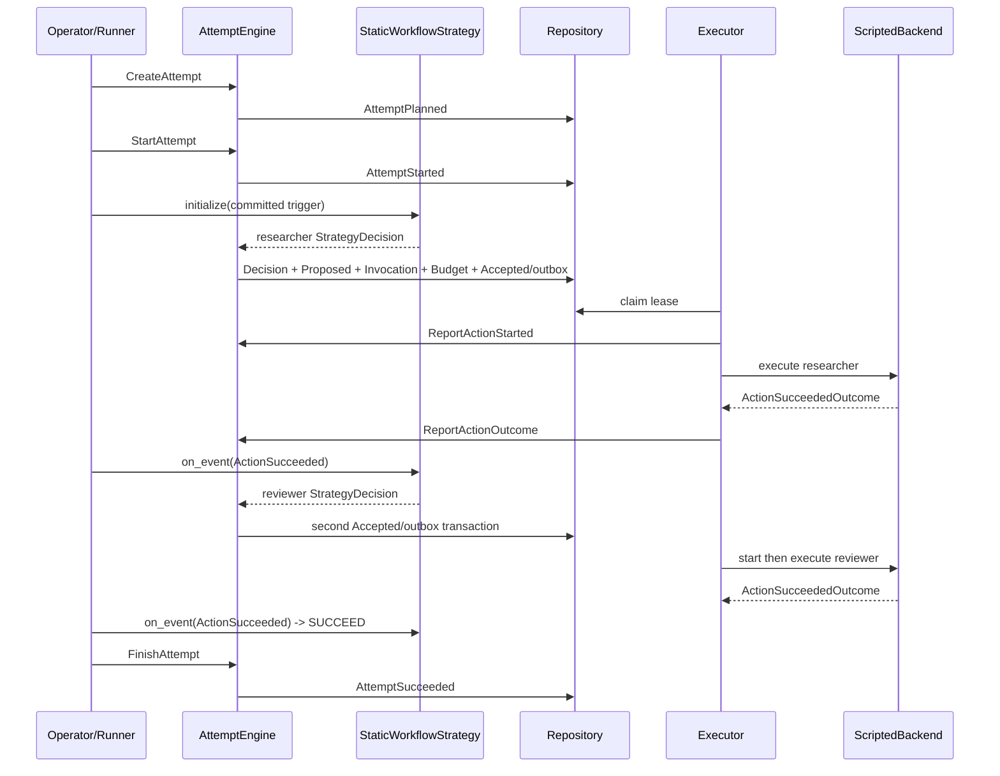

# 一个 Attempt 从创建到终止的完整事件轨迹

> 上一章：[测试与扩展](16-testing-and-extension.md) · [目录](README.md) · 下一章：[边界、现有 Agent runtime 与路线图](18-boundaries-and-roadmap.md)

## 本章学习目标

- 把前面所有模块串成一次尝试（Attempt）的可审计事件流。
- 精确对应 Command、Event、state revision、outbox 和 Strategy trigger。
- 能在 happy path 上插入一个真实的崩溃恢复分支。

## 场景和装配

`StaticWorkflowStrategy(strategy_id="research", agent_ids=("researcher","reviewer"), ...)`
依次调用两个 Agent；`ScriptedBackend` 为两个稳定 Action id 返回成功 `ActionOutcome`。
这是当前测试验证过的装配类型，不是 production live LLM。

## Happy path：24 条 Event

下面序号也是 revision；每条 Event 提交后 `state.revision` 等于它的序号。

| seq | Command | Event | 状态意义 |
| ---: | --- | --- | --- |
| 1 | `CreateAttempt` | `ATTEMPT_PLANNED` | `PLANNED`，预算/manifest/strategy 初始化 |
| 2 | `StartAttempt` | `ATTEMPT_STARTED` | `RUNNING`，成为第一个 Strategy trigger |
| 3 | `ApplyStrategyDecision` | `STRATEGY_DECISION_RECORDED` | 提议 researcher，directive CONTINUE |
| 4 | 同上 | `ACTION_PROPOSED` | researcher Action 为 PROPOSED |
| 5 | 同上 | `INVOCATION_REQUESTED` | researcher Invocation 为 REQUESTED |
| 6 | 同上 | `BUDGET_RESERVED` | 整批资源 reservation |
| 7 | 同上 | `ACTION_ACCEPTED` | NormalizedAction + outbox 同事务 |
| 8 | `ReportActionStarted` | `ACTION_STARTED` | 已进入副作用区间 |
| 9 | 同上 | `INVOCATION_STARTED` | Invocation RUNNING |
| 10 | `ReportActionOutcome` | `INVOCATION_COMPLETED` | 保存 result/context ref |
| 11 | 同上 | `ACTION_SUCCEEDED` | 第二个 Strategy trigger |
| 12 | 同上 | `BUDGET_SETTLED` | reservation 转 consumed |
| 13 | `ApplyStrategyDecision` | `STRATEGY_DECISION_RECORDED` | 根据 seq 11 提议 reviewer |
| 14 | 同上 | `ACTION_PROPOSED` | reviewer PROPOSED |
| 15 | 同上 | `INVOCATION_REQUESTED` | reviewer REQUESTED |
| 16 | 同上 | `BUDGET_RESERVED` | 第二次 reservation |
| 17 | 同上 | `ACTION_ACCEPTED` | reviewer outbox 可投递 |
| 18 | `ReportActionStarted` | `ACTION_STARTED` | reviewer STARTED |
| 19 | 同上 | `INVOCATION_STARTED` | reviewer Invocation RUNNING |
| 20 | `ReportActionOutcome` | `INVOCATION_COMPLETED` | reviewer result ref |
| 21 | 同上 | `ACTION_SUCCEEDED` | 第三个 Strategy trigger |
| 22 | 同上 | `BUDGET_SETTLED` | 第二次预算结算 |
| 23 | `ApplyStrategyDecision` | `STRATEGY_DECISION_RECORDED` | directive SUCCEED + final result_ref |
| 24 | `FinishAttempt` | `ATTEMPT_SUCCEEDED` | terminal `SUCCEEDED`，写 checkpoint |

## 全链路时序图



注意 `BudgetSettled` 不触发 Strategy；第二次 decision 的 trigger cursor 指向 seq 11，
但 Command 的 expected revision 是当时最新的 seq 12。

## 失败分支

如果 reviewer Backend 返回 `ActionFailedOutcome`，seq 20 是 `INVOCATION_FAILED`，seq 21
是 `ACTION_FAILED`，seq 22 仍是 `BUDGET_SETTLED`。Strategy 在下次 trigger 返回
`directive=FAIL` 和安全 ErrorSummary，随后 `FinishAttempt(error=...)` 生成
`ATTEMPT_FAILED`。失败不会回滚 researcher 已发生的历史。

## 崩溃分支：外调成功，outcome 未 commit

在 seq 19 后：

```text
Backend 已成功完成 reviewer
-> fault AFTER_EXTERNAL_CALL_BEFORE_OUTCOME_COMMIT
-> durable Event 流仍停在 INVOCATION_STARTED / Action STARTED
```

恢复结果取决于 reviewer Action 的 policy：

- `REPLAY_SAFE`：用同 idempotency key 再 execute，ScriptedBackend 返回 memoized outcome。
- `RECONCILABLE`：Backend reconcile，查到成功后提交正常 terminal outcome。
- `NON_REPLAYABLE`：不再调用，提交 `ACTION_OUTCOME_UNKNOWN` 和稳定的
  `EXTERNAL_INPUT_REQUESTED`，Attempt 进入 `WAITING_EXTERNAL`。

人工 `CONFIRM_SUCCEEDED` 会追加 received、approved、InvocationCompleted、
`ACTION_OUTCOME_RECONCILED` 和 BudgetSettled；Action 原 status 仍 unknown，但 Strategy 把
reconciled success 作为 trigger，流程可以继续。`ABANDON` 则终止为 `INTERRUPTED`。

## 可审计性检查

1. 路由原因：两个 `STRATEGY_DECISION_RECORDED` 中有私有 state hash/proposal。
2. 权限与预算：Proposed 后紧跟 guard 结果与 BudgetReserved/Rejected。
3. 副作用边界：Accepted/outbox commit 早于 Started，Started 早于 Backend 调用。
4. 结果：每个 started Action 有明确 terminal observation。
5. 恢复：unknown 和 reconciliation 都是新 Event，不会改写 pre-crash 序列。

完整纵向测试见 [`tests/test_experiment_runner.py`](../../tests/test_experiment_runner.py)，
崩溃证据见 [`tests/test_experiment_crash_matrix.py`](../../tests/test_experiment_crash_matrix.py)。

## 常见误解

- **一次 Command 只会生成一条 Event。** 一个领域转换常产生线性、原子的 Event 批次。
- **ActionSucceeded 后立即 AttemptSucceeded。** Strategy 先提交 terminal decision，Runner
  再发 FinishAttempt。
- **预算结算是 Strategy trigger。** 它是 bookkeeping，策略只消费有效终态 trigger。

## 本章小结

完整 Attempt 由多个小而明确的提交边界组成：计划、启动、策略决定、提案/接受、启动、
结果、再决策和终止。Event 序列同时解释控制选择、预算、副作用和恢复路径。

## 思考题与练习

1. 将 seq 21 改为 ActionFailed，写出后续两条核心 Event。
2. 在 seq 7 与 8 之间崩溃，为什么可以直接 claim，而不需要 outcome reconciliation？
3. 为什么 seq 12 不应触发第二次 reviewer 提案？
