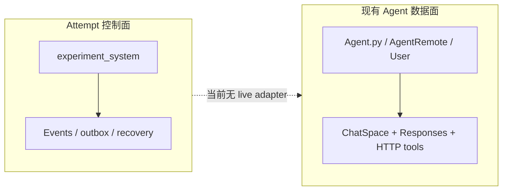

# 当前边界、与现有 Agent runtime 的关系及路线图

> 上一章：[端到端事件轨迹](17-end-to-end-walkthrough.md) · [目录](README.md) · 下一章：[与 AgentGraphInternet 结合](19-agentgraphinternet-integration.md)

## 本章学习目标

- 准确区分当前实现、设计原则与后续规划。
- 理解尝试（Attempt）控制面与现有 Agent 数据面的隔离。
- 识别状态设计稿中的概念图与当前代码之间的差异。

## 当前已实现

- strict immutable state、Command/Event union、纯 reducer 和 deterministic replay。
- AttemptEngine、预算/拓扑守卫、幂等 command ledger 和 revision conflict。
- InMemory/SQLite Repository 共同契约、SQLite WAL/hash chain/head/checkpoint repair。
- content-addressed ArtifactStore、transactional outbox、lease、Executor。
- pause/resume/cancel/expire/external input、三种 recovery policy 和 crash matrix。
- ScriptedBackend、SingleAgentStrategy、StaticWorkflowStrategy、DeterministicAttemptRunner。
- 本地 Attempt CLI；production Backend registry 为空。

## 与现有 Agent runtime 的关系

现有数据面管理本地会话、Responses/tool loop 和 peer HTTP；Attempt 控制面管理持久化控制
状态。当前它们相互隔离：既有 runtime 文件不导入 `experiment_system`，内核也没有
`LiveLLMBackend` 去调用它。`ChatSpace.save()` 是人类可读归档，不是 Attempt checkpoint。

## 设计原则与当前代码的差异

权威顺序仍是代码/测试优先。阅读
[`状态设计稿`](../../docs/superpowers/specs/2026-07-23-agent-orchestration-state-design.md)
时应注意：

| 设计稿概念 | 当前实现 |
| --- | --- |
| Event envelope 概念图列出 strategy/agent/action 等可选字段 | 公共 envelope 只有核心 identity/sequence/causality/time；领域字段在具体 Event 类型中 |
| Event families 提到 message、handoff、critique、vote、Blackboard、fault records | 当前 DomainEvent union 尚未实现这些家族 |
| 可配置 event-count checkpoint interval | 当前 checkpoint 由 submit-input、PAUSED/WAITING_EXTERNAL 和 terminal 边界触发；无公开 interval 配置 |
| checkpoint retention 可按策略裁剪中间快照 | 当前 checkpoint 只追加和校验，没有 retention pruning API |
| pause 可配置 in-flight policy | 当前实现记录请求并等待 STARTED Action 的终态观察；没有通用可配置 pause policy |
| 外部接口示意 `Repository.commit(transition, expected_revision)` | 当前实际接口是严格 `CommitRequest`，同时携 Event/outbox/artifact/claim/result/checkpoint |
| 设计稿示例 `agentgraph attempt ...` / `experiment run` | 当前入口是 `python -m experiment_system --database ...`；没有 `start`/`run` 子命令 |
| 设计稿初始 SQLite schema 描述 | 当前 Repository schema 为 v2，并支持 v1 -> v2 事务迁移 |

这些不是 bug 宣称，而是“概念设计比首个实现切片更宽”。教程以当前 API 为准。

## 后续规划，尚未实现

以下能力只能说明如何接入，不能编造 API：

- `ResponseRunner` 抽取：把现有 Responses/tool loop 变成可由 Backend adapter 调用的模块。
- 显式 `ToolExecutionContext`：让工具拿授权、deadline/cancellation 和 artifact writer，而不
  依赖隐式 current ChatSpace。
- `LiveLLMBackend`：把已批准 NormalizedAction 映射到真实模型/工具执行。
- `DecentralizedPeerStrategy` 和其余策略矩阵：复用同一 Strategy/Action 合约。
- Blackboard/shared memory：作为不同 scope/consistency 的 Store，而不是塞进 AttemptState。
- evaluation、metrics、Pareto reporting、Dashboard：从 committed Event 派生，不能由
  Strategy 自报。

上位目标见
[`多 Agent 研究平台设计`](../../docs/superpowers/specs/2026-07-23-multi-agent-research-platform-design.md)，
但它不是当前状态内核细节的事实来源。

## 与 LangGraph 风格共享 state 的区别

本项目不是 LangGraph 的简单复制。共享 state + field reducer 很适合节点协作和局部数据
合并；本内核更关注持久化 Attempt aggregate、事务提交、副作用 outbox、幂等命令、崩溃
恢复和审计重放。未来 Strategy 内部可以使用图或局部 reducer，但平台控制 state 仍必须
通过 domain Event 变化。

## 接入未来能力时不应改变的原则

1. Live adapter 只能执行已经 commit 的 outbox Action。
2. 新 Strategy 只读取 StrategyView，不拿凭据/数据库。
3. 工具/Agent 不能直接修改 AttemptState。
4. 大内容仍存 artifact，Event/State 只留安全引用。
5. live retry/recovery 必须声明 policy，unknown 不能猜失败。
6. 指标和评估从 Event 派生，不能改写 execution terminal state。

## 常见误解

- **“状态内核已完成”意味着完整研究平台完成。** 这里只完成控制内核与确定性纵向切片。
- **现有 Agent 自动受 AttemptEngine 管理。** 当前没有 live adapter，二者仍隔离。
- **路线图里的类名已经可 import。** 不可；只有当前代码导出的接口才可用。

## 本章小结

当前内核已经提供可审计、幂等、可恢复的控制骨架，但尚未接入 live LLM 和完整研究平台。
严格标记边界，才能让未来 adapter 复用内核而不污染现有 Agent runtime 或夸大能力。

## 思考题与练习

1. `LiveLLMBackend` 接入时，哪一步必须发生在真实模型调用前？
2. Blackboard 为什么应是独立 Store，而不是新增 `AttemptState.blackboard`？
3. 找出一个设计稿中的未来 Event family，并说明当前教程为何不能给它编造字段。
