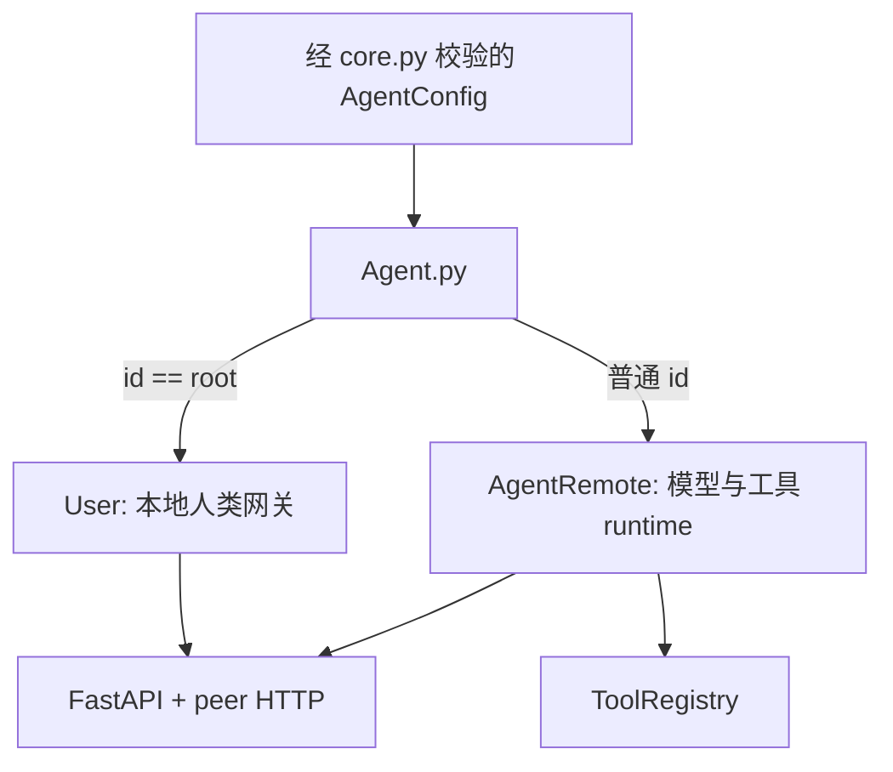
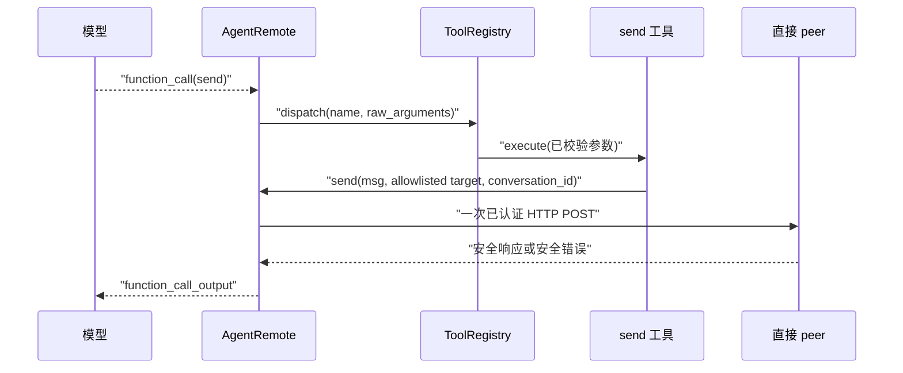
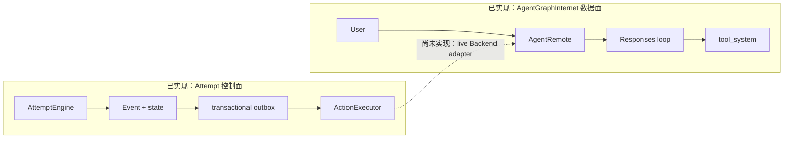

# 与 AgentGraphInternet 结合：控制面、数据面与接入边界

> 上一章：[当前边界与路线图](18-boundaries-and-roadmap.md) · [目录](README.md) · 下一章：[贯穿示例：编排 researcher 与 reviewer](20-integration-walkthrough.md)

## 本章学习目标

- 看懂 `Agent.py`、`User.py`、`AgentRemote.py`、`core.py` 和 `tool_system/` 现在如何协作。
- 解释状态编排控制面（control plane）与 AgentGraphInternet 数据面（data plane）为何要分开。
- 找到未来接入所需的四个边界：入口、后端适配器（Backend Adapter）、artifact 和
  拓扑/身份。
- 判断哪些能力当前已经实现，哪些只是接入设计，避免把伪代码当成现有 API。

## 先用一个生活化比喻

把 AgentGraphInternet 想成一间能工作的研究室：研究员能读问题、调用模型、使用工具，
也能把问题转交给相邻研究员。`experiment_system` 更像研究项目的调度室：它登记任务、
批准费用、发出工单、记录谁已经开工，并处理停工、超时和事故恢复。

只有研究室，没有调度室，工作可以完成，但进程重启后很难回答“哪一步已经被批准和
执行”。只有调度室，没有研究室，则工单会被可靠保存，却没有人真正调用模型。所谓
“结合”，不是把两边状态揉成一个大字典，而是让调度室只投递**已经提交的工单**，让
研究室执行后只返回**明确的结果观察**。

## 现有 AgentGraphInternet 数据面

以下表格描述当前代码，不是路线图：

| 模块 | 当前职责 | 会改变什么 | 不负责什么 |
| --- | --- | --- | --- |
| [`Agent.py`](../../Agent.py) | 读取配置并选择运行时；`root` 创建 `User`，普通节点创建 `AgentRemote`；构造 FastAPI app | 创建 runtime/client；进程启动时运行服务 | 不创建 Attempt，不提交 Event |
| [`User.py`](../../User.py) | root 的人类入口；维护到直接 peer 的 `ChatSpace`；发送消息、查历史、关会话、发现拓扑 | 内存会话、peer HTTP 调用、关闭时的会话归档 | root 自己不调用模型，也不维护 Attempt revision |
| [`AgentRemote.py`](../../AgentRemote.py) | 普通 Agent 的 Responses 循环、会话隔离、peer HTTP、工具分发和 API | `ChatSpace` 上下文、模型/工具/网络副作用 | 不允许 Strategy 修改 AttemptState；当前也不认识 Attempt |
| [`core.py`](../../core.py) | 配置模型、请求模型、错误 envelope、会话键（`ConversationKey`）、`ChatSpace` | 校验输入；`ChatSpace.save()` 原子写聊天归档 | 聊天归档不是 Event Store 或 checkpoint |
| [`tool_system/`](../../tool_system/) | 固定并校验工具目录；生成严格 schema；管理生命周期并分发调用 | 工具自己的副作用和安全结构化结果 | 当前工具没有 Attempt/action/deadline 上下文 |

`Agent.py` 是装配入口，不是新的领域层。它的选择关系很简单：



### root 发起一次对话时发生什么

1. 外部调用 `POST /v1/user/chats/{to_id}/messages`，或人在 root 交互 CLI 中使用
   `/talk`。
2. `User.talk_to()` 只允许配置中的直接 peer，并按 peer 使用锁保证同一会话串行。
3. root 创建或复用本地 `ChatSpace`，先追加用户消息，再向 peer 的
   `POST /v1/agents/{target_id}/messages` 发请求。
4. 普通节点用 `(from_id, conversation_id)` 组成会话键（ConversationKey），取得自己的
   入站 `ChatSpace`。同一个 key 的请求按先进先出（FIFO）顺序串行；当一个 key 活跃时，另一个 key 会
   立即得到 `AGENT_BUSY`，当前并不是多会话并行 runtime。
5. `AgentRemote.response()` 追加消息并进入 Responses/tool loop，最终文本原路返回。
6. root 把最终文本追加到自己的 `ChatSpace`。只有关闭会话时，双方才各自归档本地会话。

这条链已经由 [`tests/test_integration_chain.py`](../../tests/test_integration_chain.py)、
[`tests/test_user.py`](../../tests/test_user.py) 和
[`tests/test_agent_remote.py`](../../tests/test_agent_remote.py) 验证；会话占用规则见
[`tests/test_conversation_isolation.py`](../../tests/test_conversation_isolation.py)。

### 普通 Agent 调用工具时发生什么

`AgentRemote._run_response_loop()` 把完整模型输出追加到 `ChatSpace.context_items`。若输出
含 `function_call`，它把名称和 JSON 参数交给
[`ToolRegistry.dispatch()`](../../tool_system/registry.py)。注册表只有在 `STARTED` 状态才
分发，拒绝未知工具和额外参数，并把常见执行异常转成安全结果。

内置 [`send`](../../tool_system/builtin_tools/send.py) 和
[`close`](../../tool_system/builtin_tools/close.py) 工具通过
[`AgentTool.require_current_chat()`](../../tool_system/contract.py) 取得当前
`ChatSpace.conversation_id`。模型只能选择配置 allowlist 中的目标，不能提供地址或认证
信息。工具结果再作为 `function_call_output` 进入下一轮模型上下文。



## 五组看似相同、实际不同的身份

| AgentGraphInternet | `experiment_system` | 为什么不能直接画等号 |
| --- | --- | --- |
| `ChatSpace.conversation_id` | `AttemptState.attempt_id` | Conversation 标识一条本地聊天分支；Attempt 标识一项可审计工作，可含多个 Invocation |
| `ConversationKey` | `invocation_id` | 前者隔离 `(上游, 会话)`；后者属于一个 `INVOKE_AGENT` Action 的控制记录 |
| HTTP `request_id` | Command `command_id` | 当前 AgentRemote 只把前者当追踪值，`response()` 不据此去重；后者进入持久幂等 ledger |
| peer allowlist | `TopologyGuard` 的 legal topology | allowlist 决定网络可达和认证；守卫决定某个提案在本 Attempt 中是否获准 |
| `ChatSpace.save()` | Repository checkpoint | 前者是带消息正文的聊天归档；后者是可由 Event 真相流验证和重建的控制状态快照 |

最危险的混淆是 `request_id`。虽然
[`MessageRequest`](../../core.py) 要求 UUID，当前
[`AgentRemote.response()`](../../AgentRemote.py) 明确不使用它自动重试或去重。相同请求再
发送一次，模型或工具仍可能再次执行。它不能替代 outbox 的稳定
`NormalizedAction.idempotency_key`。

## 当前控制面与数据面仍然隔离

当前事实是：`experiment_system` 不导入现有 Agent runtime，现有 runtime 也不导入
`experiment_system`；production Backend registry 为空。因此现在不能通过 Attempt CLI
执行 live LLM Action。



这条虚线非常重要。下文解释它应该怎样接，但不宣称它已经存在。

## 正式定义：什么才算完成接入

本教程所说的“接入”，至少同时满足以下条件：

1. 用户请求先成为可恢复的 Attempt 装配和已提交 Command，而不是先调用模型再补记录。
2. 数据面只执行从 committed outbox claim 得到的 `NormalizedAction`。
3. 每次执行只返回合约内的 `ActionOutcome`，并由 AttemptEngine 提交 terminal Event。
4. 正文通过 artifact 边界传递；Strategy、Backend 和工具都不能直接修改
   `AttemptState`。

仅仅让两个包互相 import、共享 `ChatSpace`，或给 HTTP 调用增加 `attempt_id`，都不满足
这个定义。

### `Agent.py` 应放在哪一侧

当前 [`Agent.py`](../../Agent.py) 只组装 `User` 或 `AgentRemote` 及其 FastAPI app，不创建
Repository、Engine、Executor 或 Backend。未来可以让一个独立控制服务持有这些控制面
组件，并通过受信 adapter 调普通 Agent 服务；也可以在 root 进程旁组合一个 Attempt
入口。无论选择哪种部署，普通 `AgentRemote` 都不应因此获得直接写 Attempt state 的权限，
现有聊天路由也不应被悄悄改成另一套持久语义。

## 结合所需的四个接入边界

### 1. 入口边界：用户问题先绑定到可恢复装配，再变成 Command

今天 `User.talk_to()` 会立即进入数据面。接入后，一个新的网关层应先把安全输入保存为
artifact，再向 `AttemptEngine` 提交 `CreateAttempt`。但当前 `CreateAttempt` **没有**
`input_refs` 字段；它持久化的是 `manifest_ref`、初始 Strategy envelope 和预算。当前
`StaticWorkflowStrategy.payload_ref` 也只是 Strategy 实例的构造参数，不会自动写入
`AttemptState`。

因此，一个可恢复入口还必须解决“如何从持久 manifest 重建 Attempt 专属 Strategy
装配”。例如，应用可以让 manifest artifact 以自定义 schema 引用问题 artifact，并在
重启时由一个 Strategy factory 重新构造同样的 Strategy；但仓库当前没有这个 factory 或
manifest schema。也可以在未来扩展显式输入建模。两种都属于接入工作，不能假装
`CreateAttempt(input_refs=...)` 已经存在。现有聊天 API 可以继续作为普通对话入口；是否
增加 Attempt API 属于后续产品设计。

正确顺序是：

```text
用户问题 -> 问题 ArtifactRef
         -> 可持久重建的 manifest/Strategy 装配
         -> CreateAttempt(manifest_ref=...) -> AttemptPlanned
```

错误顺序是：

```text
User.talk_to() 已调用远端 -> 再补写 CreateAttempt
```

后者在进程崩溃时会留下无法审计的真实调用。

### 2. 执行边界：Backend adapter 只接收已批准 Action

未来 Backend Adapter 必须实现当前
[`Backend`](../contract.py) 合约：接收 `NormalizedAction` 和 `ExecutionContext`，返回一个
`ActionOutcome`。它不能接收裸 `ActionProposal`，因为提案还没通过预算/拓扑守卫，也没与
outbox 原子提交。

下面是**伪代码，不是当前可 import 的类或方法**：

```python
# 伪代码：展示边界，不可直接运行。
async def execute(normalized_action, execution_context):
    assert action_was_claimed_from_outbox(normalized_action.action_id)
    payload = artifact_store.read_verified(normalized_action.payload_ref)
    effective_timeout = adapter_timeout_policy(
        requested_seconds=normalized_action.requested_timeout,
        attempt_deadline=execution_context.deadline_at,
    )
    observation = await agentgraph_adapter.invoke(
        target=normalized_action.target_ids[0],
        payload=payload,
        idempotency_key=execution_context.idempotency_key,
        timeout=effective_timeout,
    )
    return map_observation_to_action_outcome(observation)
```

当前 `AgentRemote._run_response_loop()` 是私有方法，并同时依赖 `ChatSpace`、模型客户端、
工具注册表和隐式 `currentChatSpace`。后续可以先通过现有已认证 HTTP contract 适配；若要
做进程内适配，则应先抽取路线图中的 `ResponseRunner`。不要让新 Backend 直接依赖私有
方法并把这种耦合当成稳定 API。

这里的 `adapter_timeout_policy` 也是伪代码。当前 Executor 只把 Attempt
`BudgetState.deadline_at` 放进 `ExecutionContext.deadline_at`；它没有根据
`NormalizedAction.requested_timeout` 自动计算或强制执行每 Action timeout，而且当前
`cancellation_requested` 固定为 `False`。live adapter 必须补齐这两项执行语义，或明确
声明不支持，不能把字段存在误写成超时/取消已经生效。

### 3. 数据边界：正文留在数据面，控制面只留安全引用

输入问题、模型完整响应和较大的工具输出应进入
[`ArtifactStore`](../artifacts.py)。Event 和 `AttemptState` 只保存经过校验的
`ArtifactRef`、稳定状态和安全 `ErrorSummary`。不要把以下内容复制进 Event：

- `ChatSpace.messages` 或 `context_items` 全文；
- system instructions、认证头、配置 secret 或 provider 原始异常；
- peer 的真实地址；
- 无大小上限的模型/工具原始对象。

这既缩小敏感数据边界，也让重放只依赖稳定控制事实，而不依赖 provider SDK 的对象形状。

### 4. 能力边界：拓扑快照与网络认证各守一层

`AgentConfig.agents` 定义当前节点的直接 peer。接入层可以从受信配置产生规范化的拓扑
快照，供 [`TopologyGuard`](../topology.py) 检查 `actor -> target`。但 reducer 不能在重放
时读取活配置，Strategy 也不能自行扫描网络；否则同一 Event 流会因当天配置不同而得到
不同结果。

即使 TopologyGuard 放行，数据面仍必须执行 peer allowlist、目标 id 和 Bearer 认证检查。
反过来，网络上可达也不代表本 Attempt 获准调用。

## 两种工具治理粒度

接入时必须先决定“一个 Action 包多大”：

| 粒度 | Action 覆盖范围 | 优点 | 当前限制 |
| --- | --- | --- | --- |
| 外层 Invocation | 整个 `AgentRemote` 模型/工具循环算一个 `INVOKE_AGENT` | 最容易复用现有 runtime；外层调用有 outbox 和恢复记录 | 内部 `send`/`close` 只在 ChatSpace 中可见，不是独立 Action |
| 每个副作用 | 模型提议工具后，控制面为每次工具调用生成独立 Action | 预算、拓扑、暂停、幂等和恢复都细到工具级 | 需要尚未实现的显式 `ToolExecutionContext` 和响应循环接入点 |

第一种可以作为兼容起点，但不能声称每个内部工具都被 Attempt 审计。第二种是更完整的
目标：工具获得 `attempt_id`、`action_id`、deadline、cancellation 和 artifact writer，
却仍不能直接修改 `AttemptState`。

## live 恢复策略不能照搬确定性 Backend

当前 `StaticWorkflowStrategy` 为其 Action 声明 `REPLAY_SAFE`，这在
`ScriptedBackend` 的确定性测试中成立。现有 AgentGraphInternet 消息入口没有持久去重，
模型和工具也可能产生外部副作用。因此 live adapter **不能仅因为有 `request_id` 就认定
REPLAY_SAFE**。

接入者必须逐类选择：

- `REPLAY_SAFE`：远端明确支持同一幂等 key，重复投递只返回同一结果。
- `RECONCILABLE`：可以用稳定操作 id 查询真实结果，未知时进入人工 reconciliation。
- `NON_REPLAYABLE`：不能安全重放或查询；崩溃后记录 `OUTCOME_UNKNOWN`。

HTTP timeout 只说明本地没收到结果，不说明远端没运行。即使当前 `AgentRemote.send()` 把
timeout 转成安全错误，Backend adapter 仍须根据副作用边界决定是 `FAILED`、`TIMED_OUT`
还是 `OUTCOME_UNKNOWN`，不能把未知猜成失败。

## 正确做法与错误做法

| 正确做法 | 错误做法 | 后果 |
| --- | --- | --- |
| Strategy 只返回 `ActionProposal` | Strategy 直接调用 `User.talk_to()` | 绕过守卫、outbox 和审计 |
| Executor claim 后由 Backend 调用 runtime | reducer 调模型或读网络 | replay 不再确定，事务边界失效 |
| 结果正文写 artifact，Event 只留 ref | 把 `ChatSpace.context_items` 塞进 AttemptState | 泄露面扩大，状态膨胀且耦合 SDK |
| 稳定 idempotency key 贯穿 adapter | 每次恢复都生成新的 HTTP request id | 远端可能重复执行 |
| pause/cancel 作为持久 Command/Event | 给 `AgentRemote` 加一个内存布尔开关并称为 PAUSED | 重启后丢失，也无法证明安全边界 |
| 先确定粒度，再描述可审计范围 | 外层 Action 成功就宣称内部每个工具均已审计 | 审计结论超过证据 |

## 常见误解

- **“接入”就是让 `AgentRemote` import `AttemptState`。** 这会让数据面变成第二个逻辑
  写入者；正确接口是 Action 输入和 Outcome 输出。
- **`ChatSpace` 已保存，所以可以恢复 Attempt。** 它保存会话内容，不保存 Command ledger、
  revision、预算 reservation、outbox 或 lease。
- **ToolRegistry 已校验 schema，所以工具调用已经事务化。** schema 校验解决输入安全，
  transactional outbox 解决“批准事实与待执行记录”原子提交，两者不是一回事。
- **发现到的拓扑就是许可。** topology discovery 是数据面观察；Attempt 使用的是受信、
  固定的 legal topology。

## 本章小结

AgentGraphInternet 已经是一套真实的数据面：root 网关、会话、Responses 循环、工具和
peer HTTP 都有明确契约。`experiment_system` 已经是一套独立的持久控制面。两者结合的
正确方式，是在入口、Backend、artifact 和拓扑边界处适配，而不是共享可变状态。当前
缺少 live adapter、`ResponseRunner` 和 `ToolExecutionContext`，所以这条接入仍是后续工作。

## 思考题与练习

1. 为什么 `MessageRequest.request_id` 不能直接当作 Action 已经具备恰好一次（exactly-once）语义的证据？
2. 若一个外层 Agent Action 内部调用三个工具，当前粗粒度接入能审计到哪一层？
3. 画出从 `AgentConfig.agents` 生成固定 legal topology 的边界，并标出 reducer 不能读取的位置。
4. 给“只读本地缓存”和“向远端提交订单”分别选择 recovery policy，并说明证据。
