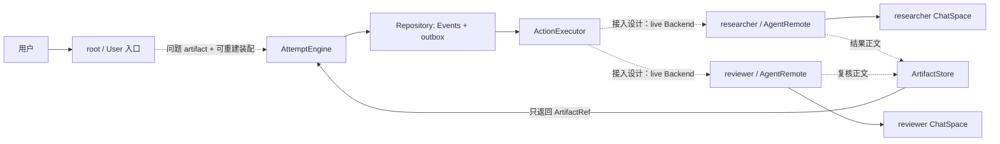
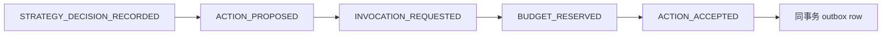
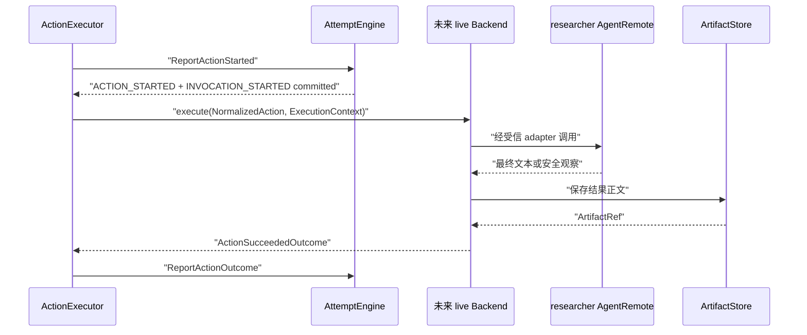
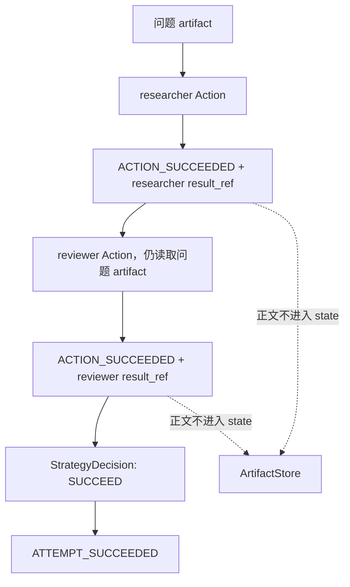
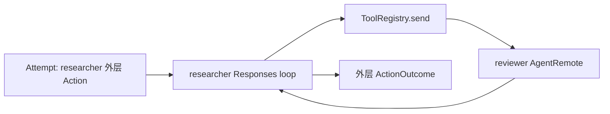

# 贯穿示例：用 Attempt 编排 researcher 与 reviewer

> 上一章：[与 AgentGraphInternet 结合](19-agentgraphinternet-integration.md) · [目录](README.md) · 下一篇：[术语表与状态速查](appendix-glossary.md)

## 本章学习目标

- 把一个研究问题从 root 入口一直追到 researcher、reviewer 和终态 Event。
- 在每一步分清“当前已有代码”“接入后调用关系”和“尚未实现的 adapter”。
- 看懂 ChatSpace、artifact、Action、Invocation 和 Event 在同一例子中如何对应。
- 在“远端成功、outcome 提交前崩溃”分支中选择诚实的恢复结果。

## 场景、角色与事实标记

用户提出一个研究问题。`researcher` 先给出研究结果，`reviewer` 再给出复核结果，Attempt
以 reviewer 的输出结束。为避免暗中假设不存在的能力，本章使用三种标记：

- **当前已实现（内核）**：`CreateAttempt`、Event、Strategy/Backend 合约、outbox、
  Executor、artifact、恢复和 Repository。
- **当前已实现（数据面）**：`User`、`AgentRemote`、`ChatSpace`、Responses/tool loop、
  peer HTTP 和 ToolRegistry。
- **接入设计（尚未实现）**：把已接受 Action 映射到 live AgentGraphInternet 的后端
  适配器（Backend Adapter），以及把 root 问题送进 Attempt 的网关。

本章不会给这个 adapter 编造构造参数。凡是伪代码都会明确标注。

## 先画完整地图



实线表示仓库中各自已经存在的组件关系；虚线表示仍需实现的接入层。现在运行 root 的
聊天 API，只会走 AgentGraphInternet 数据面，不会自动创建 Attempt。

## 第 0 步：决定工作流的真实语义

当前 [`StaticWorkflowStrategy`](../strategies/static_workflow.py) 可以依次向
`("researcher", "reviewer")` 提出两个 `INVOKE_AGENT` Action。它等待 researcher 的
terminal Event 后才提议 reviewer，因此**顺序是真实的**。

但它把构造时的同一个 `payload_ref` 交给两个 Agent；最后一次成功的 `result_ref` 成为
Attempt 结果。它不会自动把 researcher 的输出作为 reviewer 的输入。因此有两种诚实的
示例语义：

| 方案 | 当前实现状态 | reviewer 看见什么 |
| --- | --- | --- |
| 静态双阶段核验 | 当前 `StaticWorkflowStrategy` 已实现 | 与 researcher 相同的原始问题；它做独立核验，最后输出为结果 |
| 真正“审阅研究稿” | 需要新增 Strategy，内核合约已支持但该 Strategy 尚未实现 | 根据 researcher 的 `ActionSucceeded.outcome.result_ref` 构造下一份 reviewer 输入 |

下面主线使用第一种，以保证每个字段都对应当前 Strategy。随后单独说明第二种如何接入，
但不把它写成现成功能。

## 第 1 步：root 接收问题，但不要先执行副作用

当前 [`User.talk_to()`](../../User.py) 会创建/复用 root 的 `ChatSpace`，随后立即向直接
peer 发消息。这适合普通聊天。Attempt 模式下，未来入口网关应改走控制面：

1. 按 capture policy 把问题正文写入 [`ArtifactStore`](../artifacts.py)，得到问题
   `ArtifactRef`。
2. 生成一个应用定义的 manifest artifact，使它能绑定问题引用和重建 Strategy 所需的
   安全配置；得到 `manifest_ref`。
3. 用同一个问题 ref 装配 `StaticWorkflowStrategy(payload_ref=...)`，再向
   [`AttemptEngine`](../engine.py) 提交真实 `CreateAttempt` 字段：`manifest_ref`、初始
   Strategy envelope、budget 和各类 identity。
4. Repository 原子提交 `ATTEMPT_PLANNED`；state 进入 `PLANNED`，revision 为 1。

这里有一个必须正视的当前缺口：[`CreateAttempt`](../commands.py) 没有 `input_refs`，
`AttemptState` 也没有
独立 input 字段；`StaticWorkflowStrategy.payload_ref` 是进程内构造参数。仓库尚未提供
manifest schema 或策略工厂（Strategy Factory）来从 `manifest_ref` 自动恢复这套装配。
Runner 的 registry 也只按 `strategy_id` 取已注册实例；动态的每 Attempt 配置需要独立
装配或未来 factory。因此上面的
第 2、3 步是**接入设计**，不是当前 `User` 或 Runner 已有的 helper。若应用不能在重启后
确定性地重建同一个 Strategy，问题虽已存成 artifact，也不能称为完整崩溃恢复。

实际 `CreateAttempt` 的可运行装配请看
[第 12 章](12-deterministic-runner.md)和
[`tests/test_experiment_runner.py`](../../tests/test_experiment_runner.py)。这里不隐藏参数，
也不伪装一个简化 helper 已经存在。

### 此时两个世界分别有什么

| 位置 | 当前内容 |
| --- | --- |
| Attempt Event 流 | `ATTEMPT_PLANNED` |
| `AttemptState` | `PLANNED`、revision 1、`manifest_ref`、预算和 strategy id；没有独立 input ref |
| ChatSpace | Attempt 模式下尚不应因副作用而新增远端回答 |
| 外部模型/工具 | 尚未调用 |

## 第 2 步：Runner 启动 Attempt，Strategy 提议 researcher

[`DeterministicAttemptRunner`](../runner.py) 看到 `PLANNED` 后提交 `StartAttempt`，得到
`ATTEMPT_STARTED`。它从 state 构造受限 `StrategyView`，调用
`StaticWorkflowStrategy.initialize()`。Strategy 返回 `StrategyDecision`，其中包含：

- `directive=CONTINUE`；
- 一个 `ActionProposal`；
- `action_type=INVOKE_AGENT`；
- `target_ids=("researcher",)`；
- 非空 `invocation_id`；
- 原始问题的 `payload_ref`；
- timeout、resource requests 和 recovery policy。

这里的 `payload_ref` 来自应用装配的 Strategy 实例，不是 Runner 从 `AttemptState.input_ref`
读取的，因为当前没有这个字段。

Strategy 不能读 `ChatSpace`、配置 secret、Repository 或模型客户端，也不能直接调用
researcher。它只是在回答：“根据已提交事实，我建议下一步做什么？”

## 第 3 步：Engine 守卫并接受 Action

`ApplyStrategyDecision` 进入 `AttemptEngine` 后，一个提交批次依次形成 researcher 的控制
事实：



Engine 校验 trigger cursor、当前 revision、预算、拓扑和 artifact 引用。通过后，它把
`ActionProposal` 规范化为 `NormalizedAction`，补上稳定 `reservation_id` 和
`idempotency_key`。`ACTION_ACCEPTED` 与 outbox row 必须在同一个 Repository 事务中提交。

这一步结束后，researcher **获准执行但尚未执行**。即使此刻进程退出，另一个 Executor
也能从 outbox 找到它；不会出现“Event 说已批准，却没有任何待投递记录”。

## 第 4 步：Executor 把 researcher Action 交给数据面

[`ActionExecutor`](../executor.py) claim outbox lease，重新加载 durable state 并验证 claim
与 Action 一致，然后通过 Engine 提交：

1. `ACTION_STARTED`；
2. `INVOCATION_STARTED`。

只有这两个事实提交后，它才调用 Backend。`ExecutionContext` 提供 `attempt_id`、
`action_id`、`invocation_id`、稳定 `idempotency_key`、Attempt budget 的可空
`deadline_at` 和 cancellation 标记。当前 Executor 把 `cancellation_requested` 固定为
`False`，也不会把 Action 的 `requested_timeout` 自动换算成 deadline；这两项仍需 live
adapter 明确实现。

### 尚缺的 live Backend 如何映射

下面是接口映射表，不是现有类：

| `NormalizedAction` / context | AgentGraphInternet 数据面 |
| --- | --- |
| `target_ids[0] == "researcher"` | 从受信 registry 找到 researcher runtime/peer；不能使用模型生成的地址 |
| `payload_ref` | 校验后读取问题正文，作为入站消息或未来 `ResponseRunner` 输入 |
| `idempotency_key` | 贯穿传输/远端操作；当前 `request_id` 不提供持久去重，需额外契约 |
| `requested_timeout` + `deadline_at` | adapter 计算有效 timeout；当前内核只持久化前者并传入 Attempt 全局 deadline，不强制每 Action 超时 |
| `cancellation_requested` | 未来传播取消；当前 Executor 传 `False` |
| Agent 最终文本 | 先写 ArtifactStore，Backend 返回 `ActionSucceededOutcome(result_ref=...)` |
| 安全且确定的失败 | 返回 `ActionFailedOutcome(ErrorSummary(...))` |
| 外部结果无法确定 | 返回 `ActionUnknownOutcome`，或在崩溃恢复时由 policy 生成 unknown |

若 adapter 复用现有 HTTP contract，数据面会进入
`AgentRemote.response()`：同一个会话键（ConversationKey）按 FIFO 串行并创建/复用
`ChatSpace`；一个 key 活跃时，不同 key 会得到 `AGENT_BUSY`，而不是并行执行。随后 runtime
追加用户消息、执行 Responses/tool loop，并返回最终文本。若做进程内适配，则应先抽取
尚未实现的 `ResponseRunner`，不要把私有 `_run_response_loop()` 当公开 API。



## 第 5 步：提交 researcher 的终态观察

假设 researcher 成功，Backend 返回带 `result_ref` 的 `ActionSucceededOutcome`。Executor
不会直接改 state，而是发 `ReportActionOutcome`。Engine 原子追加：

1. `INVOCATION_COMPLETED`；
2. `ACTION_SUCCEEDED`；
3. `BUDGET_SETTLED`。

`ACTION_SUCCEEDED` 是下一次 Strategy trigger；`BUDGET_SETTLED` 只是记账，不再次触发
Strategy。researcher 的正文仍在 ArtifactStore，Event 只保存引用。

若 Backend 返回确定失败，则是 `INVOCATION_FAILED`、`ACTION_FAILED` 和
`BUDGET_SETTLED`。当前 StaticWorkflowStrategy 随后返回 `FAIL`，不会再提议 reviewer。

## 第 6 步：Strategy 再决策并提议 reviewer

Runner 找到新的 committed trigger，把更新后的 `StrategyView` 和
`ACTION_SUCCEEDED` 交给 `StaticWorkflowStrategy.on_event()`。Strategy 私有 envelope 记得
它正在等待第几个 Action，于是提出第二个 `INVOKE_AGENT`：

```text
target_ids = ("reviewer",)
payload_ref = 原始问题 ref
causal_parent_id = researcher ACTION_SUCCEEDED 的 event_id
```

这个 `causal_parent_id` 说明 reviewer 提案是由 researcher 的成功事实引起的，但不等于
reviewer 读取了 researcher 正文。两件事要分开：**控制因果已连接，数据 payload 当前仍
是同一个输入 artifact。**

reviewer 随后重复“提案 -> 守卫 -> Accepted/outbox -> Started -> live Backend -> terminal
Outcome”的同一条链。它拥有自己的 Action id、Invocation id、预算 reservation、lease 和
结果 artifact。

## 第 7 步：以 reviewer 结果终止 Attempt

reviewer 成功后，StaticWorkflowStrategy 返回：

```text
directive = SUCCEED
proposals = ()
result_ref = reviewer ActionSucceeded 中的 result_ref
```

Engine 先提交 `STRATEGY_DECISION_RECORDED`。Runner 确认所有 Action 都处于终态，再发
`FinishAttempt`；Engine 提交 `ATTEMPT_SUCCEEDED` 并在 terminal 边界写 checkpoint。

最终控制流与数据流如下：



完整 24 条 Event 顺序见
[第 17 章](17-end-to-end-walkthrough.md)。当前确定性纵向实现由
[`tests/test_experiment_runner.py`](../../tests/test_experiment_runner.py) 验证；现有
root→普通 Agent→下一普通 Agent 的数据面链由
[`tests/test_integration_chain.py`](../../tests/test_integration_chain.py) 验证。仓库目前没有
一个把这两项测试串成 live Attempt 的测试，这正是未实现 adapter 的边界。

## 如果 reviewer 必须看 researcher 的稿件

内核合约允许 Strategy 根据新 Event 再决策，但仓库当前没有“把前一结果传给下一
Agent”的现成 Strategy。正确扩展方式是新增一个 Strategy：它从已提交
`ActionSucceeded` 取得 researcher `result_ref`，再把该 ref（或由受控组件构造的新输入
ref）放进 reviewer 的 `ActionProposal.payload_ref`。

下面是**Strategy 逻辑伪代码，不是当前类**：

```python
# 伪代码：不可直接运行。
def on_event(private_state, committed_event, strategy_view):
    if is_researcher_success(committed_event):
        return propose_reviewer(
            payload_ref=committed_event.outcome.result_ref,
            causal_parent_id=committed_event.event_id,
        )
```

如果 reviewer 需要“原问题 + 研究稿 + 复核规则”三个部分，Strategy 本身不应读取正文并
拼字符串。可以让一个受控的、可审计的数据准备 Action 生成组合 artifact，或者定义
Backend 能理解的 manifest artifact。具体 API 尚未设计，因此这里不编造。

## 现有 `send` 工具怎样放进这个例子

AgentGraphInternet 当前还支持另一条真实链：researcher 在自己的 Responses loop 中用
`send` 工具询问 reviewer。此时 reviewer 调用发生在 researcher 的外层 Action 内部：



这是复用现有三节点数据面最快的接法，但控制面只知道一个 researcher Action。reviewer 的
内部调用可在 ChatSpace 上下文中观察，却没有独立的 `ACTION_ACCEPTED`、预算 reservation
或 recovery policy。若产品要求 reviewer 也成为一等可审计步骤，应使用前述两个 Action
方案，并实现更细的 `ToolExecutionContext`/控制适配，而不是同时走两条路径导致重复调用。

## 崩溃分支：远端完成，outcome 尚未提交

现在把故障插在 reviewer Backend 已收到成功结果、但 Executor 尚未提交
`ReportActionOutcome` 的位置：

```text
reviewer 的外部调用已经成功
-> 进程在 AFTER_EXTERNAL_CALL_BEFORE_OUTCOME_COMMIT 崩溃
-> durable state 仍显示 reviewer Action STARTED
-> lease 到期后恢复器接管
```

不能因为 Event 流里没有 `ACTION_SUCCEEDED` 就写 `ACTION_FAILED`。外部世界可能已经产生
费用、消息或其它副作用。恢复必须按照该 Action 在接受时就持久化的 policy：

| recovery policy | 恢复动作 | 对现有 AgentGraphInternet live 调用的要求 |
| --- | --- | --- |
| `REPLAY_SAFE` | 用同一 NormalizedAction 和 idempotency key 再次 `execute` | 远端必须真正去重；当前 AgentRemote `request_id` 追踪不足以证明这一点 |
| `RECONCILABLE` | 调用 Backend `reconcile` 查询操作结果 | adapter/远端必须提供按稳定操作 id 查询结果的能力；当前没有 |
| `NON_REPLAYABLE` | 不再外调，提交 `ACTION_OUTCOME_UNKNOWN` | 最保守；随后请求人工 `OUTCOME_RECONCILIATION` |

因此，对未经幂等增强的现有 live 消息链，不能盲目沿用
`StaticWorkflowStrategy` 在确定性测试中的 `REPLAY_SAFE` 假设。真正接入前必须调整策略或
调用契约，使 policy 与远端证据一致。

若选择 `NON_REPLAYABLE`，Engine 还会持久化 external request，Attempt 进入
`WAITING_EXTERNAL`。操作员确认成功后，系统追加 received/approved、Invocation terminal、
`ACTION_OUTCOME_RECONCILED` 和预算结算 Event；原来的 `OUTCOME_UNKNOWN` 不会被删除。选择
`ABANDON` 则 Attempt 进入 `INTERRUPTED`。详细状态见
[第 14 章](14-crash-recovery.md)。

## pause 与 cancel 在 live 调用中意味着什么

操作员发 pause/cancel Command 时，Engine 先持久化请求。已经 `STARTED` 的
AgentGraphInternet 调用不能靠修改一个内存布尔值就宣称停止；现有 response loop 也没有
Attempt 级的强制中断协议。

未来 adapter 应组合 `NormalizedAction.requested_timeout` 与 Attempt 的
`ExecutionContext.deadline_at`，并把有效 timeout/cancellation 传到可观察的数据面边界，
最终报告 `SUCCEEDED`、`FAILED`、`TIMED_OUT`、`CANCELLED` 或 `OUTCOME_UNKNOWN`。当前
Executor 尚未做每 Action timeout 计算，且传入的 cancellation 标记为 `False`。在所有
started Action 得到 terminal observation 前，pause request 不等于真正 `PAUSED`。

## 一张逐步核对表

| 步骤 | 控制面真相 | 数据面行为 | 崩溃后依据 |
| ---: | --- | --- | --- |
| 1 | `ATTEMPT_PLANNED` | 无模型调用 | Event 可重放出 `PLANNED` |
| 2 | `ATTEMPT_STARTED` | 无模型调用 | Strategy 可从 committed trigger 再决策 |
| 3 | researcher `ACTION_ACCEPTED` + outbox | 仍未调用 | outbox 可重新 claim |
| 4 | researcher `ACTION_STARTED` | live adapter 调 researcher | policy 决定 replay/reconcile/unknown |
| 5 | researcher terminal Event | 结果正文已写 artifact | Event 持有安全 result ref |
| 6 | reviewer `ACTION_ACCEPTED` + outbox | 仍未调用 reviewer | 第二个 outbox 独立恢复 |
| 7 | reviewer `ACTION_STARTED` | live adapter 调 reviewer | 同样按其 policy 恢复 |
| 8 | reviewer terminal + terminal decision | 结果正文留在 artifact | Event 可审计因果 |
| 9 | `ATTEMPT_SUCCEEDED` | 不再调用模型 | checkpoint 可坏，Event 仍是真相源 |

## 正确做法与错误做法

```text
正确：User/gateway -> CreateAttempt -> Accepted/outbox -> Executor -> live runtime
错误：User.talk_to -> live runtime -> 事后补写 ActionSucceeded

正确：researcher/reviewer 正文 -> ArtifactStore -> Event 保存 ArtifactRef
错误：把两边 ChatSpace.messages 全量复制进 AttemptState

正确：远端结果未知 -> OUTCOME_UNKNOWN -> reconciliation
错误：HTTP timeout -> 猜测 FAILED -> 自动发一个新请求
```

## 常见误解

- **`StaticWorkflowStrategy` 已经实现“reviewer 阅读 researcher 稿件”。** 它只保证顺序，
  当前两个 Action 使用同一构造时 payload ref。
- **researcher 内部 `send` reviewer 与两个顶层 Action 等价。** 前者是外层 Action 内的
  不透明工具副作用；后者有各自 outbox、预算、Invocation 和恢复策略。
- **ActionSucceeded 包含回答正文。** 它包含 `ArtifactRef`；正文属于 ArtifactStore/数据面。
- **有 ChatSpace 就能从中推断 Event。** ChatSpace 不是控制真相源，不能根据聊天内容补造
  Action terminal Event。
- **live adapter 是一个小 HTTP helper，所以恢复自然成立。** adapter 还必须处理稳定身份、
  artifact 验证、deadline、Outcome 分类、幂等和 reconciliation。

## 本章小结

这个例子里，Attempt 控制面决定 researcher 和 reviewer 何时获准执行，并把每个决定、
预算和结果观察持久化；AgentGraphInternet 数据面负责真正的会话、模型、工具和 peer
通信；ArtifactStore 让正文不污染控制状态。当前两边都已各自实现并有测试，但中间的 live
Backend 和入口网关仍未实现。只有保留这条事实边界，未来接入才能真正获得确定性、审计性
和崩溃恢复，而不是给现有聊天循环换一个名字。

## 思考题与练习

1. 在 reviewer `ACTION_ACCEPTED` 后、`ACTION_STARTED` 前崩溃，为什么不需要 outcome reconciliation？
2. 修改流程图，让 researcher 通过内部 `send` 调 reviewer；哪些 Event 会消失？
3. 设计一个不读取正文的 Strategy 状态 envelope，用来记录“正在等 researcher”与“正在等 reviewer”。
4. 若远端只支持 request tracking、不支持结果查询或去重，应选择哪种 recovery policy，为什么？
